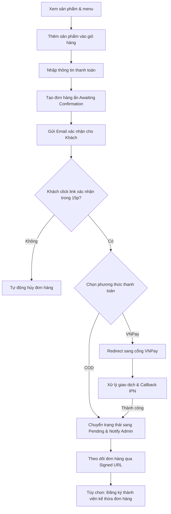
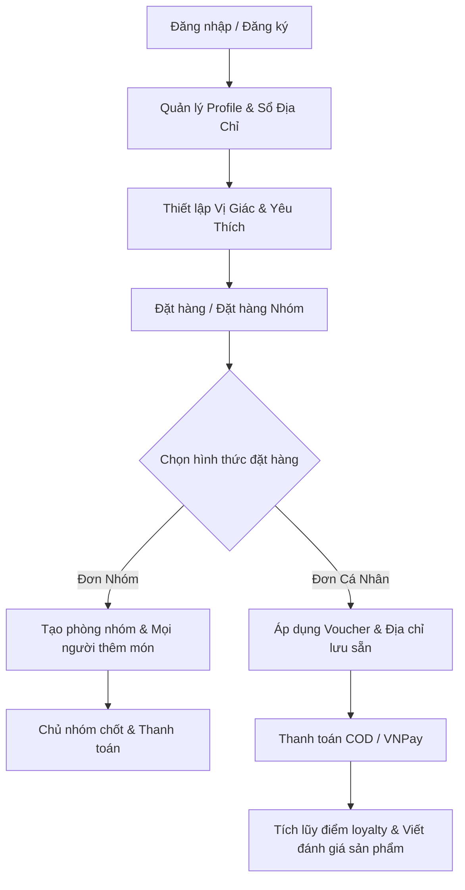
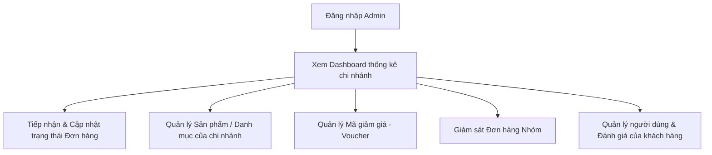
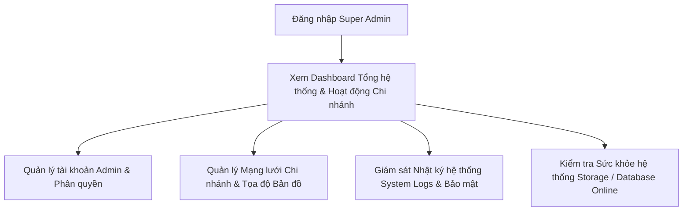

# 📚 Mô Tả Các Luồng Nghiệp Vụ Theo Vai Trò (Role-based Flows)

Tài liệu này mô tả chi tiết toàn bộ các luồng nghiệp vụ hiện có trong hệ thống **Chill Drink**, được phân nhóm theo **từng vai trò (role)** của người dùng. Mỗi luồng nghiệp vụ bao gồm mô tả chi tiết quy trình xử lý, các quy tắc nghiệp vụ và các file mã nguồn liên quan trực tiếp.

---

## 🔑 Tổng Quan Về Vai Trò & Phân Quyền

Hệ thống bao gồm 4 vai trò chính được định nghĩa trong bảng `roles` (xem [AuthAccountSeeder.php](file:///c:/xampp/htdocs/php01/du%20an%201%200000/DU_AN_1/DATN/chill-drink/database/seeders/AuthAccountSeeder.php)):

| ID | Tên Vai Trò | Loại Người Dùng | Middleware Áp Dụng | Mô Tả |
|:---|:---|:---|:---|:---|
| **-** | **Guest** | Khách vãng lai | `guest` hoặc không có | Người dùng chưa đăng nhập hệ thống, được phép duyệt món, thêm vào giỏ hàng và mua hàng (qua xác nhận email). |
| **1** | **User** | Khách hàng thành viên | `auth` | Người dùng đã đăng ký tài khoản, được hưởng các tính năng nâng cao (Sổ địa chỉ, tích điểm, đặt hàng nhóm, vị giác...). |
| **2** | **Admin** | Quản trị viên Chi nhánh | `auth`, `admin` | Người quản lý một chi nhánh cụ thể, có quyền quản lý đơn hàng, sản phẩm, voucher, đánh giá thuộc chi nhánh đó. |
| **3** | **Super Admin** | Quản trị viên Hệ thống | `auth`, `superadmin` | Người quản lý tối cao của hệ thống, quản lý chi nhánh, tài khoản Admin và giám sát hoạt động toàn hệ thống. |

### Cơ chế Middleware bảo vệ:
- [AdminMiddleware.php](file:///c:/xampp/htdocs/php01/du%20an%201%200000/DU_AN_1/DATN/chill-drink/app/Http/Middleware/AdminMiddleware.php) (`admin`): Kiểm tra người dùng đã đăng nhập và có `role_id` là `2` hoặc `3` (`isAdmin()`). Nếu không, chuyển hướng về trang chủ với thông báo lỗi.
- [SuperAdminMiddleware.php](file:///c:/xampp/htdocs/php01/du%20an%201%200000/DU_AN_1/DATN/chill-drink/app/Http/Middleware/SuperAdminMiddleware.php) (`superadmin`): Kiểm tra người dùng đã đăng nhập và có `role_id` là `3` (`isSuperAdmin()`). Nếu không, chuyển hướng về trang Dashboard của Admin với thông báo lỗi.
- Đăng ký alias tại [app.php](file:///c:/xampp/htdocs/php01/du%20an%201%200000/DU_AN_1/DATN/chill-drink/bootstrap/app.php).

---

## 1. 🌐 Luồng Của Khách Vãng Lai (Guest / Anonymous User)

Khách vãng lai là người dùng chưa đăng nhập, sử dụng trình duyệt để xem menu và thực hiện mua hàng trực tiếp mà không cần đăng ký.



### 1.1 Duyệt sản phẩm & Menu
- **Mô tả**: Xem danh sách sản phẩm, lọc theo danh mục, lọc theo khoảng giá (`min_price`, `max_price`), tìm kiếm theo tên/SKU/mô tả và xem chi tiết sản phẩm bao gồm mô tả, kích thước (size S, M, L), topping đi kèm và các đánh giá từ khách hàng trước.
- **Quy tắc nghiệp vụ**:
  - Chỉ hiển thị các sản phẩm có trạng thái hoạt động (`status = true`).
  - Topping hiển thị động dựa trên danh mục sản phẩm (Matcha, trà sữa, cà phê, soda...).
  - Tính toán điểm đánh giá trung bình từ các review đã được duyệt (`status = true`).
- **Files liên quan**:
  - Controller: [HomeController.php@index](file:///c:/xampp/htdocs/php01/du%20an%201%200000/DU_AN_1/DATN/chill-drink/app/Http/Controllers/Client/HomeController.php), [ProductController.php](file:///c:/xampp/htdocs/php01/du%20an%201%200000/DU_AN_1/DATN/chill-drink/app/Http/Controllers/Client/ProductController.php) (phương thức `index`, `show`)
  - Model: [Product.php](file:///c:/xampp/htdocs/php01/du%20an%201%200000/DU_AN_1/DATN/chill-drink/app/Models/Product.php), [Category.php](file:///c:/xampp/htdocs/php01/du%20an%201%200000/DU_AN_1/DATN/chill-drink/app/Models/Category.php)
  - Support: [ProductCatalog.php](file:///c:/xampp/htdocs/php01/du%20an%201%200000/DU_AN_1/DATN/chill-drink/app/Support/ProductCatalog.php)
  - View: [index.blade.php](file:///c:/xampp/htdocs/php01/du%20an%201%200000/DU_AN_1/DATN/chill-drink/resources/views/client/products/index.blade.php), [show.blade.php](file:///c:/xampp/htdocs/php01/du%20an%201%200000/DU_AN_1/DATN/chill-drink/resources/views/client/products/show.blade.php)
  - Routes: `home`, `products.index`, `products.show` trong [web.php](file:///c:/xampp/htdocs/php01/du%20an%201%200000/DU_AN_1/DATN/chill-drink/routes/web.php)

### 1.2 Giỏ hàng (Session-based)
- **Mô tả**: Thêm sản phẩm vào giỏ với tùy chọn tùy chỉnh (Size, lượng đường, lượng đá, topping đi kèm, số lượng, ghi chú). Cập nhật số lượng hoặc xóa sản phẩm khỏi giỏ hàng.
- **Quy tắc nghiệp vụ**:
  - Giỏ hàng của khách vãng lai lưu trữ trực tiếp trong `session('cart')`.
  - Phí chênh lệch Size: Size S (+0đ), Size M (+5.000đ), Size L (+10.000đ).
  - Phí topping cộng trực tiếp vào giá sản phẩm trong giỏ.
- **Files liên quan**:
  - Controller: [CartController.php](file:///c:/xampp/htdocs/php01/du%20an%201%200000/DU_AN_1/DATN/chill-drink/app/Http/Controllers/Client/CartController.php) (các phương thức `index`, `add`, `update`, `remove`, `clear`)
  - View: [cart/index.blade.php](file:///c:/xampp/htdocs/php01/du%20an%201%200000/DU_AN_1/DATN/chill-drink/resources/views/client/cart/index.blade.php)
  - Routes: `cart.index`, `cart.add`, `cart.update`, `cart.remove`, `cart.clear` trong [web.php](file:///c:/xampp/htdocs/php01/du%20an%201%200000/DU_AN_1/DATN/chill-drink/routes/web.php)

### 1.3 Đặt hàng không đăng nhập (Guest Checkout)
- **Mô tả**: Tiến hành thanh toán mà không cần tài khoản. Người dùng nhập tên, số điện thoại, email và lựa chọn hình thức:
  1. *Giao hàng tận nơi (Delivery)*: Chọn khu vực giao hàng và tính phí vận chuyển theo khoảng cách thực tế đến chi nhánh gần nhất.
  2. *Lấy tại chi nhánh (Pickup)*: Chọn chi nhánh muốn tới lấy hàng (phí ship = 0đ).
- **Quy tắc nghiệp vụ**:
  - Chỉ được hiển thị và chọn các chi nhánh đang hoạt động (`status = true`).
  - Lựa chọn phương thức thanh toán: Trả tiền mặt khi nhận hàng (COD) hoặc Chuyển khoản qua cổng VNPay.
  - Khi hoàn thành đặt hàng, hệ thống tạo bản ghi đơn hàng với trạng thái đặc biệt: `awaiting_email_confirmation` (Đơn hàng chờ xác nhận email). Đơn hàng này sẽ bị ẩn đối với các Admin chi nhánh cho đến khi được xác nhận.
  - Sinh token xác nhận có thời hạn 15 phút (`confirmation_token_expires_at`).
  - Gửi email xác thực đến hòm thư của khách.
- **Files liên quan**:
  - Controller: [GuestCheckoutController.php](file:///c:/xampp/htdocs/php01/du%20an%201%200000/DU_AN_1/DATN/chill-drink/app/Http/Controllers/Client/GuestCheckoutController.php) (các phương thức `index`, `storeInfo`, `payment`, `process`)
  - Mailer: [GuestOrderEmailConfirmationMail.php](file:///c:/xampp/htdocs/php01/du%20an%201%200000/DU_AN_1/DATN/chill-drink/app/Mail/GuestOrderEmailConfirmationMail.php)
  - Support: [ShippingFee.php](file:///c:/xampp/htdocs/php01/du%20an%201%200000/DU_AN_1/DATN/chill-drink/app/Support/ShippingFee.php)
  - View: [guest/index.blade.php](file:///c:/xampp/htdocs/php01/du%20an%201%200000/DU_AN_1/DATN/chill-drink/resources/views/client/checkout/guest/index.blade.php), [guest/payment.blade.php](file:///c:/xampp/htdocs/php01/du%20an%201%200000/DU_AN_1/DATN/chill-drink/resources/views/client/checkout/guest/payment.blade.php), [guest/pending-confirmation.blade.php](file:///c:/xampp/htdocs/php01/du%20an%201%200000/DU_AN_1/DATN/chill-drink/resources/views/client/checkout/guest/pending-confirmation.blade.php)
  - Routes: `checkout.guest.index`, `checkout.guest.info.store`, `checkout.guest.payment`, `checkout.guest.process`, `checkout.guest.pending-confirmation` trong [web.php](file:///c:/xampp/htdocs/php01/du%20an%201%200000/DU_AN_1/DATN/chill-drink/routes/web.php)

### 1.4 Xác nhận đơn hàng qua Email
- **Mô tả**: Khách hàng mở email và bấm vào liên kết xác nhận.
- **Quy tắc nghiệp vụ**:
  - Nếu token xác nhận khớp và chưa hết hạn: Trạng thái đơn hàng chuyển sang `pending` (chờ xử lý), xóa token xác nhận để tránh dùng lại.
  - Gửi tín hiệu thông báo thời gian thực cho Admin chi nhánh qua [RealtimeOrderNotifier.php](file:///c:/xampp/htdocs/php01/du%20an%201%200000/DU_AN_1/DATN/chill-drink/app/Support/RealtimeOrderNotifier.php) để chuẩn bị đồ uống.
  - Lưu trạng thái cho phép thiết bị của khách xem đơn hàng đó vào session (`guest_order_tokens`).
  - Nếu token hết hạn (quá 15 phút): Đơn hàng tự động bị hủy và thông báo cho người dùng liên kết không còn hiệu lực.
- **Files liên quan**:
  - Controller: [GuestCheckoutController.php@confirmEmail](file:///c:/xampp/htdocs/php01/du%20an%201%200000/DU_AN_1/DATN/chill-drink/app/Http/Controllers/Client/GuestCheckoutController.php)
  - Support: [GuestOrderAccess.php](file:///c:/xampp/htdocs/php01/du%20an%201%200000/DU_AN_1/DATN/chill-drink/app/Support/GuestOrderAccess.php), [RealtimeOrderNotifier.php](file:///c:/xampp/htdocs/php01/du%20an%201%200000/DU_AN_1/DATN/chill-drink/app/Support/RealtimeOrderNotifier.php)
  - View: [guest/confirm-email-result.blade.php](file:///c:/xampp/htdocs/php01/du%20an%201%200000/DU_AN_1/DATN/chill-drink/resources/views/client/checkout/guest/confirm-email-result.blade.php)
  - Route: `checkout.guest.confirm-email` trong [web.php](file:///c:/xampp/htdocs/php01/du%20an%201%200000/DU_AN_1/DATN/chill-drink/routes/web.php)

### 1.5 Theo dõi đơn hàng của khách vãng lai
- **Mô tả**: Xem trạng thái và thông tin tiến độ đơn hàng theo thời gian thực (Đang pha chế, Đang giao, Đã giao...).
- **Quy tắc nghiệp vụ**:
  - Vì khách vãng lai không có tài khoản, hệ thống sử dụng **Signed URL** bảo mật (đường dẫn có chữ ký số mã hóa của Laravel) để xác thực quyền truy cập trang theo dõi.
  - Phải có middleware `signed` bảo vệ hoặc session chứa token phù hợp (`GuestOrderAccess::canView`).
- **Files liên quan**:
  - Controller: [GuestCheckoutController.php@track](file:///c:/xampp/htdocs/php01/du%20an%201%200000/DU_AN_1/DATN/chill-drink/app/Http/Controllers/Client/GuestCheckoutController.php)
  - Support: [GuestOrderAccess.php](file:///c:/xampp/htdocs/php01/du%20an%201%200000/DU_AN_1/DATN/chill-drink/app/Support/GuestOrderAccess.php)
  - View: [checkout/success.blade.php](file:///c:/xampp/htdocs/php01/du%20an%201%200000/DU_AN_1/DATN/chill-drink/resources/views/client/checkout/success.blade.php) (Dùng chung giao diện tracking)
  - Route: `checkout.guest.track` (được bảo vệ bởi middleware `signed`) trong [web.php](file:///c:/xampp/htdocs/php01/du%20an%201%200000/DU_AN_1/DATN/chill-drink/routes/web.php)

### 1.6 Chuyển đổi tài khoản Khách sang Thành viên (Guest-to-Member)
- **Mô tả**: Sau khi khách vãng lai hoàn thành đặt đơn thành công, hệ thống hiển thị tùy chọn cho phép khách đăng ký nhanh tài khoản thành viên bằng cách chỉ cần thiết lập mật khẩu cho email đã dùng đặt hàng.
- **Quy tắc nghiệp vụ**:
  - Thông tin đăng ký kế thừa từ thông tin đơn hàng vừa đặt (Tên, email, số điện thoại).
  - Tự động liên kết đơn hàng khách vừa đặt vào tài khoản thành viên mới (`user_id = $new_user_id`).
  - Cộng điểm thưởng tích lũy (loyalty points) từ đơn hàng vừa đặt vào tài khoản thành viên mới tạo.
- **Files liên quan**:
  - Controller: [GuestConvertController.php@store](file:///c:/xampp/htdocs/php01/du%20an%201%200000/DU_AN_1/DATN/chill-drink/app/Http/Controllers/Auth/GuestConvertController.php)
  - Model: [User.php](file:///c:/xampp/htdocs/php01/du%20an%201%200000/DU_AN_1/DATN/chill-drink/app/Models/User.php)
  - Route: `register.guest-convert` trong [web.php](file:///c:/xampp/htdocs/php01/du%20an%201%200000/DU_AN_1/DATN/chill-drink/routes/web.php)

### 1.7 Nhận và áp dụng Voucher dành cho Khách
- **Mô tả**: Khách chưa đăng nhập vẫn có thể nhập mã voucher và nhận voucher (lưu trữ theo Session ID hoặc `guest_identifier` làm khóa định danh tạm thời).
- **Files liên quan**:
  - Controller: [VoucherController.php](file:///c:/xampp/htdocs/php01/du%20an%201%200000/DU_AN_1/DATN/chill-drink/app/Http/Controllers/Api/VoucherController.php) (các phương thức `receive`, `getReceived`, `markAsUsed`)
  - Routes: `api.vouchers.receive`, `api.vouchers.received`, `api.vouchers.mark-used` trong [api.php](file:///c:/xampp/htdocs/php01/du%20an%201%200000/DU_AN_1/DATN/chill-drink/routes/api.php)

### 1.8 Luồng thanh toán trực tuyến qua cổng VNPay
- **Mô tả**: Cho phép khách hàng hoặc khách vãng lai thanh toán hóa đơn bằng tài khoản ngân hàng hoặc ví điện tử qua cổng VNPay.
- **Quy tắc nghiệp vụ**:
  - Khi xử lý checkout với `payment_method = 'vnpay'`, hệ thống tạo bản ghi đơn hàng với `payment_status = 'pending'`.
  - Redirect người dùng sang cổng thanh toán VNPay kèm theo chuỗi bảo mật SHA512 tạo từ dữ liệu đơn hàng và `hash_secret`.
  - **Trang Callback phản hồi (Return)**: Khách hàng thanh toán xong được chuyển hướng về `/vnpay/return`. Hệ thống kiểm tra chữ ký chữ số, so khớp số tiền thực thu với hóa đơn gốc, và cập nhật trạng thái `payment_status = 'paid'` & `status = 'in_progress'` nếu thành công.
  - **Webhook hậu đài (IPN)**: API chạy ngầm `/vnpay/ipn` được gọi bởi máy chủ VNPay để đảm bảo cập nhật trạng thái thanh toán ngay cả khi khách hàng đóng trình duyệt. Hệ thống sử dụng khóa hàng dữ liệu (`lockForUpdate()`) trong Database để tránh tình trạng cập nhật trạng thái trùng lặp (Race Condition).
- **Files liên quan**:
  - Controller: [VnpayController.php](file:///c:/xampp/htdocs/php01/du%20an%201%200000/DU_AN_1/DATN/chill-drink/app/Http/Controllers/Client/VnpayController.php) (các phương thức `payment`, `return`, `ipn`)
  - Routes: `vnpay.payment`, `vnpay.return`, `vnpay.ipn` trong [web.php](file:///c:/xampp/htdocs/php01/du%20an%201%200000/DU_AN_1/DATN/chill-drink/routes/web.php)

### 1.9 Hệ thống định vị GPS & tự động tính phí vận chuyển
- **Mô tả**: Tự động tính toán khoảng cách địa lý và đưa ra gợi ý chi nhánh gần nhất và phí ship tương ứng.
- **Quy tắc nghiệp vụ**:
  - Sử dụng công thức toán học **Haversine** trong [Branch.php](file:///c:/xampp/htdocs/php01/du%20an%201%200000/DU_AN_1/DATN/chill-drink/app/Models/Branch.php) để tính khoảng cách đường chim bay giữa tọa độ GPS của người dùng và chi nhánh.
  - API `/api/branches/nearest` trả về chi nhánh hoạt động gần nhất.
  - API `/api/branches` trả về danh sách toàn bộ các chi nhánh hoạt động, sắp xếp tăng dần theo khoảng cách (km).
  - Lớp [ShippingFee.php](file:///c:/xampp/htdocs/php01/du%20an%201%200000/DU_AN_1/DATN/chill-drink/app/Support/ShippingFee.php) quy định phí vận chuyển theo khoảng cách:
    - 0 - 2 km: 10.000đ | 2 - 5 km: 15.000đ | 5 - 8 km: 22.000đ | 8 - 12 km: 30.000đ | 12 - 15 km: 40.000đ | 15 - 20 km: 50.000đ.
    - Phương thức giao hàng Giao Nhanh (`fast`) cộng thêm phụ phí 8.000đ so với Giao Tiêu Chuẩn (`standard`).
  - Nếu không có quyền truy cập tọa độ GPS, hệ thống sử dụng bộ từ khóa địa chỉ (`keywords` như "hoàn kiếm", "cầu giấy"...) để ước lượng khoảng cách tương đối.
- **Files liên quan**:
  - Controller: [NearestBranchController.php](file:///c:/xampp/htdocs/php01/du%20an%201%200000/DU_AN_1/DATN/chill-drink/app/Http/Controllers/Api/NearestBranchController.php) (các phương thức `nearest`, `list`)
  - Model: [Branch.php](file:///c:/xampp/htdocs/php01/du%20an%201%200000/DU_AN_1/DATN/chill-drink/app/Models/Branch.php) (phương thức `distanceTo`, scope `availableForLocation`)
  - Support: [ShippingFee.php](file:///c:/xampp/htdocs/php01/du%20an%201%200000/DU_AN_1/DATN/chill-drink/app/Support/ShippingFee.php)
  - Routes: `api.branches.nearest`, `api.branches.list` trong [api.php](file:///c:/xampp/htdocs/php01/du%20an%201%200000/DU_AN_1/DATN/chill-drink/routes/api.php)

---

## 2. 👤 Luồng Của Khách Hàng Thành Viên (Registered User / Customer)

Khách hàng thành viên là người dùng đã đăng ký tài khoản, đăng nhập vào hệ thống để sử dụng các dịch vụ chăm sóc khách hàng và các tính năng nâng cao.



### 2.1 Đăng ký / Đăng nhập / Xác thực tài khoản
- **Mô tả**: Người dùng có thể đăng ký tài khoản mới, đăng nhập bằng email/mật khẩu, đăng nhập thông qua mạng xã hội (Google, Facebook), xác thực email và khôi phục mật khẩu khi quên.
- **Files liên quan**:
  - Controller: [RegisteredUserController.php](file:///c:/xampp/htdocs/php01/du%20an%201%200000/DU_AN_1/DATN/chill-drink/app/Http/Controllers/Auth/RegisteredUserController.php), [AuthenticatedSessionController.php](file:///c:/xampp/htdocs/php01/du%20an%201%200000/DU_AN_1/DATN/chill-drink/app/Http/Controllers/Auth/AuthenticatedSessionController.php), [GoogleController.php](file:///c:/xampp/htdocs/php01/du%20an%201%200000/DU_AN_1/DATN/chill-drink/app/Http/Controllers/Auth/GoogleController.php), [FacebookController.php](file:///c:/xampp/htdocs/php01/du%20an%201%200000/DU_AN_1/DATN/chill-drink/app/Http/Controllers/Auth/FacebookController.php)
  - Routes: Định nghĩa đầy đủ trong [auth.php](file:///c:/xampp/htdocs/php01/du%20an%201%200000/DU_AN_1/DATN/chill-drink/routes/auth.php)

### 2.2 Quản lý Hồ sơ & Sổ địa chỉ (Address Book)
- **Mô tả**: Thay đổi thông tin cá nhân, cập nhật ảnh đại diện (avatar), thay đổi mật khẩu và quản lý danh sách địa chỉ giao hàng cá nhân.
- **Quy tắc nghiệp vụ**:
  - Có thể lưu nhiều địa chỉ (Ví dụ: Nhà riêng, Công ty, Trường học).
  - Có tùy chọn đặt một địa chỉ làm mặc định (`is_default`). Khi đặt mặc định, hệ thống tự động đồng bộ thông tin địa chỉ này lên thông tin chính của User (`name`, `phone`, `address`, `area`).
- **Files liên quan**:
  - Controller: [ProfileController.php](file:///c:/xampp/htdocs/php01/du%20an%201%200000/DU_AN_1/DATN/chill-drink/app/Http/Controllers/ProfileController.php), [AddressController.php](file:///c:/xampp/htdocs/php01/du%20an%201%200000/DU_AN_1/DATN/chill-drink/app/Http/Controllers/Client/AddressController.php)
  - Model: [Address.php](file:///c:/xampp/htdocs/php01/du%20an%201%200000/DU_AN_1/DATN/chill-drink/app/Models/Address.php)
  - View: [profile/edit.blade.php](file:///c:/xampp/htdocs/php01/du%20an%201%200000/DU_AN_1/DATN/chill-drink/resources/views/profile/edit.blade.php)
  - Routes: `profile.edit`, `profile.update`, `profile.destroy` trong [web.php](file:///c:/xampp/htdocs/php01/du%20an%201%200000/DU_AN_1/DATN/chill-drink/routes/web.php)

### 2.3 Đặt hàng cá nhân & Áp dụng Voucher (Member Checkout)
- **Mô tả**: Thực hiện thanh toán giỏ hàng hiện tại của thành viên.
- **Quy tắc nghiệp vụ**:
  - Lựa chọn nhanh địa chỉ từ sổ địa chỉ đã lưu.
  - Phí vận chuyển được tính dựa trên tọa độ GPS (nếu trình duyệt cấp quyền định vị) hoặc theo địa chỉ từ sổ địa chỉ (Xem chi tiết mục 1.9).
  - Có thể áp dụng các mã giảm giá (Voucher) đã lưu trong ví tài khoản để giảm tiền trực tiếp hoặc giảm phí ship.
  - Sau khi đặt hàng thành công, hệ thống tự động tính toán và tích lũy điểm thưởng dựa trên tổng giá trị đơn hàng (Loyalty Points).
- **Files liên quan**:
  - Controller: [CheckoutController.php](file:///c:/xampp/htdocs/php01/du%20an%201%200000/DU_AN_1/DATN/chill-drink/app/Http/Controllers/Client/CheckoutController.php) (các phương thức `index`, `process`, `storeAddress`, `updateAddress`, `updatePrimaryAddress`)
  - Model: [Voucher.php](file:///c:/xampp/htdocs/php01/du%20an%201%200000/DU_AN_1/DATN/chill-drink/app/Models/Voucher.php), [UserVoucher.php](file:///c:/xampp/htdocs/php01/du%20an%201%200000/DU_AN_1/DATN/chill-drink/app/Models/UserVoucher.php)
  - Routes: `checkout.index`, `checkout.process`, `checkout.addresses.store` trong [web.php](file:///c:/xampp/htdocs/php01/du%20an%201%200000/DU_AN_1/DATN/chill-drink/routes/web.php)

### 2.4 Lịch sử mua hàng & Đặt lại đơn hàng nhanh (Reorder)
- **Mô tả**: Xem danh sách các đơn hàng đã đặt, chi tiết từng đơn hàng kèm trạng thái. Cung cấp tính năng:
  1. *Đặt lại toàn bộ đơn hàng (Reorder Order)*: Thêm lại tất cả sản phẩm của đơn hàng cũ vào giỏ hàng hiện tại với cấu hình lựa chọn cũ.
  2. *Đặt lại từng sản phẩm (Reorder Item)*: Chọn một món cụ thể từ đơn hàng cũ để thêm nhanh vào giỏ.
- **Quy tắc nghiệp vụ**:
  - Giá của các món khi đặt lại sẽ được tự động cập nhật theo giá bán hiện hành của hệ thống, không giữ giá cũ của đơn hàng lịch sử.
  - Hệ thống ghi lại lịch sử thao tác này trong bảng `reorder_history`.
- **Files liên quan**:
  - Controller: [QuickOrderController.php](file:///c:/xampp/htdocs/php01/du%20an%201%200000/DU_AN_1/DATN/chill-drink/app/Http/Controllers/Client/QuickOrderController.php) (các phương thức `reorderOrder`, `reorderItem`)
  - View: [profile/orders.blade.php](file:///c:/xampp/htdocs/php01/du%20an%201%200000/DU_AN_1/DATN/chill-drink/resources/views/profile/orders.blade.php)
  - Routes: `orders.reorder`, `orders.items.reorder` trong [web.php](file:///c:/xampp/htdocs/php01/du%20an%201%200000/DU_AN_1/DATN/chill-drink/routes/web.php)

### 2.5 Thiết lập vị giác & Sản phẩm yêu thích (Favorites & Taste Profile)
- **Mô tả**:
  1. *Yêu thích*: Bấm nút tim để lưu sản phẩm vào danh sách yêu thích cá nhân để dễ tìm và đặt lại sau.
  2. *Hồ sơ Vị Giác (Taste Profile)*: Lưu cấu hình tùy chỉnh mặc định (Size, mức đường, mức đá, toppings yêu thích, ghi chú) cho từng món uống.
- **Quy tắc nghiệp vụ**:
  - Khi người dùng mở trang chi tiết sản phẩm đã được lưu cấu hình vị giác, hệ thống sẽ tự động tick chọn sẵn các tùy chọn (đường, đá, size, topping) theo cấu hình người dùng đã lưu trước đó.
- **Files liên quan**:
  - Controller: [QuickOrderController.php](file:///c:/xampp/htdocs/php01/du%20an%201%200000/DU_AN_1/DATN/chill-drink/app/Http/Controllers/Client/QuickOrderController.php) (các phương thức `favorites`, `toggleFavorite`, `saveTaste`)
  - Model: [Favorite.php](file:///c:/xampp/htdocs/php01/du%20an%201%200000/DU_AN_1/DATN/chill-drink/app/Models/Favorite.php), [TasteProfile.php](file:///c:/xampp/htdocs/php01/du%20an%201%200000/DU_AN_1/DATN/chill-drink/app/Models/TasteProfile.php)
  - View: [favorites/index.blade.php](file:///c:/xampp/htdocs/php01/du%20an%201%200000/DU_AN_1/DATN/chill-drink/resources/views/client/favorites/index.blade.php)
  - Routes: `favorites.index`, `favorites.toggle`, `taste-profiles.store` trong [web.php](file:///c:/xampp/htdocs/php01/du%20an%201%200000/DU_AN_1/DATN/chill-drink/routes/web.php)

### 2.6 Đặt hàng nhóm (Group Order)
- **Mô tả**: Cho phép một nhóm người dùng (ví dụ: đồng nghiệp trong văn phòng) cùng chọn món chung vào một đơn hàng duy nhất để tiết kiệm phí vận chuyển.
- **Quy trình chi tiết**:
  1. **Tạo đơn nhóm**: Trưởng nhóm (Initiator) bấm tạo đơn nhóm, thiết lập tên nhóm và thời gian tự động chốt đơn (`closes_at`). Hệ thống sinh mã Code gồm 8 ký tự in hoa ngẫu nhiên.
  2. **Tham gia nhóm**: Các thành viên khác đăng nhập tài khoản thành viên, nhập mã Code hoặc truy cập link chia sẻ để tham gia vào nhóm.
  3. **Thêm món ăn/đồ uống**: Mỗi thành viên tự thêm món của mình vào danh sách chung, tự chọn các thông số (đường, đá, size, topping).
  4. **Giám sát & Hiện diện**: Hệ thống liên tục đồng bộ trạng thái online/offline của các thành viên và các món ăn đã được thêm trong thời gian thực.
  5. **Chốt đơn & Gom giỏ**: Chỉ Trưởng nhóm mới có quyền bấm "Chốt đơn nhóm". Khi chốt, hệ thống khóa không cho thêm món, lưu trạng thái đơn nhóm thành `closed`, sao lưu giỏ hàng cá nhân của trưởng nhóm, sau đó nạp toàn bộ món của tất cả thành viên vào giỏ hàng của trưởng nhóm.
  6. **Thanh toán**: Trưởng nhóm thực hiện các bước thanh toán (nhập địa chỉ, áp voucher, chọn thanh toán COD/VNPay) như một đơn hàng bình thường. Sau khi thanh toán thành công, đơn nhóm chuyển sang trạng thái `ordered` và liên kết với mã đơn hàng thật.
- **Files liên quan**:
  - Controller: [GroupOrderController.php (Client)](file:///c:/xampp/htdocs/php01/du%20an%201%200000/DU_AN_1/DATN/chill-drink/app/Http/Controllers/Client/GroupOrderController.php)
  - Model: [GroupOrder.php](file:///c:/xampp/htdocs/php01/du%20an%201%200000/DU_AN_1/DATN/chill-drink/app/Models/GroupOrder.php), [GroupOrderItem.php](file:///c:/xampp/htdocs/php01/du%20an%201%200000/DU_AN_1/DATN/chill-drink/app/Models/GroupOrderItem.php), [GroupOrderMember.php](file:///c:/xampp/htdocs/php01/du%20an%201%200000/DU_AN_1/DATN/chill-drink/app/Models/GroupOrderMember.php)
  - View: [group-orders/index.blade.php](file:///c:/xampp/htdocs/php01/du%20an%201%200000/DU_AN_1/DATN/chill-drink/resources/views/client/group-orders/index.blade.php), [group-orders/create.blade.php](file:///c:/xampp/htdocs/php01/du%20an%201%200000/DU_AN_1/DATN/chill-drink/resources/views/client/group-orders/create.blade.php), [group-orders/show.blade.php](file:///c:/xampp/htdocs/php01/du%20an%201%200000/DU_AN_1/DATN/chill-drink/resources/views/client/group-orders/show.blade.php)
  - Routes: `group-orders.index`, `group-orders.create`, `group-orders.store`, `group-orders.show`, `group-orders.join`, `group-orders.items.store`, `group-orders.items.increment`, `group-orders.items.destroy`, `group-orders.close`, `group-orders.cancel`, `group-orders.resume` trong [web.php](file:///c:/xampp/htdocs/php01/du%20an%201%200000/DU_AN_1/DATN/chill-drink/routes/web.php)

### 2.7 Viết đánh giá sản phẩm (Product Reviews)
- **Mô tả**: Sau khi nhận được sản phẩm từ đơn hàng hoàn thành, khách hàng có thể viết nhận xét và đánh giá sao (1-5 sao) cho sản phẩm đó.
- **Quy tắc nghiệp vụ**:
  - Chỉ thành viên đã mua sản phẩm đó mới được viết đánh giá để đảm bảo tính khách quan.
- **Files liên quan**:
  - Controller: [ProductReviewController.php@store](file:///c:/xampp/htdocs/php01/du%20an%201%200000/DU_AN_1/DATN/chill-drink/app/Http/Controllers/Client/ProductReviewController.php)
  - Model: [Review.php](file:///c:/xampp/htdocs/php01/du%20an%201%200000/DU_AN_1/DATN/chill-drink/app/Models/Review.php)
  - Route: `products.reviews.store` trong [web.php](file:///c:/xampp/htdocs/php01/du%20an%201%200000/DU_AN_1/DATN/chill-drink/routes/web.php)

---

## 3. 🏪 Luồng Của Quản Trị Viên Chi Nhánh (Branch Admin - Admin)

Admin chi nhánh phụ trách quản lý toàn bộ các công việc vận hành hàng ngày của một chi nhánh được phân công. Tất cả dữ liệu hiển thị và thao tác đều được tự động lọc theo chi nhánh của Admin đó.



### 3.1 Xem Dashboard thống kê chi nhánh
- **Mô tả**: Xem biểu đồ doanh thu, số lượng đơn hàng, số tài khoản khách hàng đăng ký mới và các chỉ số hoạt động.
- **Quy tắc nghiệp vụ**:
  - Dữ liệu hiển thị tự động lọc theo `branch_id` của tài khoản Admin đăng nhập (`resolveDashboardScope`).
  - Hỗ trợ lọc nhanh theo các khoảng thời gian: Hôm nay, Tuần này, Tháng này, Năm nay.
- **Files liên quan**:
  - Controller: [DashboardController.php](file:///c:/xampp/htdocs/php01/du%20an%201%200000/DU_AN_1/DATN/chill-drink/app/Http/Controllers/Admin/DashboardController.php) (các phương thức `index`, `data`)
  - View: [admin/dashboard.blade.php](file:///c:/xampp/htdocs/php01/du%20an%201%200000/DU_AN_1/DATN/chill-drink/resources/views/admin/dashboard.blade.php)
  - Routes: `admin.dashboard`, `admin.admin.dashboard.data` trong [web.php](file:///c:/xampp/htdocs/php01/du%20an%201%200000/DU_AN_1/DATN/chill-drink/routes/web.php)

### 3.2 Quản lý Đơn hàng chi nhánh
- **Mô tả**: Xem danh sách đơn hàng được phân bổ về chi nhánh, tìm kiếm và lọc đơn hàng theo nhiều tiêu chí. Cập nhật trạng thái xử lý đơn hàng.
- **Quy tắc nghiệp vụ**:
  - Tự động giới hạn đơn hàng thuộc chi nhánh của Admin thông qua phương thức `applyBranchScope`.
  - Quy trình trạng thái đơn hàng (sử dụng [OrderStatus.php](file:///c:/xampp/htdocs/php01/du%20an%201%200000/DU_AN_1/DATN/chill-drink/app/Support/OrderStatus.php)):
    - `pending` (Chờ duyệt) ➔ `confirmed` (Đã xác nhận) ➔ `preparing` (Đang chuẩn bị đồ) ➔ `shipping` (Đang giao hàng) ➔ `completed` (Đã hoàn thành) / `cancelled` (Đã hủy).
  - Khi cập nhật trạng thái, hệ thống gửi thông báo thời gian thực đến khách hàng qua Pusher/Echo và Notification trong cơ sở dữ liệu (`RealtimeOrderNotifier::orderStatusUpdated`).
- **Files liên quan**:
  - Controller: [OrderController.php (Admin)](file:///c:/xampp/htdocs/php01/du%20an%201%200000/DU_AN_1/DATN/chill-drink/app/Http/Controllers/Admin/OrderController.php) (các phương thức `index`, `updateStatus`, `recent`)
  - Support: [OrderStatus.php](file:///c:/xampp/htdocs/php01/du%20an%201%200000/DU_AN_1/DATN/chill-drink/app/Support/OrderStatus.php), [RealtimeOrderNotifier.php](file:///c:/xampp/htdocs/php01/du%20an%201%200000/DU_AN_1/DATN/chill-drink/app/Support/RealtimeOrderNotifier.php)
  - View: [admin/orders/index.blade.php](file:///c:/xampp/htdocs/php01/du%20an%201%200000/DU_AN_1/DATN/chill-drink/resources/views/admin/orders/index.blade.php)
  - Routes: `admin.orders.index`, `admin.orders.recent`, `admin.orders.updateStatus` trong [web.php](file:///c:/xampp/htdocs/php01/du%20an%201%200000/DU_AN_1/DATN/chill-drink/routes/web.php)

### 3.3 Quản lý Sản phẩm & Danh mục (Products & Categories CRUD)
- **Mô tả**: Quản lý danh sách sản phẩm và các danh mục đồ uống của chi nhánh.
- **Quy tắc nghiệp vụ**:
  - Tạo mới, sửa thông tin sản phẩm (Tên, mã SKU, mô tả, ảnh minh họa, giá cơ bản, số lượng tồn kho, trạng thái bật/tắt bán).
  - Cấu hình các topping được phép đi kèm với sản phẩm đó.
- **Files liên quan**:
  - Controller: [ProductController.php (Admin)](file:///c:/xampp/htdocs/php01/du%20an%201%200000/DU_AN_1/DATN/chill-drink/app/Http/Controllers/Admin/ProductController.php), [CategoryController.php](file:///c:/xampp/htdocs/php01/du%20an%201%200000/DU_AN_1/DATN/chill-drink/app/Http/Controllers/Admin/CategoryController.php)
  - Model: [Product.php](file:///c:/xampp/htdocs/php01/du%20an%201%200000/DU_AN_1/DATN/chill-drink/app/Models/Product.php), [Category.php](file:///c:/xampp/htdocs/php01/du%20an%201%200000/DU_AN_1/DATN/chill-drink/app/Models/Category.php)
  - View: Tương ứng trong `resources/views/admin/products/` và `resources/views/admin/categories/`
  - Routes: `admin.products.*`, `admin.categories.*` (đăng ký dạng resource) trong [web.php](file:///c:/xampp/htdocs/php01/du%20an%201%200000/DU_AN_1/DATN/chill-drink/routes/web.php)

### 3.4 Quản lý Mã giảm giá (Vouchers CRUD)
- **Mô tả**: Tạo và kiểm soát các chương trình khuyến mãi bằng mã voucher.
- **Quy tắc nghiệp vụ**:
  - Cấu hình các thông số: Loại giảm giá (Giảm theo số tiền cố định hoặc theo % đơn hàng), giá trị giảm, mức giảm tối đa (đối với giảm %), số lượng mã phát hành, số tiền đơn hàng tối thiểu để áp dụng, thời gian bắt đầu và kết thúc có hiệu lực.
- **Files liên quan**:
  - Controller: [VoucherController.php (Admin)](file:///c:/xampp/htdocs/php01/du%20an%201%200000/DU_AN_1/DATN/chill-drink/app/Http/Controllers/Admin/VoucherController.php)
  - Model: [Voucher.php](file:///c:/xampp/htdocs/php01/du%20an%201%200000/DU_AN_1/DATN/chill-drink/app/Models/Voucher.php)
  - View: Tương ứng trong `resources/views/admin/vouchers/`
  - Routes: `admin.vouchers.*` trong [web.php](file:///c:/xampp/htdocs/php01/du%20an%201%200000/DU_AN_1/DATN/chill-drink/routes/web.php)

### 3.5 Giám sát Đơn hàng nhóm & Đánh giá & Người dùng
- **Mô tả**: 
  - Xem danh sách và trạng thái các phòng gom đơn hàng nhóm đang hoạt động.
  - Xem danh sách feedback/reviews từ khách hàng về chất lượng đồ uống để nâng cao dịch vụ.
  - Xem danh sách khách hàng của hệ thống và thực hiện khóa/mở khóa tài khoản khách hàng khi cần thiết.
- **Files liên quan**:
  - Controller: [GroupOrderController.php (Admin)](file:///c:/xampp/htdocs/php01/du%20an%201%200000/DU_AN_1/DATN/chill-drink/app/Http/Controllers/Admin/GroupOrderController.php), [ReviewController.php](file:///c:/xampp/htdocs/php01/du%20an%201%200000/DU_AN_1/DATN/chill-drink/app/Http/Controllers/Admin/ReviewController.php), [UserController.php](file:///c:/xampp/htdocs/php01/du%20an%201%200000/DU_AN_1/DATN/chill-drink/app/Http/Controllers/Admin/UserController.php)
  - Views: `resources/views/admin/reviews/index.blade.php`, `resources/views/admin/users/`
  - Routes: `admin.group-orders.*`, `admin.reviews.index`, `admin.users.*` trong [web.php](file:///c:/xampp/htdocs/php01/du%20an%201%200000/DU_AN_1/DATN/chill-drink/routes/web.php)

---

## 4. 👑 Luồng Của Quản Trị Viên Hệ Thống (Super Admin)

Super Admin có quyền cao nhất hệ thống, thực hiện các nhiệm vụ quản lý vĩ mô như phân quyền, quản lý mạng lưới chi nhánh và theo dõi sức khỏe hệ thống.



### 4.1 Quản lý tài khoản Admin (Quản trị viên Chi nhánh)
- **Mô tả**: Xem danh sách toàn bộ các quản trị viên trong hệ thống. Thực hiện tạo mới tài khoản Admin.
- **Quy tắc nghiệp vụ**:
  - Khi tạo một Admin mới, hệ thống sẽ **tự động tạo một chi nhánh tương ứng** đi kèm có tên: `Chi nhánh - [Tên Admin]` và mã code là `ADM[ID_Admin]`, đồng thời gán trực tiếp chi nhánh này cho Admin vừa tạo trong cùng một cơ giao dịch (Transaction).
  - Có thể cập nhật gán tài khoản Admin sang quản lý chi nhánh khác (`updateBranch`).
  - Hỗ trợ đổi vai trò người dùng (`updateRole`), nâng cấp người dùng thường thành Admin, hoặc hạ cấp Admin xuống người dùng thường.
  - **Quy tắc bảo vệ**: Không được phép tự thay đổi vai trò của tài khoản đang đăng nhập hiện tại. Không được phép hạ cấp hoặc khóa tài khoản Super Admin duy nhất còn hoạt động trong hệ thống.
- **Files liên quan**:
  - Controller: [SuperAdminController.php](file:///c:/xampp/htdocs/php01/du%20an%201%200000/DU_AN_1/DATN/chill-drink/app/Http/Controllers/Admin/SuperAdminController.php) (các phương thức `storeAdmin`, `updateBranch`, `updateRole`)
  - View: [admin/super-admin.blade.php](file:///c:/xampp/htdocs/php01/du%20an%201%200000/DU_AN_1/DATN/chill-drink/resources/views/admin/super-admin.blade.php)
  - Routes: `admin.super-admin.admins.store`, `admin.super-admin.update-branch`, `admin.super-admin.update-role` trong [web.php](file:///c:/xampp/htdocs/php01/du%20an%201%200000/DU_AN_1/DATN/chill-drink/routes/web.php)

### 4.2 Quản lý mạng lưới chi nhánh (Branch Management)
- **Mô tả**: Quản lý danh sách toàn bộ các cửa hàng/chi nhánh đồ uống thuộc hệ thống Chill Drink.
- **Quy tắc nghiệp vụ**:
  - Thêm mới chi nhánh bao gồm tên, mã chi nhánh (phải là duy nhất), số điện thoại liên hệ, email quản lý, địa chỉ và **Tọa độ địa lý (Latitude, Longitude)** để tích hợp trên bản đồ và tính phí ship tự động.
  - Hệ thống tích hợp bộ giải mã địa chỉ Google Maps (`coordinatesFromMapLink`) giúp tự động trích xuất tọa độ GPS từ một link Google Maps bất kỳ do người dùng cung cấp.
  - Thay đổi trạng thái hoạt động của chi nhánh (Kích hoạt/Vô hiệu hóa). Chi nhánh bị vô hiệu hóa sẽ không hiển thị trên danh sách chọn chi nhánh ở trang checkout của khách hàng.
  - **Quy tắc bảo vệ**: Không cho phép xóa vật lý (Hard Delete) chi nhánh khỏi cơ sở dữ liệu (`destroy` sẽ redirect kèm lỗi) để bảo toàn tính toàn vẹn dữ liệu đơn hàng lịch sử. Chỉ cho phép tạm ngưng hoạt động bằng cách đổi trạng thái.
- **Files liên quan**:
  - Controller: [BranchController.php](file:///c:/xampp/htdocs/php01/du%20an%201%200000/DU_AN_1/DATN/chill-drink/app/Http/Controllers/Admin/BranchController.php) (các phương thức `store`, `update`, `toggleStatus`, `destroy`)
  - Model: [Branch.php](file:///c:/xampp/htdocs/php01/du%20an%201%200000/DU_AN_1/DATN/chill-drink/app/Models/Branch.php)
  - View: [location-picker.blade.php](file:///c:/xampp/htdocs/php01/du%20an%201%200000/DU_AN_1/DATN/chill-drink/resources/views/admin/partials/location-picker.blade.php) (Giao diện bản đồ chọn tọa độ)
  - Routes: `admin.branches.store`, `admin.branches.update`, `admin.branches.toggle-status`, `admin.branches.destroy` trong [web.php](file:///c:/xampp/htdocs/php01/du%20an%201%200000/DU_AN_1/DATN/chill-drink/routes/web.php)

### 4.3 Giám sát Nhật ký hệ thống & Bảo mật & Sức khỏe hệ thống
- **Mô tả**: Xem tổng quan trạng thái sức khỏe kỹ thuật của hệ thống.
- **Quy tắc nghiệp vụ**:
  - Xem lịch sử hoạt động (System Logs) lưu trong bảng `system_logs` ghi nhận các hành vi quan trọng (như đăng nhập, cập nhật phân quyền, thêm mới chi nhánh) của các Admin.
  - Xem chỉ số bảo mật: Số lần đăng nhập sai trong ngày, số Admin đang bị khóa, số yêu cầu khôi phục mật khẩu đang chờ.
  - Xem sức khỏe hệ thống: Trạng thái kết nối Database (Online / Offline), dung lượng lưu trữ trống trên máy chủ, Driver Cache và Mail đang hoạt động.
- **Files liên quan**:
  - Controller: [SuperAdminController.php](file:///c:/xampp/htdocs/php01/du%20an%201%200000/DU_AN_1/DATN/chill-drink/app/Http/Controllers/Admin/SuperAdminController.php) (các phương thức `systemHealth`, `securityStats`, `loginHistoryByAdmin`)
  - Model: [SystemLog.php](file:///c:/xampp/htdocs/php01/du%20an%201%200000/DU_AN_1/DATN/chill-drink/app/Models/SystemLog.php)
  - View: [admin/super-admin.blade.php](file:///c:/xampp/htdocs/php01/du%20an%201%200000/DU_AN_1/DATN/chill-drink/resources/views/admin/super-admin.blade.php)
  - Route: `admin.super-admin` (giao diện điều khiển chung) trong [web.php](file:///c:/xampp/htdocs/php01/du%20an%201%200000/DU_AN_1/DATN/chill-drink/routes/web.php)

---

## 📈 Tóm Tắt Bản Đồ Luồng Dữ Liệu (Data Flow Summary)

```
[Khách vãng lai] -----> Đặt hàng (ẩn) -----> Nhận Email -----> Xác nhận đơn -----> [Đơn chuyển sang Pending]
                                                                                            |
                                                                                            v
[Khách thành viên] ----> Đặt hàng/Đơn nhóm -----------------------------------------> [Admin tiếp nhận đơn]
                                                                                            |
                                                                                            v
                                                                                   [Pha chế & Giao hàng]
                                                                                            |
                                                                                            v
[Super Admin] <-------- Quản lý toàn hệ thống <------------------------------ [Đơn hoàn thành / Tích điểm]
```
