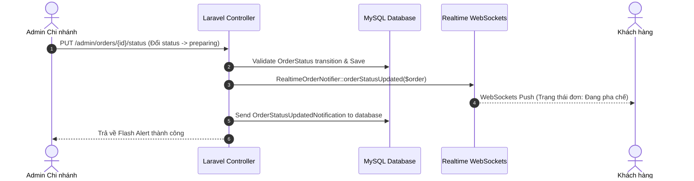

# 📖 TÀI LIỆU CHI TIẾT NGHIỆP VỤ: LUỒNG QUẢN TRỊ VIÊN CHI NHÁNH (BRANCH ADMIN FLOW)

> **Dự án:** CHILL DRINK  
> **Phiên bản tài liệu:** 2.6 (Đã đối chiếu & xử lý toàn bộ các issue trong SYSTEM_ISSUES.md)  
> **Tài liệu tham chiếu:** [PROJECT_DOCUMENTATION.md](file:///c:/xampp/htdocs/php01/du%20an%201%200000/DU_AN_1/DATN/docs/PROJECT_DOCUMENTATION.md)  
> **Người thực hiện:** Senior System Analyst & Laravel Architect  
> **Ngày cập nhật:** 31/07/2026  
> **Trạng thái:** ✅ Đã đối chiếu & xử lý toàn bộ các issue trong SYSTEM_ISSUES.md; 122/122 test pass (509 assertions).  

---

## ⚠️ PHẠM VI TÀI LIỆU — ĐỌC TRƯỚC KHI CODE/REVIEW

Tài liệu này mô tả **các luồng nghiệp vụ chính của Quản trị viên Chi nhánh (Branch Admin)** — người dùng quản lý hoạt động kinh doanh trực tiếp tại từng chi nhánh cửa hàng (`role_id = 2`).

Tài liệu bao gồm:
- Dashboard thống kê doanh thu, đơn hàng, người dùng và sản phẩm bán chạy theo phạm vi chi nhánh (`resolveDashboardScope`).
- Quản lý & Cập nhật trạng thái đơn hàng thời gian thực (`OrderStatus`).
- Quản lý Danh mục & Sản phẩm chi nhánh kèm Thùng rác Soft Delete (`trash`, `restore`, `forceDelete`).
- Quản lý Topping phụ thu & Mã giảm giá Voucher.
- Quản lý Banner Slide khuyến mãi theo chi nhánh kèm Soft Delete.
- Giám sát Đơn hàng nhóm (Group Orders) & Đánh giá sản phẩm từ khách hàng.
- Quản lý Người dùng (phân quyền & khóa/mở khóa tài khoản).

---

## 📋 MỤC LỤC

1. [Tóm Tắt Các Tính Năng Đã Cài Đặt](#1-tóm-tắt-các-tính-năng-đã-cài-đặt)
2. [Định Nghĩa Quy Tắc Cốt Lõi & Phân Quyền](#2-định-nghĩa-quy-tắc-cốt-lõi--phân-quyền)
3. [Chi Tiết Các Sub-Flow Nghiệp Vụ](#3-chi-tiết-các-sub-flow-nghiệp-vụ)
   - [3.1. Dashboard Thống Kê Chi Nhánh & Period Filtering](#31-dashboard-thống-kê-chi-nhánh--period-filtering)
   - [3.2. Quản Lý Đơn Hàng Chi Nhánh & Chuyển Trạng Thái Realtime](#32-quản-lý-đơn-hàng-chi-nhánh--chuyển-trạng-thái-realtime)
   - [3.3. Quản Lý Sản Phẩm, Danh Mục & Thùng Rác Soft Delete](#33-quản-lý-sản-phẩm-danh-mục--thùng-rác-soft-delete)
   - [3.4. Quản Lý Topping Phụ Thu (Toppings CRUD)](#34-quản-lý-topping-phụ-thu-toppings-crud)
   - [3.5. Quản Lý Mã Giảm Giá (Vouchers CRUD)](#35-quản-lý-mã-giảm-giá-vouchers-crud)
   - [3.6. Quản Lý Banner Slide Khuyến Mãi & Soft Delete](#36-quản-lý-banner-slide-khuyến-mãi--soft-delete)
   - [3.7. Giám Sát Đơn Hàng Nhóm & Kiểm Duyệt Đánh Giá](#37-giám-sát-đơn-hàng-nhóm--kiểm-duyệt-đánh-giá)
   - [3.8. Quản Lý Người Dùng & Phân Quyền Vai Trò](#38-quản-lý-người-dùng--phân-quyền-vai-trò)
4. [Biểu Đồ Luồng Nghiệp Vụ (Mermaid Diagrams)](#4-biểu-đồ-luồng-nghiệp-vụ-mermaid-diagrams)
5. [Bảng Kê Chi Tiết Endpoints API & Routes](#5-bảng-kê-chi-tiết-endpoints-api--routes)
6. [Bảng Kê File Mã Nguồn Liên Quan](#6-bảng-kê-file-mã-nguồn-liên-quan)

---

## 1. TÓM TẮT CÁC TÍNH NĂNG ĐÃ CÀI ĐẶT

| # | Chủ đề / Tính năng | Mô tả chi tiết triển khai | Trạng thái |
|---|---|---|---|
| 1 | Dashboard Phân lập Chi nhánh | Tự động lọc doanh thu, số đơn hoàn thành và sản phẩm bán chạy theo `branch_id` của Admin (`resolveDashboardScope`). Hỗ trợ chọn khung thời gian `today`, `week`, `month`, `year` và AJAX JSON endpoint. | ✅ Đã xong |
| 2 | Quản lý Đơn hàng Realtime | Cập nhật trạng thái đơn qua `OrderStatus` state machine, tự động phát WebSockets Broadcast (`RealtimeOrderNotifier`) và gửi Database Notification tới người dùng. Ẩn đơn `awaiting_email_confirmation`. | ✅ Đã xong |
| 3 | Quản lý Sản phẩm & Danh mục | CRUD Sản phẩm/Danh mục kèm cấu hình Size/Topping. Tích hợp Thùng rác Soft Delete (`onlyTrashed`, `restore`, `forceDelete`) tự xóa ảnh khỏi disk khi xóa vĩnh viễn. | ✅ Đã xong |
| 4 | Quản lý Topping phụ thu | CRUD Topping phụ thu (tên, giá, trạng thái). Khi xóa, hệ thống chỉ detach khỏi sản phẩm và xóa nếu topping chưa xuất hiện trong lịch sử đơn hàng; topping đã dùng phải chuyển sang ngưng bán. | ✅ Đã xong |
| 5 | Quản lý Mã giảm giá (Voucher) | CRUD Mã voucher giảm % hoặc cố định, cấu hình số tiền tối thiểu, hạn dùng và tổng số lượt phát hành. | ✅ Đã xong |
| 6 | Quản lý Banner Slide theo Chi nhánh | Quản lý slide khuyến mãi hiển thị trên slider trang chủ của chi nhánh. Hỗ trợ Soft Delete, restore, forceDelete; `store`, `update` và `restore` đều kiểm tra trùng `sort_order` trong phạm vi chi nhánh. | ✅ Đã xong |
| 7 | Giám sát Đơn hàng nhóm & Review | Xem danh sách các phòng đặt hàng nhóm đang diễn ra tại chi nhánh. Kiểm duyệt đánh giá 1-5 sao từ khách mua hàng. | ✅ Đã xong |
| 8 | Quản lý Người dùng & An toàn Admin | Xem danh sách, tìm kiếm, sửa vai trò và khóa/mở khóa tài khoản. Hàm `wouldRemoveLastActiveAdmin` đảm bảo giữ ít nhất 1 Admin hoạt động. Ghi vết log `system_logs`. | ✅ Đã xong |

---

## 2. ĐỊNH NGHĨA QUY TẮC CỐT LÕI & PHÂN QUYỀN

| Quy tắc | Chi tiết nghiệp vụ |
|---|---|
| **Branch Isolation (Phân lập dữ liệu)** | Tất cả truy vấn đơn hàng, doanh thu, slide banner của Admin chi nhánh (`role_id = 2`) đều tự động ràng buộc `where('branch_id', $user->branch_id)`. SuperAdmin (`role_id = 3`) có quyền xem toàn bộ. |
| **Bảo vệ Đơn hàng đang xác nhận** | Không hiển thị các đơn hàng ở trạng thái `awaiting_email_confirmation` trên danh sách đơn hàng Admin cho tới khi khách xác nhận email thành công. |
| **Quy trình Chuyển trạng thái đơn** | Phải tuân theo State Machine chuẩn trong [OrderStatus.php](file:///c:/xampp/htdocs/php01/du%20an%201%200000/DU_AN_1/DATN/chill-drink/app/Support/OrderStatus.php): `pending` ➔ `confirmed` ➔ `preparing` ➔ `ready_for_delivery` ➔ `shipper_picked_up` ➔ `delivering` ➔ `delivered` ➔ `completed`. |
| **Bảo toàn dữ liệu Thùng rác (Soft Delete)** | Sản phẩm, Danh mục và Slide banner khi xóa sẽ chuyển vào Thùng rác (`deleted_at`). Chỉ người dùng có thẩm quyền mới được `restore` hoặc `forceDelete` (xóa vĩnh viễn). |
| **Giữ lại Admin hoạt động tối thiểu** | Hệ thống từ chối hạ cấp vai trò hoặc khóa tài khoản Admin nếu đó là Admin duy nhất đang ở trạng thái kích hoạt (`is_active = true`). |

---

## 3. CHI TIẾT CÁC SUB-FLOW NGHIỆP VỤ

### 3.1. Dashboard Thống Kê Chi Nhánh & Period Filtering
- **Mô tả**: Hiển thị các chỉ số kinh doanh chính của chi nhánh: Tổng doanh thu, tổng đơn hàng, người dùng mới, sản phẩm bán chạy nhất, danh sách 5 đơn hàng mới nhất và biểu đồ doanh thu.
- **Quy tắc nghiệp vụ**:
  - Dữ liệu tự động lọc theo `branch_id` của Admin đăng nhập thông qua `resolveDashboardScope()`; doanh thu và tổng số đơn chỉ tính các đơn `completed`.
  - Hỗ trợ chọn khung thời gian `period`: `today`, `week`, `month`, `year`.
  - Cung cấp JSON Endpoint `GET /admin/dashboard/data` phục vụ AJAX client mà không cần reload trang.
- **Mã nguồn liên quan**:
  - Controller: [DashboardController.php](file:///c:/xampp/htdocs/php01/du%20an%201%200000/DU_AN_1/DATN/chill-drink/app/Http/Controllers/Admin/DashboardController.php)
  - View: [admin/dashboard.blade.php](file:///c:/xampp/htdocs/php01/du%20an%201%200000/DU_AN_1/DATN/chill-drink/resources/views/admin/dashboard.blade.php)

---

### 3.2. Quản Lý Đơn Hàng Chi Nhánh & Chuyển Trạng Thái Realtime
- **Mô tả**: Quản lý đơn hàng được phân bổ về chi nhánh, chuyển trạng thái qua từng công đoạn pha chế - giao hàng.
- **Quy tắc nghiệp vụ**:
  - **Scope**: Admin chỉ thấy đơn hàng có `branch_id` trùng với `branch_id` của mình.
  - Tự động ẩn các đơn `awaiting_email_confirmation` chưa xác nhận email.
  - Luồng trạng thái chuẩn (`OrderStatus.php`):
    `pending` ➔ `confirmed` ➔ `preparing` ➔ `ready_for_delivery` ➔ `shipper_picked_up` ➔ `delivering` ➔ `delivered` ➔ `completed`.
  - Khi đổi trạng thái: Phát sự kiện realtime [RealtimeOrderNotifier.php](file:///c:/xampp/htdocs/php01/du%20an%201%200000/DU_AN_1/DATN/chill-drink/app/Support/RealtimeOrderNotifier.php) qua WebSockets và gửi Database Notification [OrderStatusUpdatedNotification.php](file:///c:/xampp/htdocs/php01/du%20an%201%200000/DU_AN_1/DATN/chill-drink/app/Notifications/OrderStatusUpdatedNotification.php) cho khách.
- **Mã nguồn liên quan**:
  - Controller: [OrderController.php (Admin)](file:///c:/xampp/htdocs/php01/du%20an%201%200000/DU_AN_1/DATN/chill-drink/app/Http/Controllers/Admin/OrderController.php)
  - Support: [OrderStatus.php](file:///c:/xampp/htdocs/php01/du%20an%201%200000/DU_AN_1/DATN/chill-drink/app/Support/OrderStatus.php)

---

### 3.3. Quản Lý Sản Phẩm, Danh Mục & Thùng Rác Soft Delete
- **Mô tả**: CRUD Sản phẩm và Danh mục đồ uống, đính kèm bảng giá Size (S, M, L) và danh sách Topping phù hợp.
- **Quy tắc nghiệp vụ**:
  - Sử dụng Soft Delete (`onlyTrashed()`, `restore()`, `forceDelete()`). Khi xóa mềm, sản phẩm/danh mục được chuyển vào **Thùng rác** thay vì xóa hẳn khỏi DB.
  - Xóa vĩnh viễn (`forceDelete`): Tự động xóa file ảnh liên quan khỏi `storage/app/public/products`.
- **Mã nguồn liên quan**:
  - Controllers: [ProductController.php (Admin)](file:///c:/xampp/htdocs/php01/du%20an%201%200000/DU_AN_1/DATN/chill-drink/app/Http/Controllers/Admin/ProductController.php), [CategoryController.php](file:///c:/xampp/htdocs/php01/du%20an%201%200000/DU_AN_1/DATN/chill-drink/app/Http/Controllers/Admin/CategoryController.php)

---

### 3.4. Quản Lý Topping Phụ Thu (Toppings CRUD)
- **Mô tả**: Thêm, sửa, xóa các loại topping đồ uống kèm giá phụ thu.
- **Quy tắc nghiệp vụ**: Khi xóa topping chưa có trong lịch sử đơn hàng, hệ thống gỡ liên kết khỏi sản phẩm (`$topping->products()->detach()`) rồi xóa. Nếu topping đã được dùng trong `order_item_toppings`, hệ thống chặn xóa để bảo toàn lịch sử và yêu cầu chuyển sang ngưng bán.
- **Mã nguồn liên quan**:
  - Controller: [ToppingController.php](file:///c:/xampp/htdocs/php01/du%20an%201%200000/DU_AN_1/DATN/chill-drink/app/Http/Controllers/Admin/ToppingController.php)
  - Model: [Topping.php](file:///c:/xampp/htdocs/php01/du%20an%201%200000/DU_AN_1/DATN/chill-drink/app/Models/Topping.php)

---

### 3.5. Quản Lý Mã Giảm Giá (Vouchers CRUD)
- **Mô tả**: Tạo các chương trình mã giảm giá khuyến mãi (giảm theo % hoặc giảm tiền cố định), quy định đơn hàng tối thiểu, lượt sử dụng tối đa và thời hạn hiệu lực.
- **Mã nguồn liên quan**:
  - Controller: [VoucherController.php (Admin)](file:///c:/xampp/htdocs/php01/du%20an%201%200000/DU_AN_1/DATN/chill-drink/app/Http/Controllers/Admin/VoucherController.php)
  - Model: [Voucher.php](file:///c:/xampp/htdocs/php01/du%20an%201%200000/DU_AN_1/DATN/chill-drink/app/Models/Voucher.php)

---

### 3.6. Quản Lý Banner Slide Khuyến Mãi & Soft Delete
- **Mô tả**: Quản lý banner hình ảnh khuyến mãi hiển thị trên slider trang chủ của chi nhánh.
- **Quy tắc nghiệp vụ**:
  - Phân lập theo chi nhánh (`branch_id`). Admin chỉ được quản lý slide thuộc chi nhánh của mình.
  - Hỗ trợ Thùng rác Soft Delete (`trash`, `restore`, `forceDelete`).
  - Quản lý thứ tự hiển thị `sort_order`; khi tạo, cập nhật hoặc khôi phục, hệ thống chặn trùng thứ tự với slide đang hoạt động trong cùng chi nhánh.
- **Mã nguồn liên quan**:
  - Controller: [BranchSlideController.php](file:///c:/xampp/htdocs/php01/du%20an%201%200000/DU_AN_1/DATN/chill-drink/app/Http/Controllers/Admin/BranchSlideController.php)
  - Model: [BranchSlide.php](file:///c:/xampp/htdocs/php01/du%20an%201%200000/DU_AN_1/DATN/chill-drink/app/Models/BranchSlide.php)

---

### 3.7. Giám Sát Đơn Hàng Nhóm & Kiểm Duyệt Đánh Giá
- **Mô tả**: Xem danh sách các phòng đặt hàng nhóm đang diễn ra tại chi nhánh và duyệt nhận xét đánh giá từ khách hàng.
- **Mã nguồn liên quan**:
  - Controllers: [GroupOrderController.php (Admin)](file:///c:/xampp/htdocs/php01/du%20an%201%200000/DU_AN_1/DATN/chill-drink/app/Http/Controllers/Admin/GroupOrderController.php), [ReviewController.php](file:///c:/xampp/htdocs/php01/du%20an%201%200000/DU_AN_1/DATN/chill-drink/app/Http/Controllers/Admin/ReviewController.php)

---

### 3.8. Quản Lý Người Dùng & Phân Quyền Vai Trò
- **Mô tả**: Quản lý danh sách tài khoản khách hàng, khóa/mở khóa tài khoản và thay đổi vai trò.
- **Quy tắc nghiệp vụ**:
  - Admin thường không được xem hoặc thao tác lên tài khoản SuperAdmin (`isSuperAdmin()`).
  - Không cho phép tự thay đổi vai trò hoặc khóa tài khoản đang đăng nhập.
  - **Bảo vệ hệ thống**: Hàm `wouldRemoveLastActiveAdmin()` đảm bảo phải giữ lại ít nhất 1 Admin đang hoạt động.
  - Ghi vết lịch sử vào bảng `system_logs` [SystemLog.php](file:///c:/xampp/htdocs/php01/du%20an%201%200000/DU_AN_1/DATN/chill-drink/app/Models/SystemLog.php).
- **Mã nguồn liên quan**:
  - Controller: [UserController.php](file:///c:/xampp/htdocs/php01/du%20an%201%200000/DU_AN_1/DATN/chill-drink/app/Http/Controllers/Admin/UserController.php)
  - Model: [SystemLog.php](file:///c:/xampp/htdocs/php01/du%20an%201%200000/DU_AN_1/DATN/chill-drink/app/Models/SystemLog.php)

---

## 4. BIỂU ĐỒ LUỒNG NGHIỆP VỤ (MERMAID DIAGRAMS)

### 4.1 Sơ đồ Xử lý Đơn hàng Chi nhánh (Order Processing Sequence Diagram)

---

## 5. BẢNG KÊ CHI TIẾT ENDPOINTS API & ROUTES

| HTTP Method | URI | Route Name | Controller @ Method | Mục Đích |
|---|---|---|---|---|
| `GET` | `/admin/dashboard` | `admin.dashboard` | `DashboardController@index` | Dashboard Admin |
| `GET` | `/admin/dashboard/data` | `admin.admin.dashboard.data` | `DashboardController@data` | AJAX Dashboard Data |
| `RESOURCE` | `/admin/orders` | `admin.orders.index` | `OrderController@index` | Quản lý đơn hàng |
| `PUT` | `/admin/orders/{id}/status` | `admin.orders.updateStatus` | `OrderController@updateStatus` | Đổi trạng thái đơn |
| `RESOURCE` | `/admin/products` | `admin.products.*` | `ProductController` | CRUD Sản phẩm |
| `GET` | `/admin/products/trash` | `admin.products.trash` | `ProductController@trash` | Thùng rác sản phẩm |
| `POST` | `/admin/products/{id}/restore` | `admin.products.restore` | `ProductController@restore` | Khôi phục sản phẩm |
| `DELETE` | `/admin/products/{id}/force-delete` | `admin.products.force-delete` | `ProductController@forceDelete` | Xóa vĩnh viễn sản phẩm |
| `RESOURCE` | `/admin/categories` | `admin.categories.*` | `CategoryController` | CRUD Danh mục |
| `GET` | `/admin/categories/trash` | `admin.categories.trash` | `CategoryController@trash` | Thùng rác danh mục |
| `POST` | `/admin/categories/{id}/restore` | `admin.categories.restore` | `CategoryController@restore` | Khôi phục danh mục |
| `RESOURCE` | `/admin/toppings` | `admin.toppings.*` | `ToppingController` | CRUD Topping |
| `RESOURCE` | `/admin/vouchers` | `admin.vouchers.*` | `VoucherController` | CRUD Voucher |
| `GET` | `/admin/slides` | `admin.slides.index` | `BranchSlideController@index` | Danh sách Slide |
| `POST` | `/admin/slides` | `admin.slides.store` | `BranchSlideController@store` | Tạo Slide mới |
| `GET` | `/admin/slides/trash` | `admin.slides.trash` | `BranchSlideController@trash` | Thùng rác Slide |
| `RESOURCE` | `/admin/users` | `admin.users.*` | `UserController` | Quản lý người dùng |
| `PATCH` | `/admin/users/{user}/status` | `admin.users.toggle-status` | `UserController@toggleStatus` | Khóa/Mở tài khoản |

---

## 6. QUẢN LÝ STAFF SAU MERGE

- Admin/SuperAdmin use `admin.staff.*` to create, update, lock/unlock and delete Staff accounts (`role_id = 5`).
- SuperAdmin can assign any branch. A regular Admin must have a branch and can manage Staff from that branch only.
- Staff operations are branch-scoped; an unassigned Staff account cannot list or update orders, group orders or chat.
- Order cancellation keeps the same stock, voucher and loyalty rollback rules as Admin order processing.

## 7. BẢNG KÊ FILE MÃ NGUỒN LIÊN QUAN

- **Controllers**:
  - [DashboardController.php](file:///c:/xampp/htdocs/php01/du%20an%201%200000/DU_AN_1/DATN/chill-drink/app/Http/Controllers/Admin/DashboardController.php)
  - [OrderController.php (Admin)](file:///c:/xampp/htdocs/php01/du%20an%201%200000/DU_AN_1/DATN/chill-drink/app/Http/Controllers/Admin/OrderController.php)
  - [ProductController.php (Admin)](file:///c:/xampp/htdocs/php01/du%20an%201%200000/DU_AN_1/DATN/chill-drink/app/Http/Controllers/Admin/ProductController.php)
  - [CategoryController.php](file:///c:/xampp/htdocs/php01/du%20an%201%200000/DU_AN_1/DATN/chill-drink/app/Http/Controllers/Admin/CategoryController.php)
  - [ToppingController.php](file:///c:/xampp/htdocs/php01/du%20an%201%200000/DU_AN_1/DATN/chill-drink/app/Http/Controllers/Admin/ToppingController.php)
  - [VoucherController.php (Admin)](file:///c:/xampp/htdocs/php01/du%20an%201%200000/DU_AN_1/DATN/chill-drink/app/Http/Controllers/Admin/VoucherController.php)
  - [BranchSlideController.php](file:///c:/xampp/htdocs/php01/du%20an%201%200000/DU_AN_1/DATN/chill-drink/app/Http/Controllers/Admin/BranchSlideController.php)
  - [UserController.php](file:///c:/xampp/htdocs/php01/du%20an%201%200000/DU_AN_1/DATN/chill-drink/app/Http/Controllers/Admin/UserController.php)
- **Support & Models**:
  - [OrderStatus.php](file:///c:/xampp/htdocs/php01/du%20an%201%200000/DU_AN_1/DATN/chill-drink/app/Support/OrderStatus.php)
  - [RealtimeOrderNotifier.php](file:///c:/xampp/htdocs/php01/du%20an%201%200000/DU_AN_1/DATN/chill-drink/app/Support/RealtimeOrderNotifier.php)
  - [SystemLog.php](file:///c:/xampp/htdocs/php01/du%20an%201%200000/DU_AN_1/DATN/chill-drink/app/Models/SystemLog.php)

---
*Tài liệu phản ánh luồng hiện có và các giới hạn đã được đối chiếu ngày 31/07/2026; xem `SYSTEM_ISSUES.md` để biết lỗi còn tồn tại.*
