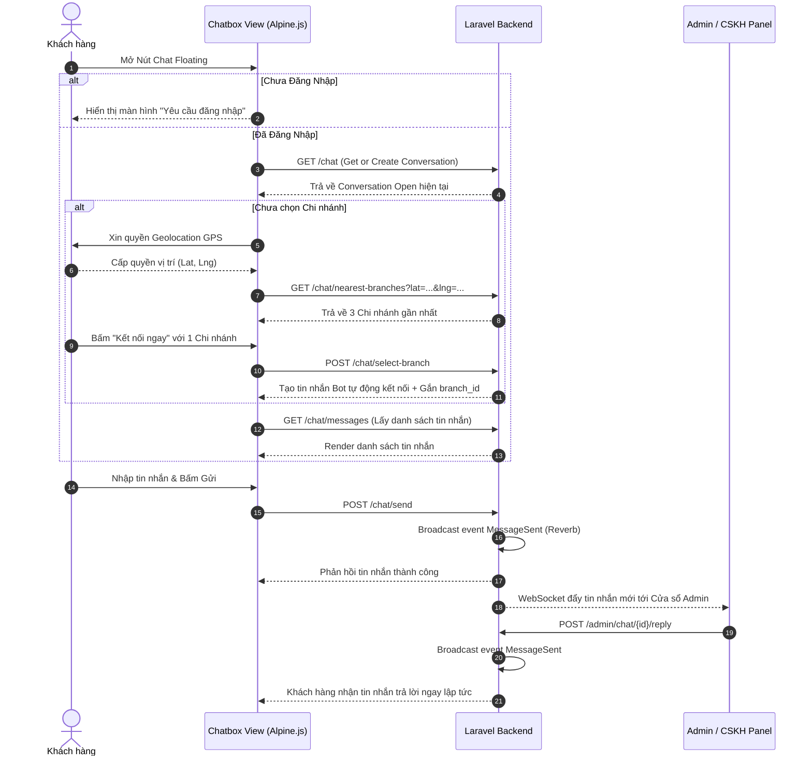

# TÀI LIỆU TOÀN BỘ MÃ NGUỒN, GIAO DIỆN & LUỒNG NGHIỆP VỤ HỆ THỐNG CHAT

> **Dự án:** CHILL DRINK  
> **Commit chuẩn:** `8160a89` ("tối ưu việc load lại đoạn chat")  
> **Ngày cập nhật:** 31/07/2026  

---

## 📋 MỤC LỤC

1. [Tổng Quan Kiến Trúc & Công Nghệ](#1-tổng-quan-kiến-trúc--công-nghệ)
2. [Luồng Nghiệp Vụ Chi Tiết (Business Workflows)](#2-luồng-nghiệp-vụ-chi-tiết-business-workflows)
   - [Luồng 1: Khách Hàng Khởi Tạo & Chọn Chi Nhánh](#luồng-1-khách-hàng-khởi-tạo--chọn-chi-nhánh)
   - [Luồng 2: Gửi / Nhận Tin Nhắn Real-time Khách Hàng](#luồng-2-gửi--nhận-tin-nhắn-real-time-khách-hàng)
   - [Luồng 3: Quản Lý & Trả Lời Tin Nhắn Của Admin / CSKH](#luồng-3-quản-lý--trả-lời-tin-nhắn-của-admin--cskh)
   - [Luồng 4: Tự Động Kết Nối Chat Theo Đơn Hàng (ChatHelper)](#luồng-4-tự-động-kết-nối-chat-theo-đơn-hàng-chathelper)
3. [Giao Diện Người Dùng (UI/UX)](#3-giao-diện-người-dùng-uiux)
4. [Toàn Bộ Mã Nguồn (Full Source Code)](#4-toàn-bộ-mã-nguồn-full-source-code)
   - [4.1. Routes (`routes/web.php`)](#41-routes-routeswebphp)
   - [4.2. Client Controller (`ChatController.php`)](#42-client-controller-chatcontrollerphp)
   - [4.3. Admin Controller (`AdminChatController.php`)](#43-admin-controller-adminchatcontrollerphp)
   - [4.4. Models (`Conversation.php` & `Message.php`)](#44-models-conversationphp--messagephp)
   - [4.5. MessageResource & MessageSent Event](#45-messageresource--messagesent-event)
   - [4.6. ChatHelper Support (`ChatHelper.php`)](#46-chathelper-support-chathelperphp)
   - [4.7. Client View (`chatbox.blade.php`)](#47-client-view-chatboxbladephp)
   - [4.8. Admin View (`admin/chat/index.blade.php`)](#48-admin-view-adminchatindexbladephp)

---

## 1. TỔNG QUAN KIẾN TRÚC & CÔNG NGHỆ

Hệ thống Chat trực tuyến của **Chill Drink** cung cấp kênh tương tác trực tiếp giữa **Khách hàng (Client)** và **Nhân viên hỗ trợ / CSKH / Admin tại các Chi nhánh**.

- **Công nghệ nền tảng:** Laravel 11, Alpine.js, JavaScript, TailwindCSS & Custom CSS.
- **Cơ chế Real-time Kép (Dual Real-time Strategy):**
  1. **WebSocket (Laravel Reverb + Echo):** Khi tin nhắn mới được tạo, server phát sóng sự kiện `MessageSent` trên Private Channel `conversation.{id}`. Client đã đăng nhập và Admin có thể nhận event nếu private-channel authorization thành công.
  2. **Polling:** Client vẫn dùng polling để đồng bộ tin nhắn; code hiện tại chưa dừng polling khi Echo kết nối. Guest không xác thực được private channel nên phụ thuộc polling. Admin polling danh sách conversation mỗi khoảng 4 giây.
- **Tự động Định vị GPS & Gợi ý Chi nhánh:** Khi khách hàng lần đầu bấm chat, trình duyệt yêu cầu quyền truy cập GPS. Hệ thống tính khoảng cách địa lý (Haversine Formula) để đưa ra **03 chi nhánh gần nhất** nhằm hỗ trợ tối ưu.

---

## 2. LUỒNG NGHIỆP VỤ CHI TIẾT (BUSINESS WORKFLOWS)



### Luồng 1: Khách Hàng Khởi Tạo & Chọn Chi Nhánh
1. Khách bấm mở Chatbox ở góc dưới màn hình.
2. Nút bấm sử dụng State Machine linh hoạt: nếu chưa đăng nhập -> yêu cầu bấm "Đăng nhập ngay".
3. Nếu đã đăng nhập, hệ thống tự động tìm cuộc trò chuyện `status = 'open'`. Nếu chưa có -> tạo mới.
4. Nếu chưa chọn Chi nhánh hỗ trợ:
   - Hệ thống xin quyền định vị GPS của trình duyệt (`navigator.geolocation`).
   - Gửi tọa độ `lat`, `lng` lên server để lọc ra 3 chi nhánh có khoảng cách ngắn nhất.
   - Khi khách hàng bấm chọn Chi nhánh, server gửi ngay 1 tin nhắn chào tự động từ Bot (`🤖 Hệ thống`) và thiết lập `branch_id` cho cuộc trò chuyện.
5. Sau khi khách hàng đã bắt đầu nhắn tin (`hasUserSentMessage = true`), tính năng [Đổi chi nhánh] sẽ được khóa lại để giữ luồng hỗ trợ nhất quán.

### Luồng 2: Gửi / Nhận Tin Nhắn Real-time Khách Hàng
1. Gửi tin nhắn: Gửi qua AJAX API `/chat/send` kèm nội dung/tệp đính kèm.
2. Nhận tin nhắn: Client đã đăng nhập có thể lắng nghe Laravel Echo trên kênh private `conversation.{id}`; polling vẫn chạy để đồng bộ. Guest chỉ nhận qua polling vì không có quyền subscribe private channel.
3. Khi tab trình duyệt ẩn (`document.hidden`), hệ thống tạm dừng polling để tiết kiệm tài nguyên.

### Luồng 3: Quản Lý & Trả Lời Tin Nhắn Của Admin / CSKH
1. Admin vào trang `/admin/chat`. Danh sách cuộc trò chuyện bên trái tự động hiển thị theo phân quyền:
   - **Super Admin:** Xem toàn bộ cuộc trò chuyện của tất cả chi nhánh (hoặc lọc theo chi nhánh).
   - **Admin / CSKH:** Chỉ xem các cuộc trò chuyện thuộc Chi nhánh mà nhân viên đó quản lý.
2. Khi Admin bấm chọn 1 khách hàng:
   - Một cửa sổ chat dạng floating popup mọc lên ở góc dưới màn hình (hỗ trợ mở tối đa **3 cửa sổ chat song song**).
   - Có thể thu nhỏ (Minimize) hoặc mở rộng (Maximize) từng cửa sổ.
3. Cơ chế Assign tự động: Khi nhân viên CSKH trả lời tin nhắn đầu tiên, hệ thống khóa conversation trong transaction (`lockForUpdate()`), kiểm tra lại assignment rồi mới gán `cskh_id = user->id`. Request đến sau không được ghi đè người phụ trách.

### Luồng 4: Tự Động Kết Nối Chat Theo Đơn Hàng (ChatHelper)
- Khi khách hàng tiến hành đặt đơn hàng mới, hàm `ChatHelper::ensureChatWithOrderBranch($order)` sẽ kiểm tra:
  - Nếu khách chưa có chat hoặc chat cũ ở chi nhánh khác -> tự động đóng chat cũ và tạo chat mới nối trực tiếp tới Chi nhánh xử lý đơn hàng đó kèm tin nhắn thông báo mã đơn hàng.

---

## 3. GIAO DIỆN NGƯỜI DÙNG (UI/UX)

### Giao Diện Client (`components/chatbox.blade.php`)
- **Nút Floating Toggle:** Đặt cố định góc dưới bên phải (`z-index: 1050`), gradient đẹp mắt, có tích hợp badge đếm tin nhắn chưa đọc màu đỏ.
- **Cửa Sổ Pop-up Hỗ Trợ:** Thiết kế Bo góc 2xl, bóng mờ 2xl shadow, tông màu chủ đạo đồng bộ với thương hiệu Chill Drink.
- **Luồng thẻ Chi Nhánh:** Thẻ hiển thị tên chi nhánh, khoảng cách km kèm nút "Kết nối ngay" mượt mà.

### Giao Diện Admin (`admin/chat/index.blade.php`)
- **Bảng điều khiển đa nhiệm:** Cột trái danh sách cuộc trò chuyện với Badge thông báo unread real-time.
- **Khung Chat Floating Đa Cửa Sổ (Multi-window Chat Boxes):** Hiển thị tối đa 3 khung chat cùng lúc sát cạnh đáy màn hình, chuẩn phong cách Facebook Messenger Web.

---

## 4. TOÀN BỘ MÃ NGUỒN (FULL SOURCE CODE)

### 4.1. Routes (`routes/web.php`)

```php
// Chat routes (client)
Route::middleware('auth')->prefix('chat')->name('chat.')->group(function () {
    Route::get('/', [ChatController::class, 'getOrCreateConversation'])->name('index');
    Route::get('/nearest-branches', [ChatController::class, 'nearestBranches'])->name('nearest-branches');
    Route::post('/select-branch', [ChatController::class, 'selectBranch'])->name('select-branch');
    Route::post('/end-session', [ChatController::class, 'endSession'])->name('end-session');
    Route::get('/messages', [ChatController::class, 'messages'])->name('messages');
    Route::post('/send', [ChatController::class, 'send'])->name('send');
});

// Chat routes (admin/cskh)
Route::prefix('admin/chat')->name('admin.chat.')->middleware(['auth', 'cskh'])->group(function () {
    Route::get('/', [AdminChatController::class, 'index'])->name('index');
    Route::get('/conversations', [AdminChatController::class, 'conversationList'])->name('conversations');
    Route::get('/unread-count', [AdminChatController::class, 'unreadCount'])->name('unread-count');
    Route::get('/{conversation}/messages', [AdminChatController::class, 'messages'])->name('messages');
    Route::get('/{conversation}', [AdminChatController::class, 'show'])->name('show');
    Route::post('/{conversation}/reply', [AdminChatController::class, 'reply'])->name('reply');
    Route::patch('/{conversation}/close', [AdminChatController::class, 'close'])->name('close');
});
```

---

### 4.2. Client Controller (`ChatController.php`)

```php
<?php

namespace App\Http\Controllers\Client;

use App\Events\ConversationClosed;
use App\Events\MessageSent;
use App\Http\Controllers\Controller;
use App\Http\Resources\MessageResource;
use App\Models\Branch;
use App\Models\Conversation;
use App\Models\Message;
use App\Models\User;
use Illuminate\Http\Request;
use Illuminate\Support\Facades\DB;

class ChatController extends Controller
{
    public function __construct()
    {
        $this->middleware('auth');
    }

    public function nearestBranches(Request $request)
    {
        $this->ensureCustomer();

        $lat = $request->input('lat');
        $lng = $request->input('lng');

        if (is_numeric($lat) && is_numeric($lng)) {
            $lat = (float) $lat;
            $lng = (float) $lng;
            session(['user_lat' => $lat, 'user_lng' => $lng]);

            $branches = Branch::availableForLocation()
                ->get()
                ->map(function (Branch $branch) use ($lat, $lng) {
                    $distanceKm = $branch->distanceTo($lat, $lng);
                    return [
                        'id' => $branch->id,
                        'name' => $branch->name,
                        'address' => $branch->address,
                        'phone' => $branch->phone,
                        'distance' => round($distanceKm, 2),
                        'distance_text' => round($distanceKm, 1) . ' km',
                    ];
                })
                ->sortBy('distance')
                ->values()
                ->take(3);
        } else {
            $branches = Branch::availableForLocation()
                ->take(3)
                ->get()
                ->map(function (Branch $branch) {
                    return [
                        'id' => $branch->id,
                        'name' => $branch->name,
                        'address' => $branch->address,
                        'phone' => $branch->phone,
                        'distance' => 0,
                        'distance_text' => '',
                    ];
                });
        }

        return response()->json([
            'success' => true,
            'branches' => $branches,
        ]);
    }

    public function getOrCreateConversation(Request $request)
    {
        $this->ensureCustomer();

        $user = auth()->user();

        $conversation = $user->conversations()
            ->where('status', 'open')
            ->latest()
            ->first();

        if (!$conversation) {
            $conversation = $user->conversations()->create([
                'subject'   => 'Hỗ trợ khách hàng',
                'status'    => 'open',
                'branch_id' => null,
            ]);
        }

        $conversation->load('branch');

        return response()->json([
            'conversation_id' => $conversation->id,
            'branch_id'       => $conversation->branch_id,
            'branch_name'     => $conversation->branch?->name ?? '',
            'status'          => $conversation->status,
            'success'         => true,
        ]);
    }

    public function selectBranch(Request $request)
    {
        $this->ensureCustomer();

        $request->validate([
            'conversation_id' => 'required|exists:conversations,id',
            'branch_id'       => 'required|exists:branches,id',
        ]);

        $conversation = Conversation::findOrFail($request->conversation_id);

        if ($conversation->user_id !== auth()->id()) {
            abort(403);
        }

        $branch = Branch::findOrFail($request->branch_id);

        $isNewBranch = ($conversation->branch_id !== $branch->id);

        $conversation->update([
            'branch_id' => $branch->id,
        ]);

        session(['nearest_branch_id' => $branch->id]);

        $systemMessage = null;

        if ($isNewBranch || $conversation->messages()->count() === 0) {
            $staffUser = User::whereIn('role_id', [2, 3, 4])
                ->where('branch_id', $branch->id)
                ->where('is_active', true)
                ->first()
                ?? User::whereIn('role_id', [2, 3, 4])
                    ->where('is_active', true)
                    ->first();

            if ($staffUser) {
                $branchNameFormatted = \Illuminate\Support\Str::startsWith($branch->name, 'Chi nhánh') ? $branch->name : 'Chi nhánh ' . $branch->name;
            $systemContent = "🤖 Hệ thống\nXin chào!\nBạn đã được kết nối với " . $branchNameFormatted . ".\n\nNhân viên sẽ phản hồi bạn trong giây lát.\nBạn có thể gửi trước câu hỏi hoặc yêu cầu của mình.";

            $systemMessage = $conversation->messages()->create([
                'sender_id' => $staffUser->id,
                'content'   => $systemContent,
            ]);

            DB::table('conversations')
                ->where('id', $conversation->id)
                ->update(['last_message_at' => now()]);

            $systemMessage->load(['sender', 'displayAsSender']);

                try {
                    broadcast(new MessageSent($systemMessage))->toOthers();
                } catch (\Throwable) {}
            }
        }

        return response()->json([
            'success'     => true,
            'branch_id'   => $branch->id,
            'branch_name' => $branch->name,
            'message'     => $systemMessage ? MessageResource::toPublicArray($systemMessage) : null,
        ]);
    }

    public function endSession(Request $request)
    {
        $this->ensureCustomer();

        $request->validate([
            'conversation_id' => 'required|exists:conversations,id',
        ]);

        $conversation = Conversation::findOrFail($request->conversation_id);

        if ($conversation->user_id !== auth()->id()) {
            abort(403);
        }

        $conversation->update(['status' => 'closed']);

        try {
            broadcast(new ConversationClosed($conversation, 'client'))->toOthers();
        } catch (\Throwable) {}

        return response()->json([
            'success' => true,
            'message' => 'Đã kết thúc phiên tư vấn thành công.',
        ]);
    }

    public function messages(Request $request)
    {
        $this->ensureCustomer();

        $request->validate([
            'conversation_id' => 'required|exists:conversations,id',
        ]);

        $conversation = Conversation::findOrFail($request->conversation_id);

        if ($conversation->user_id !== auth()->id()) {
            abort(403);
        }

        if ($conversation->branch_id) {
            $conversationIds = Conversation::where('user_id', auth()->id())
                ->where('branch_id', $conversation->branch_id)
                ->pluck('id');

            $messages = Message::whereIn('conversation_id', $conversationIds)
                ->with(['sender', 'displayAsSender'])
                ->orderBy('created_at', 'asc')
                ->get();
        } else {
            $messages = $conversation->messages()
                ->with(['sender', 'displayAsSender'])
                ->get();
        }

        if ($request->input('mark_as_read')) {
            $conversation->messages()
                ->where('is_read', false)
                ->where('sender_id', '!=', auth()->id())
                ->update(['is_read' => true]);
        }

        return response()->json([
            'success'             => true,
            'conversation_status' => $conversation->status,
            'messages'            => $messages->map(
                fn (Message $message) => MessageResource::toPublicArray($message)
            ),
        ]);
    }

    public function send(Request $request)
    {
        return $this->sendMessage($request);
    }

    public function sendMessage(Request $request)
    {
        $this->ensureCustomer();

        $request->validate([
            'conversation_id' => 'required|exists:conversations,id',
            'content' => 'nullable|string',
            'attachment' => 'nullable|file|mimes:jpg,jpeg,png,gif,webp,pdf,doc,docx|max:10240',
        ]);

        $conversation = Conversation::findOrFail($request->conversation_id);

        if ($conversation->user_id !== auth()->id()) {
            abort(403);
        }

        if (!$request->filled('content') && !$request->hasFile('attachment')) {
            return response()->json([
                'success' => false,
                'message' => 'Vui lòng nhập nội dung tin nhắn hoặc đính kèm file.',
            ], 422);
        }

        $attachmentPath = null;
        $attachmentName = null;

        if ($request->hasFile('attachment')) {
            $file = $request->file('attachment');
            $attachmentName = $file->getClientOriginalName();
            $attachmentPath = $file->store('chat-attachments', 'public');
        }

        $message = $conversation->messages()->create([
            'sender_id' => auth()->id(),
            'content' => $request->input('content'),
            'attachment_path' => $attachmentPath,
            'attachment_name' => $attachmentName,
        ]);

        DB::table('conversations')
            ->where('id', $conversation->id)
            ->update(['last_message_at' => now()]);

        $message->load(['sender', 'displayAsSender']);

        try {
            broadcast(new MessageSent($message))->toOthers();
        } catch (\Throwable) {
            // Broadcasting optional
        }

        return response()->json([
            'success' => true,
            'message' => MessageResource::toPublicArray($message),
        ]);
    }

    private function ensureCustomer()
    {
        // Allowed for all authenticated users
    }
}
```

---

### 4.3. Admin Controller (`AdminChatController.php`)

```php
<?php

namespace App\Http\Controllers\Admin;

use App\Events\MessageSent;
use App\Http\Controllers\Controller;
use App\Http\Resources\MessageResource;
use App\Models\Conversation;
use App\Models\Message;
use Illuminate\Http\Request;
use Illuminate\Support\Facades\DB;

class AdminChatController extends Controller
{
    public function index()
    {
        $conversations = $this->conversationQuery()
            ->orderBy('last_message_at', 'desc')
            ->orderBy('created_at', 'desc')
            ->paginate(20);

        return view('admin.chat.index', compact('conversations'));
    }

    public function unreadCount()
    {
        return response()->json([
            'count' => auth()->user()->unreadConversationMessagesCount(),
        ]);
    }

    public function conversationList()
    {
        $user = auth()->user();

        $conversations = $this->conversationQuery()
            ->withCount([
                'messages as unread_count' => fn ($q) => $q
                    ->where('is_read', false)
                    ->whereColumn('sender_id', 'conversations.user_id'),
            ])
            ->orderBy('last_message_at', 'desc')
            ->orderBy('created_at', 'desc')
            ->limit(50)
            ->get();

        return response()->json([
            'success' => true,
            'conversations' => $conversations->map(fn ($c) => [
                'id'         => $c->id,
                'user_id'    => $c->user_id,
                'user_name'  => $c->user?->name ?? '—',
                'user_email' => $c->user?->email ?? '',
                'cskh_name'  => $c->cskh?->name,
                'unread'     => (int) $c->unread_count,
                'can_reply'  => $user->isAdmin() || !$c->cskh_id || $c->cskh_id === $user->id,
                'last_at'    => $c->latestMessage?->created_at?->format('H:i'),
            ]),
            'total_unread' => $conversations->sum('unread_count'),
        ]);
    }

    public function show(Conversation $conversation)
    {
        $this->authorizeView($conversation);

        $conversation->load([
            'user',
            'cskh',
            'messages.sender',
            'messages.displayAsSender',
        ]);

        $conversations = $this->conversationQuery()
            ->orderBy('last_message_at', 'desc')
            ->orderBy('created_at', 'desc')
            ->get();

        $this->markMessagesAsRead($conversation);

        $canReply = $this->canReply($conversation);

        return view('admin.chat.index', compact('conversations', 'conversation', 'canReply'));
    }

    public function messages(Conversation $conversation)
    {
        $this->authorizeView($conversation);

        $this->markMessagesAsRead($conversation);

        $messages = $conversation->messages()
            ->with(['sender', 'displayAsSender'])
            ->get();

        return response()->json([
            'success' => true,
            'can_reply' => $this->canReply($conversation),
            'messages' => $messages->map(
                fn (Message $message) => MessageResource::toStaffArray($message, auth()->user())
            ),
        ]);
    }

    public function reply(Request $request, Conversation $conversation)
    {
        $request->validate([
            'content' => 'required|string|max:5000',
        ]);

        $user = auth()->user();
        $message = DB::transaction(function () use ($conversation, $user, $request) {
            $lockedConversation = Conversation::query()
                ->lockForUpdate()
                ->findOrFail($conversation->id);
            abort_unless($this->canReply($lockedConversation), 403);

            if (! $lockedConversation->cskh_id && ! $user->isSuperAdmin()) {
                $lockedConversation->update(['cskh_id' => $user->id]);
            }

            if ($lockedConversation->status === 'closed') {
                $lockedConversation->update(['status' => 'open']);
            }

            return $this->createMessage($lockedConversation, [
                'sender_id' => $user->id,
                'content' => $request->content,
            ]);
        });

        return $this->jsonMessageResponse($message);
    }

    public function close(Conversation $conversation)
    {
        $this->authorizeView($conversation);

        $conversation->update(['status' => 'closed']);

        return back()->with('success', 'Cuộc trò chuyện đã được đóng!');
    }

    protected function conversationQuery()
    {
        $user = auth()->user();

        $query = Conversation::with(['user', 'cskh', 'latestMessage', 'branch'])
            ->whereHas('user', fn ($customer) => $customer->customers())
            ->where('status', 'open');

        if ($user->isSuperAdmin()) {
            if (request()->has('branch_id') && request('branch_id')) {
                $query->where('branch_id', request('branch_id'));
            }
        } elseif ($user->isAdmin() || $user->isCskh()) {
            if ($user->branch_id) {
                $query->where('branch_id', $user->branch_id);
            }
            
            if ($user->isCskh() && !$user->isAdmin()) {
                $query->where(function ($inner) use ($user) {
                    $inner->whereNull('cskh_id')
                        ->orWhere('cskh_id', $user->id);
                });
            }
        }

        return $query;
    }

    protected function authorizeView(Conversation $conversation): void
    {
        $conversation->loadMissing('user');
        $user = auth()->user();

        if (! $conversation->user?->isCustomer()) {
            abort(403);
        }

        if ($user->isAdmin()) {
            return;
        }

        if ($conversation->cskh_id === $user->id || !$conversation->cskh_id) {
            return;
        }

        abort(403);
    }

    protected function canReply(Conversation $conversation): bool
    {
        $user = auth()->user();

        if ($user->isAdmin()) {
            return true;
        }

        return $conversation->cskh_id === $user->id || !$conversation->cskh_id;
    }

    protected function createMessage(Conversation $conversation, array $data): Message
    {
        $message = $conversation->messages()->create($data);

        DB::table('conversations')
            ->where('id', $conversation->id)
            ->update(['last_message_at' => now()]);

        $message->load(['sender', 'displayAsSender']);

        try {
            broadcast(new MessageSent($message))->toOthers();
        } catch (\Throwable) {
            // Broadcasting optional
        }

        return $message;
    }

    protected function jsonMessageResponse(Message $message)
    {
        return response()->json([
            'success' => true,
            'message' => MessageResource::toStaffArray($message, auth()->user()),
        ]);
    }

    protected function markMessagesAsRead(Conversation $conversation): void
    {
        $conversation->messages()
            ->where('is_read', false)
            ->where('sender_id', $conversation->user_id)
            ->update(['is_read' => true]);
    }
}
```

---

### 4.4. Models (`Conversation.php` & `Message.php`)

#### Model `Conversation.php`
```php
<?php

namespace App\Models;

use Illuminate\Database\Eloquent\Model;
use Illuminate\Database\Eloquent\Relations\BelongsTo;
use Illuminate\Database\Eloquent\Relations\HasMany;

class Conversation extends Model
{
    protected $fillable = [
        'user_id',
        'branch_id',
        'cskh_id',
        'order_id',
        'subject',
        'status',
        'last_message_at',
    ];

    protected function casts(): array
    {
        return [
            'last_message_at' => 'datetime',
        ];
    }

    public function user(): BelongsTo
    {
        return $this->belongsTo(User::class, 'user_id');
    }

    public function cskh(): BelongsTo
    {
        return $this->belongsTo(User::class, 'cskh_id');
    }

    public function order(): BelongsTo
    {
        return $this->belongsTo(Order::class);
    }

    public function branch(): BelongsTo
    {
        return $this->belongsTo(Branch::class);
    }

    public function messages(): HasMany
    {
        return $this->hasMany(Message::class)->orderBy('created_at', 'asc');
    }

    public function latestMessage()
    {
        return $this->hasOne(Message::class)->latestOfMany();
    }
}
```

#### Model `Message.php`
```php
<?php

namespace App\Models;

use Illuminate\Database\Eloquent\Model;
use Illuminate\Database\Eloquent\Relations\BelongsTo;
use Illuminate\Support\Facades\Storage;

class Message extends Model
{
    protected $fillable = [
        'conversation_id',
        'sender_id',
        'impersonated_by_id',
        'display_as_sender_id',
        'content',
        'attachment_path',
        'attachment_name',
        'is_read',
    ];

    protected function casts(): array
    {
        return [
            'is_read' => 'boolean',
            'created_at' => 'datetime',
            'updated_at' => 'datetime',
        ];
    }

    public function conversation(): BelongsTo
    {
        return $this->belongsTo(Conversation::class);
    }

    public function sender(): BelongsTo
    {
        return $this->belongsTo(User::class, 'sender_id');
    }

    public function impersonatedBy(): BelongsTo
    {
        return $this->belongsTo(User::class, 'impersonated_by_id');
    }

    public function displayAsSender(): BelongsTo
    {
        return $this->belongsTo(User::class, 'display_as_sender_id');
    }

    public function getDisplaySenderAttribute()
    {
        return $this->display_as_sender_id ? $this->displayAsSender : $this->sender;
    }

    public function getIsImpersonatedAttribute()
    {
        return !is_null($this->impersonated_by_id);
    }

    public function getAttachmentUrlAttribute()
    {
        if (!$this->attachment_path) {
            return null;
        }
        return Storage::url($this->attachment_path);
    }
}
```

---

### 4.5. MessageResource & MessageSent Event

#### `MessageResource.php`
```php
<?php

namespace App\Http\Resources;

use App\Models\Message;
use App\Models\User;

class MessageResource
{
    public static function toPublicArray(Message $message): array
    {
        $message->loadMissing(['sender', 'displayAsSender', 'impersonatedBy']);
        $display = $message->display_sender;

        return [
            'id' => $message->id,
            'conversation_id' => $message->conversation_id,
            'sender_id' => $message->sender_id,
            'content' => $message->content,
            'attachment_path' => $message->attachment_path,
            'attachment_name' => $message->attachment_name,
            'attachment_url' => $message->attachment_url,
            'is_read' => (bool) $message->is_read,
            'created_at' => $message->created_at instanceof \DateTimeInterface ? $message->created_at->toIso8601String() : ($message->created_at ? (string)$message->created_at : now()->toIso8601String()),
            'sender' => [
                'id' => $display?->id ?? $message->sender_id,
                'name' => $display?->name ?? 'Hệ thống',
                'avatar' => $display?->avatar,
            ],
        ];
    }

    public static function toStaffArray(Message $message, User $viewer): array
    {
        $payload = self::toPublicArray($message);

        if ($viewer->canMonitorChat() && $message->is_impersonated) {
            $message->loadMissing(['sender', 'impersonatedBy']);

            $payload['is_impersonated'] = true;
            $payload['actual_sender'] = [
                'id' => $message->sender_id,
                'name' => $message->sender->name,
            ];
            $payload['impersonated_by'] = [
                'id' => $message->impersonatedBy->id,
                'name' => $message->impersonatedBy->name,
            ];
        }

        return $payload;
    }

    public static function toBroadcastArray(Message $message): array
    {
        $message->loadMissing(['sender', 'displayAsSender']);
        $display = $message->display_sender;

        return [
            'message_id' => $message->id,
            'conversation_id' => $message->conversation_id,
            'sender_id' => $display->id,
            'sender_name' => $display->name,
            'content' => $message->content,
            'attachment_path' => $message->attachment_path,
            'attachment_name' => $message->attachment_name,
            'attachment_url' => $message->attachment_url,
            'is_read' => $message->is_read,
            'created_at' => $message->created_at?->toISOString(),
        ];
    }
}
```

#### `MessageSent.php`
```php
<?php

namespace App\Events;

use App\Http\Resources\MessageResource;
use App\Models\Message;
use Illuminate\Broadcasting\InteractsWithSockets;
use Illuminate\Broadcasting\PrivateChannel;
use Illuminate\Contracts\Broadcasting\ShouldBroadcastNow;
use Illuminate\Foundation\Events\Dispatchable;
use Illuminate\Queue\SerializesModels;

class MessageSent implements ShouldBroadcastNow
{
    use Dispatchable, InteractsWithSockets, SerializesModels;

    public function __construct(public Message $message)
    {
        $this->message->loadMissing(['sender', 'displayAsSender', 'conversation']);
    }

    public function broadcastOn(): array
    {
        return [
            new PrivateChannel("conversation.{$this->message->conversation_id}"),
        ];
    }

    public function broadcastAs(): string
    {
        return 'message-sent';
    }

    public function broadcastWith(): array
    {
        return MessageResource::toBroadcastArray($this->message);
    }
}
```

---

### 4.6. ChatHelper Support (`ChatHelper.php`)

```php
<?php

namespace App\Support;

use App\Events\MessageSent;
use App\Models\Conversation;
use App\Models\Order;
use App\Models\User;
use Illuminate\Support\Facades\DB;

class ChatHelper
{
    public static function ensureChatWithOrderBranch(Order $order): void
    {
        if (! auth()->check() || ! $order->branch_id) {
            return;
        }

        $user = auth()->user();

        $existing = Conversation::where('user_id', $user->id)
            ->where('status', 'open')
            ->latest()
            ->first();

        if ($existing && (int) $existing->branch_id === (int) $order->branch_id) {
            return;
        }

        if ($existing && $existing->branch_id && (int) $existing->branch_id !== (int) $order->branch_id) {
            $existing->update(['status' => 'closed']);
        }

        $branch = \App\Models\Branch::find($order->branch_id);
        if (! $branch) {
            return;
        }

        $conversation = Conversation::create([
            'user_id'   => $user->id,
            'subject'   => "Đơn hàng #{$order->id}",
            'status'    => 'open',
            'branch_id' => $branch->id,
        ]);

        $staffUser = User::whereIn('role_id', [2, 3, 4])
            ->where('branch_id', $branch->id)
            ->where('is_active', true)
            ->first()
            ?? User::whereIn('role_id', [2, 3, 4])
                ->where('is_active', true)
                ->first();

        if (! $staffUser) {
            return;
        }

        $message = $conversation->messages()->create([
            'sender_id' => $staffUser->id,
            'content'   => "Xin chào! Bạn vừa đặt đơn hàng #{$order->id} tại Chi nhánh {$branch->name}.\nNhân viên sẽ hỗ trợ bạn trong giây lát.",
        ]);

        DB::table('conversations')
            ->where('id', $conversation->id)
            ->update(['last_message_at' => now()]);

        $message->load(['sender', 'displayAsSender']);

        try {
            broadcast(new MessageSent($message))->toOthers();
        } catch (\Throwable) {
            // Broadcasting optional
        }
    }
}
```

---

### 4.7. Client View (`chatbox.blade.php`)

Mã nguồn giao diện Chatbox khách hàng xem chi tiết tại file gốc:
📍 [chatbox.blade.php](file:///c:/xampp/htdocs/php01/du%20an%201%200000/DU_AN_1/DATN/chill-drink/resources/views/components/chatbox.blade.php)

---

### 4.8. Staff View and branch authorization

Staff chat is implemented by `StaffChatController` and the view `resources/views/staff/chat/index.blade.php`. The shared chat controller now checks the conversation branch for direct view, messages, reply and close requests. A Staff or CSKH account without a branch is denied chat data.

### 4.9. Admin View (`admin/chat/index.blade.php`)

Mã nguồn giao diện Quản lý Chat Admin xem chi tiết tại file gốc:
📍 [admin/chat/index.blade.php](file:///c:/xampp/htdocs/php01/du%20an%201%200000/DU_AN_1/DATN/chill-drink/resources/views/admin/chat/index.blade.php)
