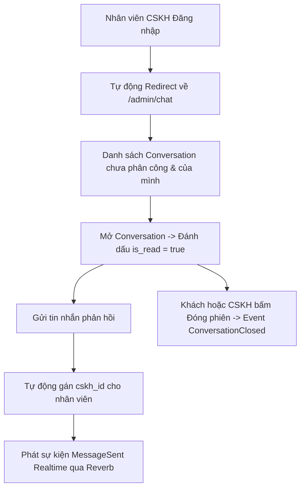
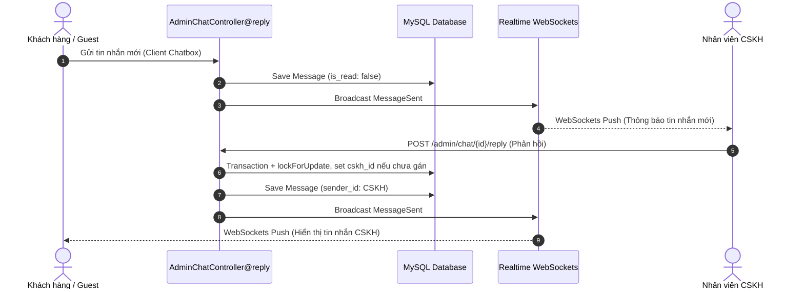

# 📖 TÀI LIỆU CHI TIẾT NGHIỆP VỤ: LUỒNG CHĂM SÓC KHÁCH HÀNG (CSKH FLOW)

> **Dự án:** CHILL DRINK  
> **Phiên bản tài liệu:** 1.1 (Đã đối chiếu lại với code thực tế; các giới hạn còn tồn tại được ghi rõ)  
> **Tài liệu tham chiếu:** [PROJECT_DOCUMENTATION.md](file:///c:/xampp/htdocs/php01/du%20an%201%200000/DU_AN_1/DATN/docs/PROJECT_DOCUMENTATION.md), [NEW_CHAT_DOCUMENTATION.md](file:///c:/xampp/htdocs/php01/du%20an%201%200000/DU_AN_1/DATN/docs/NEW_CHAT_DOCUMENTATION.md)  
> **Ngày cập nhật:** 31/07/2026  
> **Trạng thái:** ⚠️ Đã xác minh các luồng chính; auto-timeout và realtime Guest chưa tự động hoàn toàn  

---

## ⚠️ PHẠM VI TÀI LIỆU

Tài liệu này mô tả **các luồng nghiệp vụ chính của Nhân viên Chăm sóc Khách hàng (CSKH)** — người tiếp nhận và phản hồi tin nhắn trực tuyến từ cả Khách vãng lai và Thành viên (`role_id = 4`, hoặc Admin/SuperAdmin có quyền CSKH).

Tài liệu bao gồm:
- Cơ chế bảo vệ Middleware `cskh` & Tự động điều hướng CSKH từ `/dashboard` về `/admin/chat`.
- Tiếp nhận cuộc trò chuyện, tự động phân công `cskh_id` khi phản hồi tin nhắn đầu tiên trong transaction có khóa bản ghi, tránh hai CSKH cùng nhận một phòng chat.
- Nhắn tin trực tuyến thời gian thực (Realtime WebSockets Laravel Reverb / Pusher).
- API đếm tin nhắn chưa đọc (`unreadCount`) & Danh sách conversation dạng JSON (`conversationList`).
- Tự động đánh dấu `is_read = true` và Đóng cuộc hội thoại (`ConversationClosed`).
- Có command đóng conversation không hoạt động quá 24h (`CloseInactiveConversations`), nhưng command này hiện chưa được đăng ký scheduler; `CleanupOldChats` mới là command có lịch chạy.
- Giám sát & Đóng giả gửi tin nhắn của SuperAdmin (Impersonation Takeover & Audit Logs).

---

## 📋 MỤC LỤC

1. [Tổng Quan Luồng CSKH](#1-tổng-quan-luồng-cskh)
2. [Chi Tiết Các Sub-Flow Nghiệp Vụ](#2-chi-tiết-các-sub-flow-nghiệp-vụ)
   - [2.1. Phân Quyền & Điều Hướng Đăng Nhập CSKH](#21-phân-quyền--điều-hướng-đăng-nhập-cskh)
   - [2.2. Tiếp Nhận & Tự Động Phân Công Cuộc Trò Chuyện](#22-tiếp-nhận--tự-động-phân-công-cuộc-trò-chuyện)
   - [2.3. Nhắn Tin Trực Tuyến Realtime WebSockets & API JSON](#23-nhắn-tin-trực-tuyến-realtime-websockets--api-json)
   - [2.4. Đóng Cuộc Hội Thoại & Auto-Timeout 24h](#24-đóng-cuộc-hội-thoại--auto-timeout-24h)
   - [2.5. Phối Hợp Giám Sát SuperAdmin Impersonation Takeover](#25-phối-hợp-giám-sát-superadmin-impersonation-takeover)
3. [Biểu Đồ Luồng Nghiệp Vụ (Mermaid Diagrams)](#3-biểu-đồ-luồng-nghiệp-vụ-mermaid-diagrams)
4. [Bảng Kê Chi Tiết Endpoints API & Routes](#4-bảng-kê-chi-tiết-endpoints-api--routes)
5. [Bảng Kê File Mã Nguồn Liên Quan](#5-bảng-kê-file-mã-nguồn-liên-quan)

---

## 1. TỔNG QUAN LUỒNG CSKH

Nhân viên CSKH phản hồi các thắc mắc, tư vấn món ăn và hỗ trợ sự cố đơn hàng trực tiếp với khách hàng qua widget chatbox thời gian thực.

---

## 2. CHI TIẾT CÁC SUB-FLOW NGHIỆP VỤ

### 2.1. Phân Quyền & Điều Hướng Đăng Nhập CSKH
- **Mô tả**: Tự động đưa nhân viên CSKH về giao diện làm việc chuyên dụng.
- **Quy tắc nghiệp vụ**:
  - Middleware [CskhMiddleware.php](file:///c:/xampp/htdocs/php01/du%20an%201%200000/DU_AN_1/DATN/chill-drink/app/Http/Middleware/CskhMiddleware.php) kiểm tra `user->isCskh()` (`role_id === 4`, `2` hoặc `3`).
  - Khi tài khoản CSKH đăng nhập hoặc truy cập trang `/dashboard` ➔ Closure logic trong [web.php](file:///c:/xampp/htdocs/php01/du%20an%201%200000/DU_AN_1/DATN/chill-drink/routes/web.php) tự động redirect thẳng về `/admin/chat`.
  - Nút "Quay lại trang quản lý" xuất hiện trên Header cho tất cả nhân viên (`isStaff()`).
- **Mã nguồn liên quan**:
  - Controller: [AdminChatController.php](file:///c:/xampp/htdocs/php01/du%20an%201%200000/DU_AN_1/DATN/chill-drink/app/Http/Controllers/Admin/AdminChatController.php)
  - Middleware: [CskhMiddleware.php](file:///c:/xampp/htdocs/php01/du%20an%201%200000/DU_AN_1/DATN/chill-drink/app/Http/Middleware/CskhMiddleware.php)

---

### 2.2. Tiếp Nhận & Tự Động Phân Công Cuộc Trò Chuyện
- **Mô tả**: Danh sách hội thoại hiển thị các phòng chat chưa có người phụ trách (`cskh_id = null`) hoặc phòng do CSKH đó đảm nhận.
- **Quy tắc nghiệp vụ**:
  - Khi CSKH gửi tin nhắn trả lời đầu tiên vào phòng chat chưa có người phụ trách ➔ Hệ thống dùng `lockForUpdate()` trong transaction, kiểm tra lại trạng thái rồi mới gán `cskh_id = $cskhUser->id`; request cạnh tranh bị từ chối nếu phòng đã được nhận.
  - Đánh dấu tin nhắn là đã đọc (`is_read = true`) cho tất cả tin nhắn gửi từ phía khách hàng khi CSKH nạp danh sách tin nhắn (`messages()`).
  - API `unreadCount()`: Trả về tổng số tin nhắn chưa đọc của nhân viên.
  - API `conversationList()`: Trả về danh sách 50 phòng chat mới nhất kèm số tin nhắn chưa đọc dưới dạng JSON.
- **Mã nguồn liên quan**:
  - Controller: [AdminChatController.php](file:///c:/xampp/htdocs/php01/du%20an%201%200000/DU_AN_1/DATN/chill-drink/app/Http/Controllers/Admin/AdminChatController.php) (các phương thức `index`, `show`, `messages`, `reply`, `unreadCount`, `conversationList`)

---

### 2.3. Nhắn Tin Trực Tuyến Realtime WebSockets & API JSON
- **Mô tả**: Gửi và nhận tin nhắn không độ trễ giữa CSKH và Khách hàng.
- **Quy tắc nghiệp vụ**:
  - Khi CSKH bấm gửi tin nhắn (`reply`): Tạo record [Message.php](file:///c:/xampp/htdocs/php01/du%20an%201%200000/DU_AN_1/DATN/chill-drink/app/Models/Message.php) với `sender_id = $cskhUser->id`.
  - Chuẩn hóa dữ liệu trả về thông qua API Resource [MessageResource.php](file:///c:/xampp/htdocs/php01/du%20an%201%200000/DU_AN_1/DATN/chill-drink/app/Http/Resources/MessageResource.php).
  - Phát sự kiện WebSockets [MessageSent.php](file:///c:/xampp/htdocs/php01/du%20an%201%200000/DU_AN_1/DATN/chill-drink/app/Events/MessageSent.php) lên private channel `conversation.{conversationId}`. Client đã đăng nhập/Admin có thể nhận event; Guest hiện không authorize được private channel và dùng polling.
- **Mã nguồn liên quan**:
  - Controller: [AdminChatController.php@reply](file:///c:/xampp/htdocs/php01/du%20an%201%200000/DU_AN_1/DATN/chill-drink/app/Http/Controllers/Admin/AdminChatController.php)
  - Event: [MessageSent.php](file:///c:/xampp/htdocs/php01/du%20an%201%200000/DU_AN_1/DATN/chill-drink/app/Events/MessageSent.php)
  - Resource: [MessageResource.php](file:///c:/xampp/htdocs/php01/du%20an%201%200000/DU_AN_1/DATN/chill-drink/app/Http/Resources/MessageResource.php)

---

### 2.4. Đóng Cuộc Hội Thoại & Auto-Timeout 24h
- **Mô tả**: Đóng phiên chat sau khi hỗ trợ xong hoặc tự động đóng khi phòng không hoạt động.
- **Quy tắc nghiệp vụ**:
  - **Đóng chủ động (`close`)**: Chuyển status `Conversation` thành `closed`, phát sự kiện [ConversationClosed.php](file:///c:/xampp/htdocs/php01/du%20an%201%200000/DU_AN_1/DATN/chill-drink/app/Events/ConversationClosed.php). Client đã authorize private channel có thể nhận event; Guest nhận trạng thái qua polling.
  - **Đóng theo timeout**: Artisan Command [CloseInactiveConversations.php](file:///c:/xampp/htdocs/php01/du%20an%201%200000/DU_AN_1/DATN/chill-drink/app/Console/Commands/CloseInactiveConversations.php) chuyển các conversation `open` không phát sinh tin nhắn mới trong 24 giờ sang `closed` khi command được gọi. Hiện command chưa có lịch trong `routes/console.php`.
  - **Dọn dẹp lịch sử cũ**: Artisan Command [CleanupOldChats.php](file:///c:/xampp/htdocs/php01/du%20an%201%200000/DU_AN_1/DATN/chill-drink/app/Console/Commands/CleanupOldChats.php) chạy hàng ngày (`daily()`) để dọn dẹp các conversation cũ quá hạn.
- **Mã nguồn liên quan**:
  - Controller: [AdminChatController.php@close](file:///c:/xampp/htdocs/php01/du%20an%201%200000/DU_AN_1/DATN/chill-drink/app/Http/Controllers/Admin/AdminChatController.php)
  - Commands: [CloseInactiveConversations.php](file:///c:/xampp/htdocs/php01/du%20an%201%200000/DU_AN_1/DATN/chill-drink/app/Console/Commands/CloseInactiveConversations.php), [CleanupOldChats.php](file:///c:/xampp/htdocs/php01/du%20an%201%200000/DU_AN_1/DATN/chill-drink/app/Console/Commands/CleanupOldChats.php)

---

### 2.5. Phối Hợp Giám Sát SuperAdmin Impersonation Takeover
- **Mô tả**: Hỗ trợ cơ chế SuperAdmin đóng giả CSKH nhắn tin tư vấn khi cần can thiệp xử lý sự cố.
- **Quy tắc nghiệp vụ**:
  - Tin nhắn do SuperAdmin đóng giả gửi đi vẫn hiển thị tên người gửi là CSKH trên thiết bị của khách hàng (`display_as_sender_id`).
  - Ghi log kiểm toán đầy đủ trong `chat_audit_logs` để đảm bảo tính minh bạch trách nhiệm.
- **Mã nguồn liên quan**:
  - Support: [ChatHelper.php](file:///c:/xampp/htdocs/php01/du%20an%201%200000/DU_AN_1/DATN/chill-drink/app/Support/ChatHelper.php)
  - Models: [ChatTakeoverSession.php](file:///c:/xampp/htdocs/php01/du%20an%201%200000/DU_AN_1/DATN/chill-drink/app/Models/ChatTakeoverSession.php), [ChatAuditLog.php](file:///c:/xampp/htdocs/php01/du%20an%201%200000/DU_AN_1/DATN/chill-drink/app/Models/ChatAuditLog.php)

---

## 3. BIỂU ĐỒ LUỒNG NGHIỆP VỤ (MERMAID DIAGRAMS)

### 3.1 Sơ đồ Trình tự Phản hồi Tin nhắn CSKH (Sequence Diagram)

---

## 4. BẢNG KÊ CHI TIẾT ENDPOINTS API & ROUTES

| HTTP Method | URI | Route Name | Controller @ Method | Mục Đích |
|---|---|---|---|---|
| `GET` | `/admin/chat` | `admin.chat.index` | `AdminChatController@index` | Giao diện Chat CSKH |
| `GET` | `/admin/chat/conversations` | `admin.chat.conversations` | `AdminChatController@conversationList` | AJAX lấy danh sách hội thoại |
| `GET` | `/admin/chat/unread-count` | `admin.chat.unread-count` | `AdminChatController@unreadCount` | API số tin nhắn chưa đọc |
| `GET` | `/admin/chat/{conversation}` | `admin.chat.show` | `AdminChatController@show` | Chi tiết 1 cuộc hội thoại |
| `GET` | `/admin/chat/{conversation}/messages` | `admin.chat.messages` | `AdminChatController@messages` | Danh sách tin nhắn của phòng |
| `POST` | `/admin/chat/{conversation}/reply` | `admin.chat.reply` | `AdminChatController@reply` | Phản hồi tin nhắn |
| `PATCH` | `/admin/chat/{conversation}/close` | `admin.chat.close` | `AdminChatController@close` | Đóng cuộc hội thoại |

---

## 5. STAFF CHAT SAU MERGE

- Staff (`role_id = 5`) uses `/staff/chat` and inherits the chat message/reply/close flow.
- Staff can see and reply only to open customer conversations belonging to the Staff user's branch and not assigned to another worker.
- Every direct view, messages request and reply re-checks branch authorization; users without a branch receive no chat data.
- The shared `/admin/chat` routes accept CSKH and Admin/SuperAdmin; Staff uses its separate `/staff/chat` routes.

## 6. BẢNG KÊ FILE MÃ NGUỒN LIÊN QUAN

- **Controller & Middleware**:
  - [AdminChatController.php](file:///c:/xampp/htdocs/php01/du%20an%201%200000/DU_AN_1/DATN/chill-drink/app/Http/Controllers/Admin/AdminChatController.php)
  - [CskhMiddleware.php](file:///c:/xampp/htdocs/php01/du%20an%201%200000/DU_AN_1/DATN/chill-drink/app/Http/Middleware/CskhMiddleware.php)
- **Events & Resources**:
  - [MessageSent.php](file:///c:/xampp/htdocs/php01/du%20an%201%200000/DU_AN_1/DATN/chill-drink/app/Events/MessageSent.php)
  - [ConversationClosed.php](file:///c:/xampp/htdocs/php01/du%20an%201%200000/DU_AN_1/DATN/chill-drink/app/Events/ConversationClosed.php)
  - [MessageResource.php](file:///c:/xampp/htdocs/php01/du%20an%201%200000/DU_AN_1/DATN/chill-drink/app/Http/Resources/MessageResource.php)
- **Models & Support**:
  - [Conversation.php](file:///c:/xampp/htdocs/php01/du%20an%201%200000/DU_AN_1/DATN/chill-drink/app/Models/Conversation.php)
  - [Message.php](file:///c:/xampp/htdocs/php01/du%20an%201%200000/DU_AN_1/DATN/chill-drink/app/Models/Message.php)
  - [ChatHelper.php](file:///c:/xampp/htdocs/php01/du%20an%201%200000/DU_AN_1/DATN/chill-drink/app/Support/ChatHelper.php)
- **Commands**:
  - [CloseInactiveConversations.php](file:///c:/xampp/htdocs/php01/du%20an%201%200000/DU_AN_1/DATN/chill-drink/app/Console/Commands/CloseInactiveConversations.php)
  - [CleanupOldChats.php](file:///c:/xampp/htdocs/php01/du%20an%201%200000/DU_AN_1/DATN/chill-drink/app/Console/Commands/CleanupOldChats.php)

---
*Tài liệu phản ánh trạng thái code được kiểm tra ngày 31/07/2026; các phần chưa tự động hóa được ghi rõ ở trên.*
