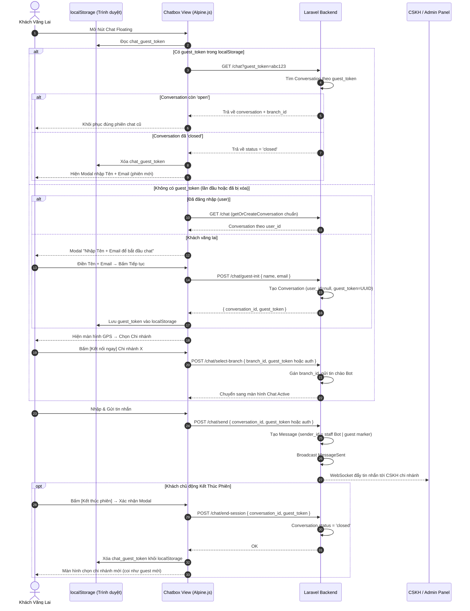

# TÀI LIỆU BỔ SUNG NGHIỆP VỤ: CHAT KHÁCH VÃNG LAI (GUEST CHAT)

> **Dự án:** CHILL DRINK  
> **Phiên bản tài liệu:** 1.1 — Đã đối chiếu với code thực tế  
> **Người thực hiện:** Senior System Analyst  
> **Ngày cập nhật:** 31/07/2026  
> **Trạng thái:** ⚠️ Đã triển khai luồng chính; còn giới hạn realtime và timeout  

---

## ⚠️ PHẠM VI TÀI LIỆU — ĐỌC TRƯỚC KHI CODE

Tài liệu này là **bản bổ sung thứ 2**, xây dựng trên nền:
- `CHAT_DOCUMENTATION.md` — Kiến trúc gốc, giao diện, real-time, phân quyền Admin.
- `NEW_CHAT_DOCUMENTATION.md` — Nghiệp vụ Phiên làm việc & chọn chi nhánh.

**Tài liệu này chỉ mô tả phần delta mới: Cho phép Khách vãng lai (chưa đăng nhập) sử dụng chat.**  
Không viết lại từ đầu — chỉ áp dụng các thay đổi nêu ở đây lên nền code hiện tại.

> **Trạng thái triển khai:** Phần lớn route/controller/view Guest Chat đã có trong code. Tài liệu này được dùng để mô tả hành vi hiện tại, không còn là danh sách việc cần code mới.

> **⚠️ Lưu ý quan trọng về phạm vi:** Tính năng Guest Chat này áp dụng cho việc **khách tự chủ động mở chat** từ nút Floating trên giao diện. Tính năng **tự động kết nối chat theo đơn hàng** (`ChatHelper::ensureChatWithOrderBranch`) hiện tại có guard `if (!auth()->check())` — tức là **Guest đặt đơn hàng sẽ KHÔNG tự động được tạo conversation chat** như user đăng nhập. Việc mở rộng `ChatHelper` cho Guest là phạm vi riêng, cần thảo luận thêm nếu cần.

---

## 📋 MỤC LỤC

1. [Tóm Tắt Delta So Với Hệ Thống Hiện Tại](#1-tóm-tắt-delta-so-với-hệ-thống-hiện-tại)
2. [Định Nghĩa & Quy Tắc Nghiệp Vụ Guest](#2-định-nghĩa--quy-tắc-nghiệp-vụ-guest)
   - [2.1. Nhận Diện Khách Vãng Lai](#21-nhận-diện-khách-vãng-lai)
   - [2.2. Luồng Thông Tin Đầu Vào Của Guest](#22-luồng-thông-tin-đầu-vào-của-guest)
   - [2.3. Vòng Đời Phiên Guest](#23-vòng-đời-phiên-guest)
   - [2.4. Sau Khi Guest Đăng Nhập](#24-sau-khi-guest-đăng-nhập)
   - [2.5. CSKH Nhìn Thấy Gì](#25-cskh-nhìn-thấy-gì)
3. [Biểu Đồ Luồng Nghiệp Vụ (Sequence Diagram)](#3-biểu-đồ-luồng-nghiệp-vụ-sequence-diagram)
4. [Thiết Kế Database (Delta)](#4-thiết-kế-database-delta)
5. [Luồng Nghiệp Vụ Chi Tiết](#5-luồng-nghiệp-vụ-chi-tiết)
6. [Danh Sách File Cần Chỉnh Sửa](#6-danh-sách-file-cần-chỉnh-sửa)

---

## 1. TÓM TẮT DELTA SO VỚI HỆ THỐNG HIỆN TẠI

| # | Điểm thay đổi | Hệ thống cũ | Bổ sung mới |
|---|---|---|---|
| 1 | Quyền truy cập | `middleware('auth')` — phải đăng nhập | Bỏ `auth` middleware trên route `/chat/*` (client). Dùng `guest_token` để xác thực thay thế. |
| 2 | Nhận diện người dùng | `user_id` (FK sang `users`) | Với guest: `user_id = null`, nhận diện qua `guest_token` (UUID lưu trong `localStorage`) |
| 3 | Thông tin đầu vào | Lấy từ tài khoản đăng nhập | Guest phải nhập **Tên + Email** trước khi chat (Modal bước 1) |
| 4 | Lưu trữ lịch sử qua reload | Persistent (user có account) | Persistent qua `localStorage` — tồn tại đến khi xóa localStorage hoặc bấm `[Kết thúc phiên]` |
| 5 | Sau khi guest đăng nhập | Không có | Không merge — conversation guest giữ nguyên riêng; account mới mở chat mới từ đầu |
| 6 | Hiển thị trên Admin Panel | `user.name` + avatar | Guest: `guest_name` nhập lúc đầu + icon/badge "Khách vãng lai", không có avatar |
| 7 | Schema DB | `conversations.user_id NOT NULL` | Thêm `guest_name`, `guest_email`, `guest_token` (nullable); `user_id` cho phép NULL |

---

## 2. ĐỊNH NGHĨA & QUY TẮC NGHIỆP VỤ GUEST

### 2.1. Nhận Diện Khách Vãng Lai

- **Với user đã đăng nhập:** Nhận diện qua `auth()->id()` → gán vào `Conversation.user_id`.
- **Với khách vãng lai:**
  - Backend tạo `guest_token` (UUID v4) khi guest bắt đầu chat → lưu vào `Conversation.guest_token`.
  - Frontend nhận `guest_token` từ API response và lưu vào `localStorage` với key `chat_guest_token`.
  - Các lần sau (reload/mở lại tab): Frontend đọc `localStorage`, gửi `guest_token` lên API để khôi phục conversation cũ thay vì tạo mới.

> **Nguyên tắc bảo mật tối thiểu:** `guest_token` là chuỗi ngẫu nhiên độ mạnh UUID — đủ để ngăn người khác đoán mò, nhưng không mã hóa phức tạp. Nếu mất (xóa localStorage) → mất quyền truy cập conversation đó, tạo conversation mới.

---

### 2.2. Luồng Thông Tin Đầu Vào Của Guest

Khi khách vãng lai mở chatbox lần đầu tiên (không có `guest_token` trong localStorage):

1. **Bước 1 — Modal thông tin** (xuất hiện trước khi chọn chi nhánh):
   - **Tên** (bắt buộc): CSKH dùng để xưng hô khi hỗ trợ.
   - **Email** (bắt buộc): CSKH liên hệ lại nếu cần, dùng để tra cứu lịch sử.
   - Sau khi điền → hệ thống tạo `Conversation` + cấp `guest_token` + lưu vào `localStorage`.

2. **Bước 2 — Chọn chi nhánh:** Giống hệt luồng user đăng nhập (GPS → 3 chi nhánh gần nhất).

3. **Bước 3 — Chat:** Giống hệt luồng user đăng nhập.

---

### 2.3. Vòng Đời Phiên Guest

| Sự kiện | Xử lý |
|---|---|
| Lần đầu mở chatbox (không có `guest_token`) | Hiện Modal nhập Tên + Email → tạo Conversation + cấp token → lưu vào localStorage |
| Reload trang / mở lại tab (có `guest_token`) | Đọc token từ localStorage → gọi `GET /chat?guest_token=...` → khôi phục conversation cũ, không hỏi lại Tên/Email |
| Mất `guest_token` (xóa localStorage / đổi trình duyệt) | Tạo conversation mới từ đầu, nhập lại thông tin |
| Bấm `[Kết thúc phiên]` (chủ động) | `status = 'closed'`, xóa `guest_token` khỏi localStorage → lần sau chat lại là guest mới |
| CSKH đóng phiên từ Admin Panel | `status = 'closed'`, server broadcast `ConversationClosed`; Guest kiểm tra trạng thái qua polling vì không subscribe private channel |
| Timeout 24h không có tin nhắn | Command `CloseInactiveConversations` có thể set `status = 'closed'` khi được gọi; hiện chưa được scheduler tự động chạy |
| Dọn dẹp dữ liệu lâu dài | (Tùy chọn) Job xóa Conversation guest `closed` sau 30 ngày không hoạt động |

---

### 2.4. Sau Khi Guest Đăng Nhập

- **Không merge** Conversation guest vào tài khoản vừa đăng nhập.
- Conversation guest giữ nguyên trạng thái hiện tại (open/closed) với `user_id = null`.
- Sau khi đăng nhập, hệ thống hoạt động theo luồng user bình thường (`getOrCreateConversation` tìm Conversation gắn `user_id`).
- CSKH vẫn có thể tra cứu conversation guest cũ qua `guest_email` nếu cần.

> **Realtime Guest:** Conversation guest vẫn được broadcast event ở server, nhưng guest không authorize được private channel `conversation.{id}` trong `routes/channels.php`. Vì vậy phía Guest hiện nhận tin nhắn qua polling, không nên mô tả là WebSocket realtime đầy đủ.

---

### 2.5. CSKH Nhìn Thấy Gì

Trên Admin Panel, với conversation từ khách vãng lai:
- **Tên hiển thị:** `guest_name` đã nhập (VD: "Nguyễn Văn A") — không có avatar, thay bằng icon 👤 + badge màu khác nhận biết.
- **Email:** Hiển thị `guest_email` ở phần chi tiết conversation (CSKH có thể liên hệ lại).
- **Phân biệt:** Badge/tag "Khách vãng lai" cạnh tên để CSKH biết đây không phải tài khoản đăng ký.
- Phân quyền xem theo `branch_id` vẫn giữ nguyên — CSKH chỉ thấy conversation guest thuộc chi nhánh mình.

---

## 3. BIỂU ĐỒ LUỒNG NGHIỆP VỤ (SEQUENCE DIAGRAM)



---

## 4. THIẾT KẾ DATABASE (DELTA)

### Thay đổi bảng `conversations` (Migration mới)

```sql
-- Thêm 3 cột mới, cho phép NULL
ALTER TABLE conversations
    ADD COLUMN guest_name  VARCHAR(255) NULL AFTER user_id,
    ADD COLUMN guest_email VARCHAR(255) NULL AFTER guest_name,
    ADD COLUMN guest_token VARCHAR(255) NULL UNIQUE AFTER guest_email;

-- Bỏ NOT NULL constraint của user_id (nếu đang có)
ALTER TABLE conversations
    MODIFY COLUMN user_id BIGINT UNSIGNED NULL;

-- Index để query nhanh theo token
CREATE INDEX idx_conversations_guest_token ON conversations (guest_token);
CREATE INDEX idx_conversations_guest_email ON conversations (guest_email);
```

### Ràng buộc dữ liệu (Business Rule ở tầng Application)

- `user_id` và `guest_token` **không được cùng NULL** — một trong hai phải có giá trị.
- `user_id` có giá trị → `guest_*` fields phải NULL (user thường).
- `user_id = null` → `guest_token`, `guest_name`, `guest_email` phải có giá trị (guest conversation).

---

## 5. LUỒNG NGHIỆP VỤ CHI TIẾT

### Luồng G1: Guest Mở Chat Lần Đầu

1. Mở Chatbox → View kiểm tra `localStorage['chat_guest_token']` → không có.
2. Nếu chưa đăng nhập → hiện **Modal Thông Tin Guest** (Tên + Email).
3. Guest điền thông tin → POST `/chat/guest-init` → server tạo Conversation (`user_id=null`, `guest_token=UUID`) → trả về token → View lưu vào localStorage.
4. Tiếp tục luồng chọn chi nhánh (GPS → 3 chi nhánh → `POST /chat/select-branch`) → chat.

### Luồng G2: Guest Reload / Mở Lại Tab

1. Mở Chatbox → đọc `localStorage['chat_guest_token']` → có token.
2. GET `/chat?guest_token=abc123` → server tìm Conversation `status='open'` với token đó.
3. Nếu còn open + có branch_id → khôi phục màn hình chat ngay, không hỏi lại thông tin.
4. Nếu đã closed → xóa token khỏi localStorage → coi như guest mới, về luồng G1.

### Luồng G3: Guest Kết Thúc Phiên

1. Bấm `[Kết thúc phiên]` → Modal xác nhận (giống user đăng nhập).
2. Bấm xác nhận → POST `/chat/end-session` → server set `status = 'closed'`.
3. View xóa `localStorage['chat_guest_token']`.
4. Màn hình reset → lần chat tiếp theo là guest mới hoàn toàn (nhập lại Tên + Email).

### Luồng G4: Xác Thực Quyền Gửi Tin Nhắn

- Mọi request từ guest phải kèm `guest_token` (hoặc xác thực qua session nếu dùng cookie).
- Server kiểm tra: `Conversation.guest_token == request.guest_token` trước khi cho phép gửi tin.
- Nếu không khớp → 403.

---

## 6. CÁC FILE ĐÃ TRIỂN KHAI VÀ CẦN THEO DÕI

| STT | File | Loại | Nội dung chỉnh sửa |
|---|---|---|---|
| 1 | `database/migrations/2026_07_20_202147_add_guest_fields_to_conversations_table.php` | Migration | Đã thêm `guest_name`, `guest_email`, `guest_token` và cho phép `user_id` NULL. |
| 2 | `routes/web.php` | Route | Bỏ `middleware('auth')` khỏi nhóm `/chat/*` client. Thêm route `POST /chat/guest-init`. |
| 3 | `app/Http/Controllers/Client/ChatController.php` | Controller | Đã có `guestInit()`, xác thực `guest_token`, chọn branch, đọc/gửi/kết thúc session cho Guest. Tin nhắn gửi vào conversation đã đóng hiện bị từ chối; chưa tự mở lại conversation. |
| 4 | `app/Models/Conversation.php` | Model | - Thêm `guest_name`, `guest_email`, `guest_token` vào `$fillable`.<br>- Thêm scope `scopeForGuest($query, $token)` và helper `isOwnedBy($userId, $guestToken)`. |
| 5 | `resources/views/components/chatbox.blade.php` | View (Alpine.js) | Đã có state/modal Guest, lưu token ở localStorage và polling. Guest không subscribe private Echo channel. |
| 6 | `resources/views/admin/chat/index.blade.php` | Admin View | Hiển thị `guest_name` thay `user.name` khi `user_id = null`. Thêm badge "Khách vãng lai" + `guest_email` trong chi tiết conversation. |
| 7 | `app/Http/Controllers/Admin/AdminChatController.php` | Admin Controller | Cập nhật `conversationQuery()` và `conversationList()` để hiển thị đúng `guest_name`/`guest_email` cho conversation guest. |

---

## 7. THAM CHIẾU CÁC TÀI LIỆU LIÊN QUAN

- 📍 [CHAT_DOCUMENTATION.md](file:///c:/xampp/htdocs/php01/du%20an%201%200000/DU_AN_1/DATN/docs/CHAT_DOCUMENTATION.md) — Kiến trúc & code gốc
- 📍 [NEW_CHAT_DOCUMENTATION.md](file:///c:/xampp/htdocs/php01/du%20an%201%200000/DU_AN_1/DATN/docs/NEW_CHAT_DOCUMENTATION.md) — Nghiệp vụ Phiên làm việc & chọn chi nhánh
