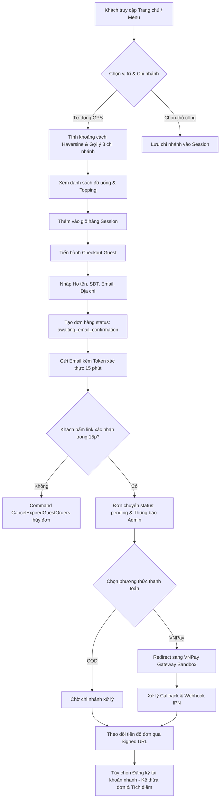
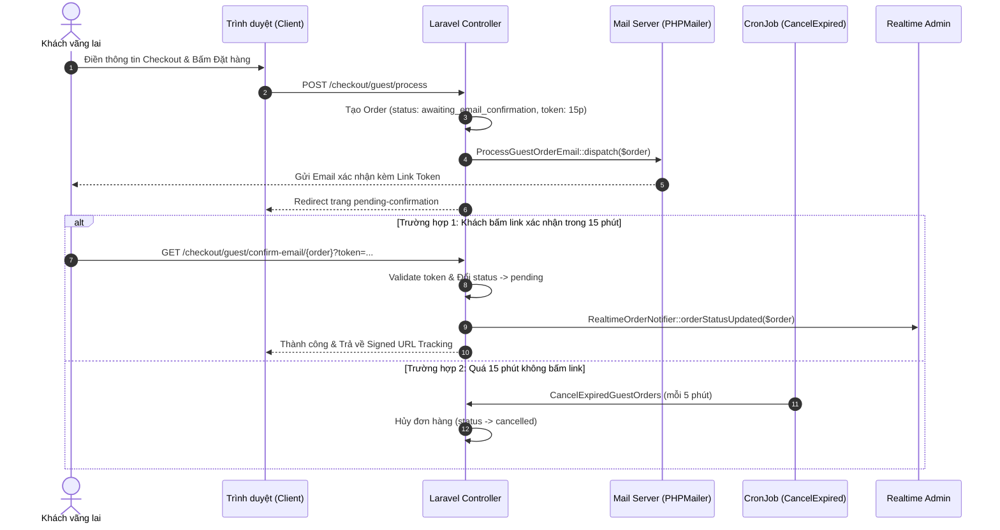

# 📖 TÀI LIỆU CHI TIẾT NGHIỆP VỤ: LUỒNG KHÁCH VÃNG LAI (GUEST FLOW)

> **Dự án:** CHILL DRINK  
> **Phiên bản tài liệu:** 1.1 (Đã đối chiếu lại với code thực tế; các giới hạn được ghi rõ)  
> **Tài liệu tham chiếu:** [PROJECT_DOCUMENTATION.md](file:///c:/xampp/htdocs/php01/du%20an%201%200000/DU_AN_1/DATN/docs/PROJECT_DOCUMENTATION.md)  
> **Ngày cập nhật:** 31/07/2026  
> **Trạng thái:** ⚠️ Đã xác minh luồng chính; Guest API checkout và convert-to-member còn thiếu hoàn thiện  

---

## ⚠️ PHẠM VI TÀI LIỆU

Tài liệu này mô tả **các luồng nghiệp vụ chính của Khách vãng lai (Guest User)** — người dùng truy cập ứng dụng **mà không cần đăng ký hay đăng nhập tài khoản**.

Tài liệu bao gồm:
- Toàn bộ các bước từ duyệt Menu, chọn món, giỏ hàng Session, Đặt hàng Guest, Xác nhận Email 15 phút, Theo dõi đơn Signed URL.
- Tra cứu đơn hàng công khai (`OrderLookupController`).
- Thanh toán VNPay Sandbox & Webhook IPN.
- Khung Chat hỗ trợ Guest bằng `guest_token` UUID và chọn chi nhánh.
- Định vị GPS Haversine, Reverse Geocode và Giải mã link Google Maps.
- Chuyển đổi Khách vãng lai thành Hội viên chính thức (Guest-to-Member Conversion).

---

## 📋 MỤC LỤC

1. [Tổng Quan Luồng Khách Vãng Lai](#1-tổng-quan-luồng-khách-vãng-lai)
2. [Chi Tiết Các Sub-Flow Nghiệp Vụ](#2-chi-tiết-các-sub-flow-nghiệp-vụ)
   - [2.1. Duyệt Sản Phẩm & Chọn Chi Nhánh Gần Nhất](#21-duyệt-sản-phẩm--chọn-chi-nhánh-gần-nhất)
   - [2.2. Quản Lý Giỏ Hàng Session (Session Cart)](#22-quản-lý-giỏ-hàng-session-session-cart)
   - [2.3. Đặt Hàng Không Đăng Nhập & Xác Nhận Email 15 Phút](#23-đặt-hàng-không-đăng-nhập--xác-nhận-email-15-phút)
   - [2.4. Theo Dõi Đơn Hàng Qua Signed URL (Tracking)](#24-theo-dõi-đơn-hàng-qua-signed-url-tracking)
   - [2.5. Tra Cứu Đơn Hàng Công Khai (Order Lookup)](#25-tra-cứu-đơn-hàng-công-khai-order-lookup)
   - [2.6. Thanh Toán Trực Tuyến VNPay (Sandbox & IPN Webhook)](#26-thanh-toán-trực-tuyến-vnpay-sandbox--ipn-webhook)
   - [2.7. Chat Hỗ Trợ Guest (Guest Chatbot & Token UUID)](#27-chat-hỗ-trợ-guest-guest-chatbot--token-uuid)
   - [2.8. Chuyển Đổi Khách Sang Thành Viên (Guest-to-Member)](#28-chuyển-đổi-khách-sang-thành-viên-guest-to-member)
   - [2.9. Tích Hợp GPS, Haversine & Google Maps Resolver](#29-tích-hợp-gps-haversine--google-maps-resolver)
3. [Biểu Đồ Luồng Nghiệp Vụ (Mermaid Sequence & Flowchart Diagrams)](#3-biểu-đồ-luồng-nghiệp-vụ-mermaid-sequence--flowchart-diagrams)
4. [Bảng Kê Chi Tiết Endpoints API & Routes](#4-bảng-kê-chi-tiết-endpoints-api--routes)
5. [Bảng Kê File Mã Nguồn Liên Quan](#5-bảng-kê-file-mã-nguồn-liên-quan)

---

## 1. TỔNG QUAN LUỒNG KHÁCH VÃNG LAI

Khách vãng lai (Guest) là đối tượng người dùng trải nghiệm dịch vụ của Chill Drink nhanh chóng mà không gặp rào cản đăng ký tài khoản.

---

## 2. CHI TIẾT CÁC SUB-FLOW NGHIỆP VỤ

### 2.1. Duyệt Sản Phẩm & Chọn Chi Nhánh Gần Nhất
- **Mô tả**: Duyệt danh sách món ăn/đồ uống, xem chi tiết từng món (Size, lượng đường/đá, topping) và chọn chi nhánh phục vụ.
- **Quy tắc nghiệp vụ**:
  - Chỉ hiển thị các sản phẩm đang có `status = true`.
  - Nếu danh mục sản phẩm có Soft Delete, hệ thống dùng `withTrashed()` để đảm bảo không gãy dữ liệu hiển thị.
  - Topping hiển thị động dựa trên danh mục đồ uống.
  - Đánh giá trung bình sao (`approved_reviews_avg_rating`) được tính từ các review có `status = true`.
- **Mã nguồn liên quan**:
  - Controller: [HomeController.php](file:///c:/xampp/htdocs/php01/du%20an%201%200000/DU_AN_1/DATN/chill-drink/app/Http/Controllers/Client/HomeController.php), [ProductController.php](file:///c:/xampp/htdocs/php01/du%20an%201%200000/DU_AN_1/DATN/chill-drink/app/Http/Controllers/Client/ProductController.php)
  - Support: [ProductCatalog.php](file:///c:/xampp/htdocs/php01/du%20an%201%200000/DU_AN_1/DATN/chill-drink/app/Support/ProductCatalog.php), [ProductImage.php](file:///c:/xampp/htdocs/php01/du%20an%201%200000/DU_AN_1/DATN/chill-drink/app/Support/ProductImage.php)

---

### 2.2. Quản Lý Giỏ Hàng Session (Session Cart)
- **Mô tả**: Lưu trữ giỏ hàng trong `session('cart')` của thiết bị mà không cần cơ sở dữ liệu.
- **Quy tắc nghiệp vụ**:
  - Key của giỏ hàng trong session được định dạng kết hợp: `{product_id}_{size_id}_{toppings_hash}_{ice}_{sugar}` để phân biệt các tùy chọn khác nhau của cùng một món.
  - Chênh lệch giá Size: Size S (+0đ), Size M (+5.000đ), Size L (+10.000đ).
  - Giá món = (Giá gốc sản phẩm + Giá Size + Tổng giá Toppings) $\times$ Số lượng.
- **Mã nguồn liên quan**:
  - Controller: [CartController.php](file:///c:/xampp/htdocs/php01/du%20an%201%200000/DU_AN_1/DATN/chill-drink/app/Http/Controllers/Client/CartController.php)

---

### 2.3. Đặt Hàng Không Đăng Nhập & Xác Nhận Email 15 Phút
- **Mô tả**: Đặt hàng trực tiếp với Email và SĐT cá nhân. Hệ thống áp dụng cơ chế xác thực Email để ngăn ngừa đơn hàng ảo (Spam).
- **Quy tắc nghiệp vụ**:
  1. Khi gửi form checkout, hệ thống sinh `order_code` dạng `CD-YYYYMMDD-XXXX` qua [OrderCodeGenerator.php](file:///c:/xampp/htdocs/php01/du%20an%201%200000/DU_AN_1/DATN/chill-drink/app/Services/OrderCodeGenerator.php).
  2. Đơn hàng khởi tạo với `status = 'awaiting_email_confirmation'`, `confirmation_token = Str::random(40)`, `confirmation_token_expires_at = now()->addMinutes(15)`.
  3. Đơn hàng ở trạng thái này sẽ **bị ẩn hoàn toàn trên giao diện Admin chi nhánh**.
  4. Dispatch Job [ProcessGuestOrderEmail.php](file:///c:/xampp/htdocs/php01/du%20an%201%200000/DU_AN_1/DATN/chill-drink/app/Jobs/ProcessGuestOrderEmail.php) để gửi email [GuestOrderEmailConfirmationMail.php](file:///c:/xampp/htdocs/php01/du%20an%201%200000/DU_AN_1/DATN/chill-drink/app/Mail/GuestOrderEmailConfirmationMail.php).
  5. Nếu quá 15 phút khách không bấm xác nhận, Artisan command [CancelExpiredGuestOrders.php](file:///c:/xampp/htdocs/php01/du%20an%201%200000/DU_AN_1/DATN/chill-drink/app/Console/Commands/CancelExpiredGuestOrders.php) chạy định kỳ mỗi 5 phút sẽ tự động chuyển `status = 'cancelled'`.
  6. Khi khách bấm link xác nhận: `status` chuyển sang `pending`, gửi thông báo realtime tới Admin qua [RealtimeOrderNotifier.php](file:///c:/xampp/htdocs/php01/du%20an%201%200000/DU_AN_1/DATN/chill-drink/app/Support/RealtimeOrderNotifier.php), đồng thời cấp token truy cập vào `session('guest_order_tokens')`.
- **Mã nguồn liên quan**:
  - Controller: [GuestCheckoutController.php](file:///c:/xampp/htdocs/php01/du%20an%201%200000/DU_AN_1/DATN/chill-drink/app/Http/Controllers/Client/GuestCheckoutController.php)
  - Mail: [GuestOrderEmailConfirmationMail.php](file:///c:/xampp/htdocs/php01/du%20an%201%200000/DU_AN_1/DATN/chill-drink/app/Mail/GuestOrderEmailConfirmationMail.php)
  - Command: [CancelExpiredGuestOrders.php](file:///c:/xampp/htdocs/php01/du%20an%201%200000/DU_AN_1/DATN/chill-drink/app/Console/Commands/CancelExpiredGuestOrders.php)

---

### 2.4. Theo Dõi Đơn Hàng Qua Signed URL (Tracking)
- **Mô tả**: Khách xem trạng thái đơn hàng qua signed URL/API mà không cần đăng nhập; việc cập nhật phụ thuộc polling/broadcast được client hỗ trợ.
- **Quy tắc nghiệp vụ**:
  - URL theo dõi sử dụng Laravel Temporary Signed Route (`URL::temporarySignedRoute('checkout.guest.track', now()->addDays(7), ...)`).
  - Tích hợp Middleware `signed` bảo vệ URL chống giả mạo tham số `order_id` hoặc `guest_token`.
  - Class [GuestOrderAccess.php](file:///c:/xampp/htdocs/php01/du%20an%201%200000/DU_AN_1/DATN/chill-drink/app/Support/GuestOrderAccess.php) kiểm tra quyền sở hữu bằng cách so khớp session token.
- **Mã nguồn liên quan**:
  - Support: [GuestOrderAccess.php](file:///c:/xampp/htdocs/php01/du%20an%201%200000/DU_AN_1/DATN/chill-drink/app/Support/GuestOrderAccess.php)
  - Controller: [GuestCheckoutController.php@track](file:///c:/xampp/htdocs/php01/du%20an%201%200000/DU_AN_1/DATN/chill-drink/app/Http/Controllers/Client/GuestCheckoutController.php)

---

### 2.5. Tra Cứu Đơn Hàng Công Khai (Order Lookup)
- **Mô tả**: Bất kỳ ai có mã đơn hàng đều có thể kiểm tra tiến độ giao hàng trên trang Tra cứu.
- **Quy tắc nghiệp vụ**:
  - Nhập mã đơn hàng `order_code` (VD: `CD-20260730-0001` hoặc `CN1-ON-20260728-0002`).
  - Hỗ trợ tìm kiếm theo ID legacy `#id` cho các đơn hàng cũ.
  - Tìm kiếm không phân biệt chữ hoa/thường (`LOWER(order_code)`).
  - Trả về thông tin tóm tắt: Trạng thái hiện tại, màu sắc badge, địa chỉ nhận hàng, hình thức thanh toán và thời gian dự kiến giao.
- **Mã nguồn liên quan**:
  - Controller: [OrderLookupController.php](file:///c:/xampp/htdocs/php01/du%20an%201%200000/DU_AN_1/DATN/chill-drink/app/Http/Controllers/Client/OrderLookupController.php)
  - View: [order-lookup/index.blade.php](file:///c:/xampp/htdocs/php01/du%20an%201%200000/DU_AN_1/DATN/chill-drink/resources/views/client/order-lookup/index.blade.php)

---

### 2.6. Thanh Toán Trực Tuyến VNPay (Sandbox & IPN Webhook)
- **Mô tả**: Tích hợp cổng thanh toán trực tuyến VNPAY.
- **Quy tắc nghiệp vụ**:
  - **Redirect URL**: Sinh chuỗi query kèm chữ ký HMAC-SHA512 (`vnp_SecureHash`) gửi tới cổng VNPAY Sandbox.
  - **Return URL (`/vnpay/return`)**: Tiếp nhận khách hàng quay lại từ cổng thanh toán, kiểm tra chữ ký và hiển thị kết quả thành công/thất bại.
  - **IPN Webhook (`/vnpay/ipn`)**: VNPAY Server gọi ngầm hậu đài để cập nhật trạng thái đơn ngay cả khi khách đóng trình duyệt. Sử dụng DB Lock `Order::where(...)->lockForUpdate()->first()` chống Race Condition khi nhiều request IPN trùng lặp.
- **Mã nguồn liên quan**:
  - Controller: [VnpayController.php](file:///c:/xampp/htdocs/php01/du%20an%201%200000/DU_AN_1/DATN/chill-drink/app/Http/Controllers/Client/VnpayController.php)

---

### 2.7. Chat Hỗ Trợ Guest (Guest Chatbot & Token UUID)
- **Mô tả**: Khách vãng lai nhắn tin trực tiếp với nhân viên CSKH mà không cần đăng nhập tài khoản.
- **Quy tắc nghiệp vụ**:
  - Bắt đầu chat: Khách nhập `guest_name` và `guest_email`.
  - Hệ thống sinh UUID `guest_token` duy nhất lưu vào `localStorage` thiết bị.
  - Mỗi khi kết nối: Server kiểm tra `guest_token`, nếu có conversation cũ ở trạng thái `open` ➔ khôi phục lại phòng chat cũ.
  - Chọn chi nhánh: Khách chọn chi nhánh muốn kết nối (`selectBranch`), gán `branch_id` vào `Conversation`.
  - Kết thúc phiên: Bấm nút `[Đổi chi nhánh]` hoặc `[Kết thúc phiên]` ➔ gọi API `POST /chat/end-session`, đổi status sang `closed`.
- **Mã nguồn liên quan**:
  - Controller: [ChatController.php](file:///c:/xampp/htdocs/php01/du%20an%201%200000/DU_AN_1/DATN/chill-drink/app/Http/Controllers/Client/ChatController.php)
  - Component: [chatbox.blade.php](file:///c:/xampp/htdocs/php01/du%20an%201%200000/DU_AN_1/DATN/chill-drink/resources/views/components/chatbox.blade.php)

---

### 2.8. Chuyển Đổi Khách Sang Thành Viên (Guest-to-Member)
- **Mô tả**: Đăng ký nhanh tài khoản sau khi mua hàng thành công để giữ lại lịch sử đơn và nhận điểm thưởng.
- **Quy tắc nghiệp vụ**:
  - Lấy thông tin Tên, Email, SĐT từ đơn hàng vừa đặt.
  - Khách chỉ cần nhập Mật khẩu và Xác nhận Mật khẩu.
  - Khi tạo tài khoản thành công: Hệ thống tự động truy vấn toàn bộ các đơn hàng cũ có cùng `guest_email` chưa được gán user và cập nhật `user_id = $new_user_id`.
  - Tự động cộng tổng điểm Loyalty Points earned từ tất cả các đơn hàng cũ đó vào tài khoản mới.
- **Mã nguồn liên quan**:
  - Controller Web: [GuestConvertController.php](file:///c:/xampp/htdocs/php01/du%20an%201%200000/DU_AN_1/DATN/chill-drink/app/Http/Controllers/Auth/GuestConvertController.php)
  - Controller API: [Api\GuestCheckoutController.php@convertToMember](file:///c:/xampp/htdocs/php01/du%20an%201%200000/DU_AN_1/DATN/chill-drink/app/Http/Controllers/Api/GuestCheckoutController.php)

---

### 2.9. Tích Hợp GPS, Haversine & Google Maps Resolver
- **Mô tả**: Tự động xác định khoảng cách địa lý và gợi ý chi nhánh phục vụ gần nhất kèm phí vận chuyển.
- **Quy tắc nghiệp vụ**:
  - **Công thức Haversine**: Tính khoảng cách đường chim bay giữa tọa độ GPS người dùng và tọa độ chi nhánh trong DB.
  - **Shipping Fee**:
    - $\le 2\text{ km}$: $15.000\text{đ}$
    - $> 2\text{ km}$: $15.000\text{đ} + 5.000\text{đ/km}$ bổ sung.
    - Đơn $\ge 500.000\text{đ}$: Miễn phí ship ($0\text{đ}$).
  - **Reverse Geocode API**: Kết hợp Nominatim & Overpass API để chuyển tọa độ lat/lng thành địa chỉ có tên đường, phường, quận, tỉnh.
  - **Google Maps Link Resolver**: Tự động giải mã link Google Maps dán vào (chứa `/maps/`, `@lat,lng`, `!3d!4d`) thành tọa độ GPS chuẩn.
- **Mã nguồn liên quan**:
  - Support: [ShippingFee.php](file:///c:/xampp/htdocs/php01/du%20an%201%200000/DU_AN_1/DATN/chill-drink/app/Support/ShippingFee.php)
  - Controller API: [NearestBranchController.php](file:///c:/xampp/htdocs/php01/du%20an%201%200000/DU_AN_1/DATN/chill-drink/app/Http/Controllers/Api/NearestBranchController.php), [ReverseGeocodeController.php](file:///c:/xampp/htdocs/php01/du%20an%201%200000/DU_AN_1/DATN/chill-drink/app/Http/Controllers/Api/ReverseGeocodeController.php), [ResolveMapLinkController.php](file:///c:/xampp/htdocs/php01/du%20an%201%200000/DU_AN_1/DATN/chill-drink/app/Http/Controllers/Api/ResolveMapLinkController.php)

---

## 3. BIỂU ĐỒ LUỒNG NGHIỆP VỤ (MERMAID DIAGRAMS)

### 3.1 Sơ đồ Trình tự Đặt hàng Guest & Xác nhận Email (Sequence Diagram)

---

## 4. BẢNG KÊ CHI TIẾT ENDPOINTS API & ROUTES

| HTTP Method | URI | Route Name | Controller @ Method | Mục Đích |
|---|---|---|---|---|
| `GET` | `/` | `home` | `HomeController@index` | Trang chủ hệ thống |
| `POST` | `/select-nearest-branch` | `select-nearest-branch` | `HomeController@selectNearestBranch` | Chọn chi nhánh gần nhất |
| `GET` | `/products` | `products.index` | `ProductController@index` | Danh sách sản phẩm |
| `GET` | `/products/{slug}` | `products.show` | `ProductController@show` | Chi tiết sản phẩm |
| `GET` | `/cart` | `cart.index` | `CartController@index` | Xem giỏ hàng session |
| `POST` | `/cart/add/{id}` | `cart.add` | `CartController@add` | Thêm món vào giỏ |
| `PATCH` | `/cart/update/{id}` | `cart.update` | `CartController@update` | Cập nhật số lượng/tùy chọn |
| `DELETE` | `/cart/remove/{id}` | `cart.remove` | `CartController@remove` | Xóa món khỏi giỏ |
| `DELETE` | `/cart/clear` | `cart.clear` | `CartController@clear` | Xóa toàn bộ giỏ hàng |
| `GET` | `/checkout/guest` | `checkout.guest.index` | `GuestCheckoutController@index` | Trang Checkout Guest |
| `POST` | `/checkout/guest/info` | `checkout.guest.info.store` | `GuestCheckoutController@storeInfo` | Lưu thông tin khách |
| `GET` | `/checkout/guest/payment` | `checkout.guest.payment` | `GuestCheckoutController@payment` | Chọn phương thức thanh toán |
| `POST` | `/checkout/guest/process` | `checkout.guest.process` | `GuestCheckoutController@process` | Tạo đơn hàng Guest |
| `GET` | `/checkout/guest/pending-confirmation/{order}` | `checkout.guest.pending-confirmation` | `GuestCheckoutController@pendingConfirmation` | Trang chờ xác nhận email |
| `GET` | `/checkout/guest/confirm-email/{order}` | `checkout.guest.confirm-email` | `GuestCheckoutController@confirmEmail` | Endpoint xác thực email token |
| `GET` | `/checkout/guest/track/{order}` | `checkout.guest.track` | `GuestCheckoutController@track` | Theo dõi đơn qua Signed URL |
| `POST` | `/register/guest-convert` | `register.guest-convert` | `GuestConvertController@store` | Đăng ký thành viên từ đơn Guest |
| `GET` | `/tra-cuu-don-hang` | `order-lookup.index` | `OrderLookupController@index` | Giao diện tra cứu đơn |
| `POST` | `/tra-cuu-don-hang` | `order-lookup.search` | `OrderLookupController@search` | Xử lý tra cứu mã đơn |
| `GET` | `/tra-cuu-don-hang/{order}/status` | `order-lookup.status` | `OrderLookupController@status` | Status JSON cho frontend |
| `GET` | `/vnpay/payment/{order}` | `vnpay.payment` | `VnpayController@payment` | Redirect sang VNPay |
| `GET` | `/vnpay/return` | `vnpay.return` | `VnpayController@return` | Callback từ VNPay |
| `GET` | `/vnpay/ipn` | `vnpay.ipn` | `VnpayController@ipn` | Webhook ngầm từ VNPay |
| `POST` | `/chat/guest-init` | `chat.guest-init` | `ChatController@guestInit` | Khởi tạo phiên chat guest UUID |
| `POST` | `/chat/select-branch` | `chat.select-branch` | `ChatController@selectBranch` | Chọn chi nhánh chat |
| `POST` | `/chat/end-session` | `chat.end-session` | `ChatController@endSession` | Kết thúc phiên chat |
| `GET` | `/api/branches/nearest` | `api.branches.nearest` | `NearestBranchController@nearest` | API định vị chi nhánh gần nhất |
| `GET` | `/api/reverse-geocode` | `api.reverse-geocode` | `ReverseGeocodeController` | API Reverse Geocode |
| `GET` | `/api/map-link/resolve` | `api.map-link.resolve` | `ResolveMapLinkController` | API giải mã link Google Maps |

---

## 5. BẢNG KÊ FILE MÃ NGUỒN LIÊN QUAN

- **Controllers**:
  - [HomeController.php](file:///c:/xampp/htdocs/php01/du%20an%201%200000/DU_AN_1/DATN/chill-drink/app/Http/Controllers/Client/HomeController.php)
  - [ProductController.php](file:///c:/xampp/htdocs/php01/du%20an%201%200000/DU_AN_1/DATN/chill-drink/app/Http/Controllers/Client/ProductController.php)
  - [CartController.php](file:///c:/xampp/htdocs/php01/du%20an%201%200000/DU_AN_1/DATN/chill-drink/app/Http/Controllers/Client/CartController.php)
  - [GuestCheckoutController.php (Client)](file:///c:/xampp/htdocs/php01/du%20an%201%200000/DU_AN_1/DATN/chill-drink/app/Http/Controllers/Client/GuestCheckoutController.php)
  - [GuestCheckoutController.php (Api)](file:///c:/xampp/htdocs/php01/du%20an%201%200000/DU_AN_1/DATN/chill-drink/app/Http/Controllers/Api/GuestCheckoutController.php)
  - [OrderLookupController.php](file:///c:/xampp/htdocs/php01/du%20an%201%200000/DU_AN_1/DATN/chill-drink/app/Http/Controllers/Client/OrderLookupController.php)
  - [VnpayController.php](file:///c:/xampp/htdocs/php01/du%20an%201%200000/DU_AN_1/DATN/chill-drink/app/Http/Controllers/Client/VnpayController.php)
  - [ChatController.php](file:///c:/xampp/htdocs/php01/du%20an%201%200000/DU_AN_1/DATN/chill-drink/app/Http/Controllers/Client/ChatController.php)
  - [GuestConvertController.php](file:///c:/xampp/htdocs/php01/du%20an%201%200000/DU_AN_1/DATN/chill-drink/app/Http/Controllers/Auth/GuestConvertController.php)
  - [NearestBranchController.php](file:///c:/xampp/htdocs/php01/du%20an%201%200000/DU_AN_1/DATN/chill-drink/app/Http/Controllers/Api/NearestBranchController.php)
  - [ReverseGeocodeController.php](file:///c:/xampp/htdocs/php01/du%20an%201%200000/DU_AN_1/DATN/chill-drink/app/Http/Controllers/Api/ReverseGeocodeController.php)
  - [ResolveMapLinkController.php](file:///c:/xampp/htdocs/php01/du%20an%201%200000/DU_AN_1/DATN/chill-drink/app/Http/Controllers/Api/ResolveMapLinkController.php)
- **Support & Services**:
  - [OrderCodeGenerator.php](file:///c:/xampp/htdocs/php01/du%20an%201%200000/DU_AN_1/DATN/chill-drink/app/Services/OrderCodeGenerator.php)
  - [GuestOrderAccess.php](file:///c:/xampp/htdocs/php01/du%20an%201%200000/DU_AN_1/DATN/chill-drink/app/Support/GuestOrderAccess.php)
  - [ShippingFee.php](file:///c:/xampp/htdocs/php01/du%20an%201%200000/DU_AN_1/DATN/chill-drink/app/Support/ShippingFee.php)
  - [RealtimeOrderNotifier.php](file:///c:/xampp/htdocs/php01/du%20an%201%200000/DU_AN_1/DATN/chill-drink/app/Support/RealtimeOrderNotifier.php)
- **Mail & Jobs & Commands**:
  - [GuestOrderEmailConfirmationMail.php](file:///c:/xampp/htdocs/php01/du%20an%201%200000/DU_AN_1/DATN/chill-drink/app/Mail/GuestOrderEmailConfirmationMail.php)
  - [GuestOrderConfirmationMail.php](file:///c:/xampp/htdocs/php01/du%20an%201%200000/DU_AN_1/DATN/chill-drink/app/Mail/GuestOrderConfirmationMail.php)
  - [ProcessGuestOrderEmail.php](file:///c:/xampp/htdocs/php01/du%20an%201%200000/DU_AN_1/DATN/chill-drink/app/Jobs/ProcessGuestOrderEmail.php)
  - [CancelExpiredGuestOrders.php](file:///c:/xampp/htdocs/php01/du%20an%201%200000/DU_AN_1/DATN/chill-drink/app/Console/Commands/CancelExpiredGuestOrders.php)

---
*Tài liệu phản ánh luồng Guest được đối chiếu ngày 31/07/2026; API Guest Checkout và API convert-to-member còn có giới hạn được ghi trong `SYSTEM_ISSUES.md`.*
