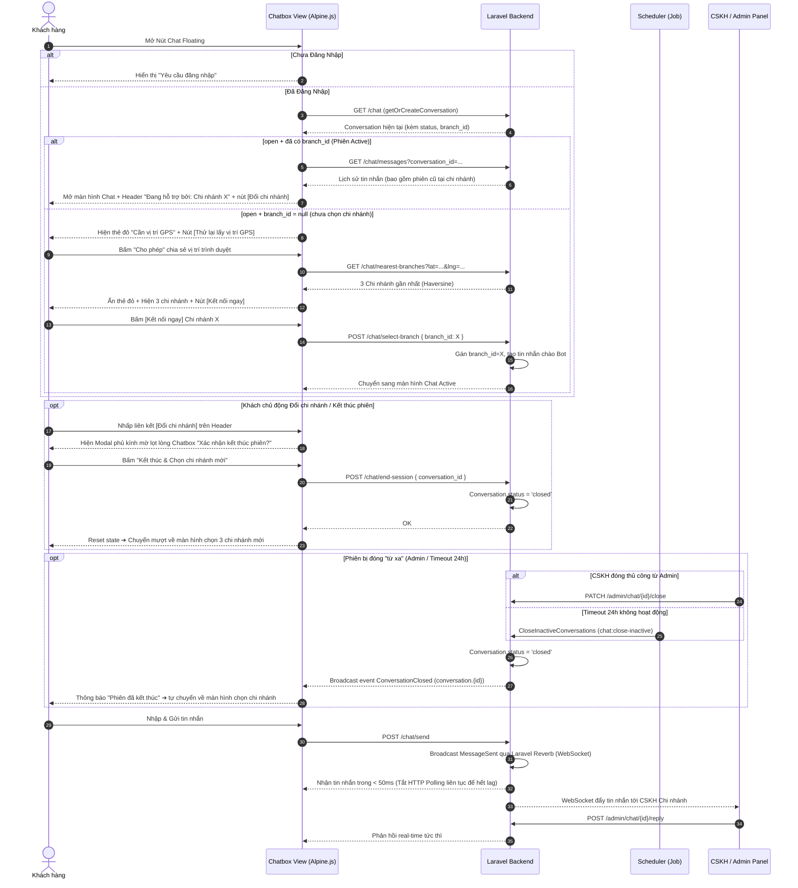

# TÀI LIỆU BỔ SUNG NGHIỆP VỤ: PHIÊN LÀM VIỆC (SESSION) & CHỌN CHI NHÁNH TRONG HỆ THỐNG CHAT

> **Dự án:** CHILL DRINK  
> **Phiên bản tài liệu:** 2.5 (Đã đối chiếu lại với code thực tế; các giới hạn còn tồn tại được ghi rõ)  
> **Người thực hiện:** Senior System Analyst  
> **Ngày cập nhật:** 31/07/2026  
> **Trạng thái:** ⚠️ Đã rà soát; một số phần vẫn đang ở mức hoàn thiện một phần  

---

## ⚠️ PHẠM VI TÀI LIỆU — ĐỌC TRƯỚC KHI CODE/REVIEW

Tài liệu này **KHÔNG thay thế** `CHAT_DOCUMENTATION.md`. Các phần kiến trúc nền tảng, giao diện, cơ chế realtime, GPS/Haversine, phân quyền Admin và ChatHelper được tham chiếu từ `CHAT_DOCUMENTATION.md`; nếu có khác biệt, trạng thái code được ghi theo kết quả kiểm tra mới nhất.

Tài liệu này là **bản bổ sung (addendum v2.5)**, mô tả nghiệp vụ **Phiên làm việc (Session), Đổi chi nhánh, xử lý UI/UX khung chat và cơ chế polling hiện có**. Những phần chưa hoàn thiện hoặc phụ thuộc scheduler/Reverb được ghi rõ thay vì coi là đã hoàn tất.

---

## 📋 MỤC LỤC

1. [Tóm Tắt Các Tính Năng Đã Cài Đặt](#1-tóm-tắt-các-tính-năng-đã-cài-đặt)
2. [Định Nghĩa Nghiệp Vụ Phiên Làm Việc (Session) & Chọn Chi Nhánh](#2-định-nghĩa-nghiệp-vụ-phiên-làm-việc-session--chọn-chi-nhánh)
   - [2.1. Quy Tắc Cốt Lõi Phiên Làm Việc](#21-quy-tắc-cốt-lõi-phiên-làm-việc)
   - [2.2. Luồng GPS Định Vị & Chọn Chi Nhánh Nâng Cấp](#22-luồng-gps-định-vị--chọn-chi-nhánh-nâng-cấp)
   - [2.3. Modal Xác Nhận Đổi Chi Nhánh Lọt Lòng Khung Chat (UI/UX)](#23-modal-xác-nhận-đổi-chi-nhánh-lọt-lòng-khung-chat-uiux)
   - [2.4. Khắc Phục Lỗi Cuộn Chuột (Mouse Wheel Scroll)](#24-khắc-phục-lỗi-cuộn-chuột-mouse-wheel-scroll)
   - [2.5. Tối Ưu Hiệu Năng Smart Polling (Hết Lag Khi Chat)](#25-tối-ưu-hiệu-năng-smart-polling-hết-lag-khi-chat)
   - [2.6. Giữ Lịch Sử Trò Chuyện Cũ Khi Mở Phiên Mới Tại Chi Nhánh](#26-giữ-lịch-sử-trò-chuyện-cũ-khi-mở-phiên-mới-tại-chi-nhánh)
   - [2.7. Đóng Phiên "Từ Xa" & Job Automatic Timeout 24h](#27-đóng-phiên-từ-xa--job-automatic-timeout-24h)
3. [Biểu Đồ Luồng Nghiệp Vụ (Mermaid Sequence Diagram)](#3-biểu-đồ-luồng-nghiệp-vụ-mermaid-sequence-diagram)
4. [Danh Sách File Đã Chỉnh Sửa & Tạo Mới](#4-danh-sách-file-đã-chỉnh-sửa--tạo-mới)

---

## 1. TÓM TẮT CÁC TÍNH NĂNG ĐÃ CÀI ĐẶT

| # | Chủ đề / Tính năng | Mô tả chi tiết triển khai | Trạng thái |
|---|---|---|---|
| 1 | Khách tự kết thúc phiên | Nút `[Đổi chi nhánh]` trên Header + Modal xác nhận + API `POST /chat/end-session`. | ✅ Đã xong |
| 2 | Modal phủ kính mờ lọt lòng Chatbox | Modal xác nhận đặt tại `position: absolute; inset: 0; backdrop-filter: blur(4px); z-index: 100` phủ vừa khít khung chat, chỉ hiện khi bấm `[Đổi chi nhánh]`. | ✅ Đã xong |
| 3 | Luồng GPS & Cảnh báo đỏ chuẩn UX | Khi chưa cấp GPS ➔ Hiện thẻ đỏ cảnh báo + nút `[Thử lại lấy vị trí GPS]`. Khi bấm "Cho phép" ➔ Nạp 3 chi nhánh gần nhất theo km + tự động ẩn thẻ đỏ. | ✅ Đã xong |
| 4 | Sửa lỗi cuộn con lăn chuột | Class `.chatbox-scroll` ép `flex: 1 1 0% !important; min-height: 0 !important; height: 100% !important; max-height: 100% !important; overflow-y: auto !important;` giúp lăn chuột mượt 100%. | ✅ Đã xong |
| 5 | Polling và WebSocket | Client hiện vẫn khởi động polling khoảng 1,5 giây; Echo chỉ là kênh bổ sung cho client đã đăng nhập. Guest không subscribe được private channel nên vẫn phụ thuộc polling. | ⚠️ Đang hoàn thiện |
| 6 | Giữ lại lịch sử chat cũ | API `GET /chat/messages` trả về toàn bộ tin nhắn từ các conversation (cả open & closed) của user tại chi nhánh đang chọn. | ✅ Đã xong |
| 7 | Chuẩn hóa tên "Chi nhánh" | Sử dụng `Str::startsWith($branch->name, 'Chi nhánh')` tránh lỗi lặp từ thành `"Chi nhánh Chi nhánh 1"`. | ✅ Đã xong |
| 8 | Đóng phiên từ xa & Timeout 24h | Đóng thủ công có broadcast `ConversationClosed`. Command `chat:close-inactive` tồn tại nhưng hiện chưa được đăng ký trong scheduler, nên chỉ chạy khi gọi thủ công. | ⚠️ Một phần |

---

## 2. ĐỊNH NGHĨA NGHIỆP VỤ PHIÊN LÀM VIỆC (SESSION) & CHỌN CHI NHÁNH

### 2.1. Quy Tắc Cốt Lõi Phiên Làm Việc

| Trạng thái | Quy tắc |
|---|---|
| **Phiên đang Active** (`Conversation.status = 'open'` và đã có `branch_id`) | Khóa cố định chi nhánh. Khách chat trực tiếp với CSKH chi nhánh đó. Header hiển thị `Đang hỗ trợ bởi: Chi nhánh X` + nút `[Đổi chi nhánh]`. |
| **`Conversation.status = 'open'` nhưng `branch_id = null`** | Chưa kết nối chi nhánh ➔ Hiển thị màn hình chọn chi nhánh (GPS gợi ý 3 chi nhánh gần nhất). |
| **Không còn Conversation nào `open`** (`closed`) | Khách được phép chọn lại chi nhánh bất kỳ để mở phiên tư vấn mới. |
| **Reload / mở lại tab** | Nếu Conversation vẫn `open` ➔ tiếp tục đúng phiên cũ (giống Facebook Messenger). Nếu đã `closed` ➔ về màn hình chọn chi nhánh. |

---

### 2.2. Luồng GPS Định Vị & Chọn Chi Nhánh Nâng Cấp

1. **Khi mở màn hình chọn Chi nhánh (chưa chọn `branch_id`):**
   - Đặt `gpsDenied = true`, `branches = []`.
   - Hiển thị thẻ màu đỏ cảnh báo:
     > 📍 **Cần vị trí GPS**  
     > *Không thể xác định vị trí của bạn. Vui lòng kiểm tra lại thiết bị hoặc bấm nút thử lại.*  
     > **`[Thử lại lấy vị trí GPS]`**
   - Trình duyệt bật pop-up xin quyền vị trí: `"http://127.0.0.1:8000 muốn Biết vị trí của bạn"`.

2. **Khi Khách bấm "Cho phép" (Allow) trên trình duyệt:**
   - Trình duyệt lấy tọa độ `lat`, `lng`.
   - Gọi API `GET /chat/nearest-branches?lat=...&lng=...` ➔ Server tính công thức Haversine trả về 03 chi nhánh gần nhất kèm số km (VD: `23.8 km`, `24.5 km`).
   - Thẻ đỏ cảnh báo **tự động ẩn hoàn toàn** (`gpsDenied = false`).
   - Danh sách 3 chi nhánh hiển thị mượt mà với nút **[Kết nối ngay]**.

3. **Nếu Khách từ chối hoặc lỗi định vị:**
   - Thẻ đỏ giữ nguyên trên màn hình kèm nút **[Thử lại lấy vị trí GPS]** để khách chủ động bấm cấp lại quyền bất cứ lúc nào.

---

### 2.3. Modal Xác Nhận Đổi Chi Nhánh Lọt Lòng Khung Chat (UI/UX)

- **Vị trí thiết kế:** Đặt lọt lòng 100% bên trong khung Chatbox (`position: absolute; inset: 0; z-index: 100; background: rgba(255,255,255,0.96); backdrop-filter: blur(4px)`).
- **Chỉ xuất hiện khi:** Người dùng chủ động nhấp vào liên kết **`[Đổi chi nhánh]`** ở thanh tiêu đề màu xanh lá.
- **Nội dung Modal:**
  > **Xác nhận kết thúc phiên?**  
  > Phiên làm việc với **Chi nhánh X** sẽ được khép lại để bạn chọn chi nhánh khác. Bạn có chắc chắn muốn kết thúc không?  
  > **`[Kết thúc & Chọn chi nhánh mới]`** | **`[Hủy bỏ (Tiếp tục chat)]`**
- Khi xác nhận kết thúc: Gọi `POST /chat/end-session` ➔ Đổi `status = 'closed'` ➔ Reset state và đưa khách mượt mà về màn hình chọn 3 chi nhánh gần nhất.

---

### 2.4. Khắc Phục Lỗi Cuộn Chuột (Mouse Wheel Scroll)

- **Vấn đề cũ:** Trong CSS Flexbox trên trình duyệt Chrome/Windows, các container con nếu không có `min-height: 0 !important; height: 100% !important;` sẽ bị vỡ chiều cao và không kích hoạt được thanh cuộn của con lăn chuột.
- **Giải pháp:** Áp dụng class CSS chuyên dụng `.chatbox-scroll`:
  ```css
  .chatbox-scroll {
      flex: 1 1 0% !important;
      min-height: 0 !important;
      height: 100% !important;
      max-height: 100% !important;
      overflow-y: auto !important;
      overscroll-behavior: contain !important;
      -webkit-overflow-scrolling: touch !important;
  }
  ```
- Tùy chỉnh thanh cuộn siêu nhỏ mượt mà 6px, đảm bảo dùng con lăn chuột cuộn lên / xuống mượt 100% ở cả màn hình chọn chi nhánh và khung tin nhắn chat.

---

### 2.5. Polling và WebSocket hiện có

- **Nguyên nhân lag trước đây:** Hệ thống vừa chạy WebSocket (Laravel Reverb), vừa chạy HTTP Polling lấy toàn bộ tin nhắn **mỗi 1.5 giây** khiến DOM liên tục bị re-render làm giật/khựng ô gõ phím.
- **Hành vi hiện tại:**
  - Client vẫn tạo polling interval khoảng 1,5 giây; code chưa có bước dừng interval khi Echo kết nối thành công.
  - User đã đăng nhập có thể nhận thêm event qua Laravel Echo trên private channel.
  - Guest không có xác thực private channel nên không nhận Echo; guest sử dụng API polling.
  - Vì vậy không ghi nhận tính năng “tắt hẳn polling khi Reverb chạy” là đã hoàn thành.

---

### 2.6. Giữ Lịch Sử Trò Chuyện Cũ Khi Mở Phiên Mới Tại Chi Nhánh

- Khi khách đã kết thúc phiên cũ tại Chi nhánh 1, nếu sau đó khách mở phiên mới lại đúng Chi nhánh 1:
  - API `GET /chat/messages` sẽ **truy vấn toàn bộ tin nhắn từ tất cả các conversation (cả closed và open)** của khách hàng đó tại `branch_id = 1`.
  - Khách hàng vẫn xem lại được toàn bộ lịch sử tư vấn trước đó với chi nhánh này.
  - Phân quyền CSKH chi nhánh nào vẫn chỉ xem đúng dữ liệu chi nhánh đó, đảm bảo bảo mật và tính toàn vẹn dữ liệu.

---

### 2.7. Đóng Phiên "Từ Xa" & Job Automatic Timeout 24h

1. **CSKH đóng cuộc trò chuyện từ Admin Panel (`PATCH /admin/chat/{id}/close`):**
   - Phát sự kiện broadcast `ConversationClosed` trên channel `conversation.{id}`.
   - Client đã authorize private channel có thể nhận event. Guest không subscribe được private channel nên cập nhật trạng thái qua polling.
2. **Command `CloseInactiveConversations` (`chat:close-inactive`):**
   - Khi được gọi, command tìm các Conversation `open` không có tin nhắn mới quá 24h (dựa trên `last_message_at ?? created_at`).
   - Chuyển `status = 'closed'` và phát event `ConversationClosed`.
   - Hiện command chưa có lịch chạy trong `routes/console.php`; muốn tự động hóa cần đăng ký scheduler.

---

## 3. BIỂU ĐỒ LUỒNG NGHIỆP VỤ (MERMAID SEQUENCE DIAGRAM)



---

## 4. DANH SÁCH FILE ĐÃ CHỈNH SỬA & TẠO MỚI

| STT | File | Loại | Nội dung chỉnh sửa |
|---|---|---|---|
| 1 | `routes/web.php` | Route | Thêm `POST /chat/end-session` (đóng phiên từ phía khách). |
| 2 | `app/Http/Controllers/Client/ChatController.php` | Controller | - Thêm `endSession()`: set `status = 'closed'` và broadcast `ConversationClosed`.<br>- Cập nhật `nearestBranches()`: hỗ trợ fallback tọa độ linh hoạt.<br>- Cập nhật `selectBranch()`: dùng `Str::startsWith` tránh lặp chữ "Chi nhánh".<br>- Cập nhật `messages()`: tải toàn bộ tin nhắn từ mọi conversation (cả closed) của user tại chi nhánh này. |
| 3 | `resources/views/components/chatbox.blade.php` | View (Alpine.js) | - Thêm nút `[Đổi chi nhánh]` + Modal phủ kính mờ lọt lòng khung chat.<br>- Thêm class `.chatbox-scroll` và luồng GPS.<br>- Duy trì polling; Echo chỉ bổ sung realtime cho client đủ điều kiện xác thực. |
| 4 | `app/Http/Controllers/Admin/AdminChatController.php` | Controller | Cập nhật `close()` phát event broadcast `ConversationClosed`. |
| 5 | `app/Events/ConversationClosed.php` | Event *(Mới)* | Implements `ShouldBroadcastNow` trên channel `conversation.{id}` với thông tin `closed_by`. |
| 6 | `app/Console/Commands/CloseInactiveConversations.php` | Command *(Mới)* | Artisan command `chat:close-inactive` đóng conversation không nhắn quá 24h khi được gọi thủ công; chưa được scheduler tự động gọi. |
