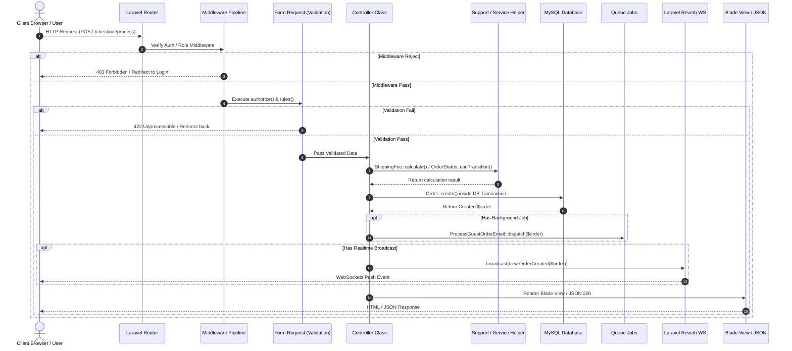
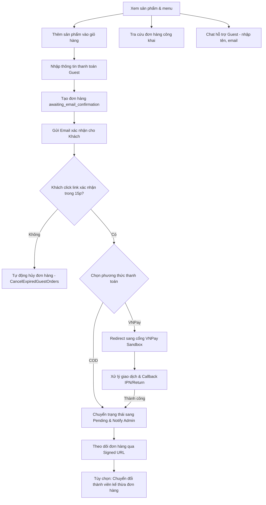
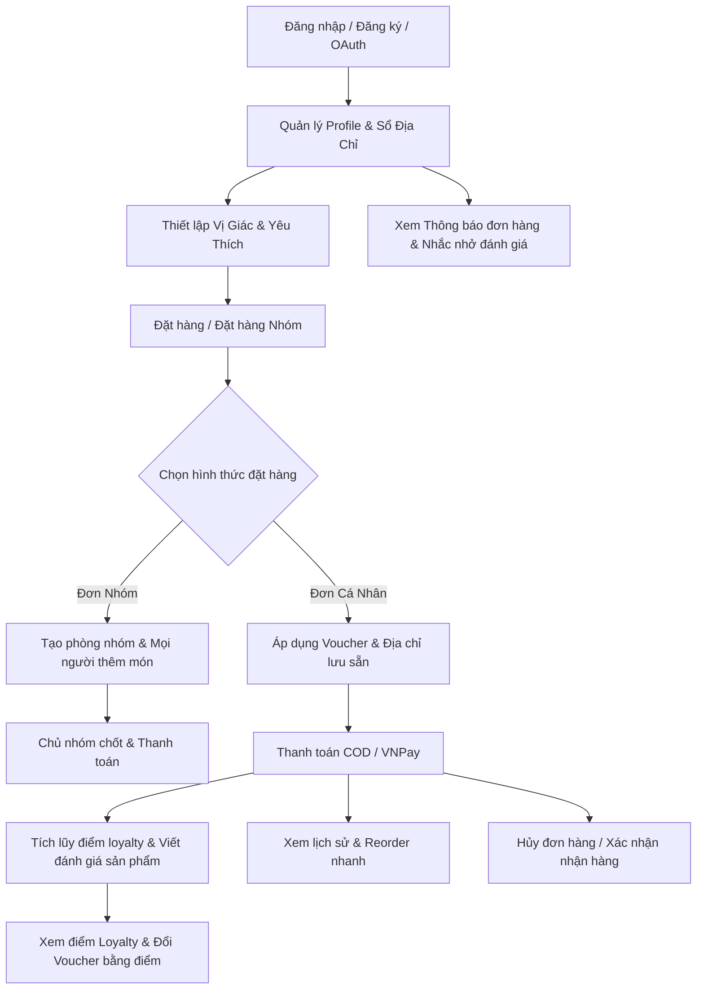
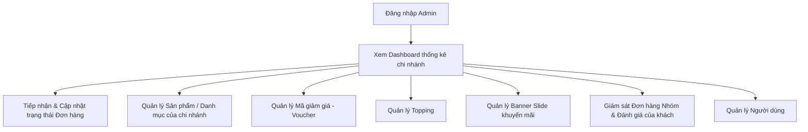
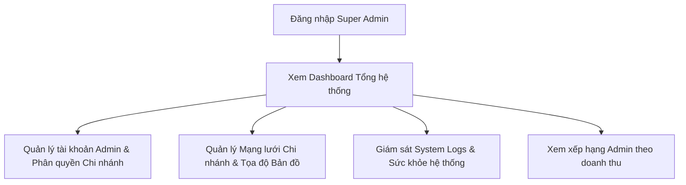
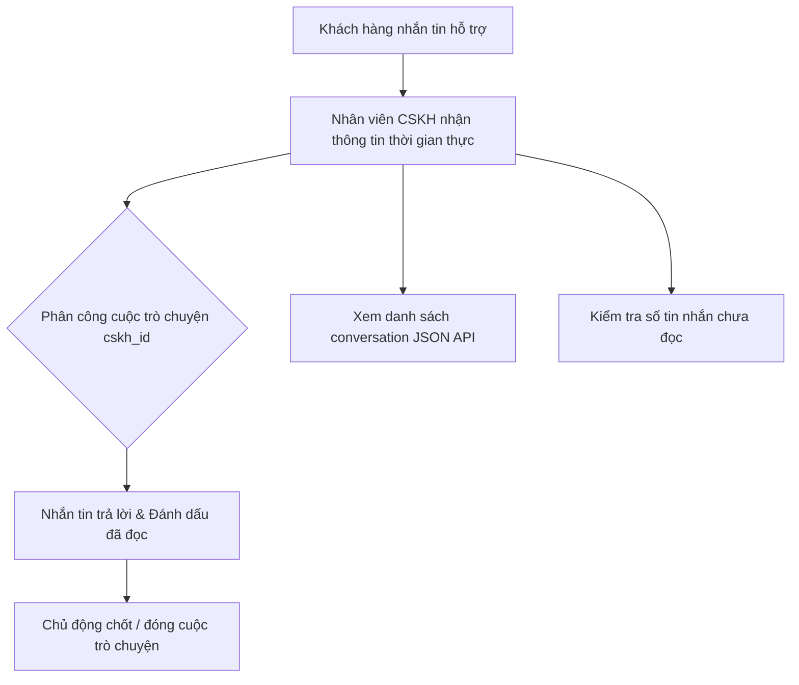

# 📚 TÀI LIỆU KỸ THUẬT & LUỒNG NGHIỆP VỤ HỆ THỐNG CHILL DRINK (LARAVEL 11)

> **Lưu ý**: Tài liệu này được biên soạn dựa trên việc đối chiếu mã nguồn tại thư mục `chill-drink/`. Trạng thái tính năng có thể còn giới hạn hoặc lỗi nghiệp vụ; các điểm chưa hoàn thiện được tổng hợp trong [SYSTEM_ISSUES.md](file:///c:/xampp/htdocs/php01/du%20an%201%200000/DU_AN_1/DATN/docs/SYSTEM_ISSUES.md). Toàn bộ liên kết file trong tài liệu đều có thể **click để mở trực tiếp trong IDE**.

> **Lần kiểm tra gần nhất:** 31/07/2026 — PHP syntax 379 file đạt, Vite build đạt, 168 route đăng ký, PHPUnit 122/122 pass (509 assertions). Tất cả 58 system issue trong [SYSTEM_ISSUES.md](file:///c:/xampp/htdocs/php01/du%20an%201%200000/DU_AN_1/DATN/docs/SYSTEM_ISSUES.md) đã được xử lý và kiểm chứng.

### Các giới hạn cần lưu ý khi đọc tài liệu

- Chat dùng broadcast trên private channel cho client đã đăng nhập/Admin; Guest hiện không authorize được channel này và tiếp tục dùng polling.
- Client chat hiện vẫn chạy polling; chưa có cơ chế tắt hoàn toàn polling khi Echo/Reverb kết nối thành công.
- `CloseInactiveConversations` tồn tại nhưng đang chạy thủ công; chưa được đăng ký trong scheduler.
- API Guest Checkout hiện chưa phải luồng tính giá sản phẩm đầy đủ: controller còn dùng giá cố định và API convert-to-member trả token giả.
- Voucher có các migration/column naming chưa thống nhất; không coi luồng đổi và sử dụng voucher là đã hoàn thiện cho tới khi hợp nhất schema.

---

## 1. 🔑 TỔNG QUAN HỆ THỐNG & PHÂN QUYỀN VAI TRÒ

### 1.1 Mục đích dự án & Kiến trúc tổng thể
**Chill Drink** là hệ thống E-commerce chuyên kinh doanh và giao đồ uống tích hợp các luồng nghiệp vụ theo vai trò (Role-based Flows):
- **Guest (Khách vãng lai)**: Duyệt menu, thêm giỏ hàng, đặt hàng không tài khoản với xác nhận Email và link theo dõi chữ ký số (`signed`), tra cứu đơn hàng công khai, chat hỗ trợ không cần đăng nhập.
- **User (Hội viên)**: Sổ địa chỉ, tích điểm Loyalty, đổi Voucher bằng điểm, lưu vị giác `TasteProfile`, đặt sản phẩm yêu thích, **Đặt hàng nhóm Realtime (Group Order)**, hủy đơn hàng, xác nhận nhận hàng, xem thông báo và viết đánh giá sản phẩm.
- **Admin (Admin Chi nhánh)**: Quản lý đơn hàng, danh mục/sản phẩm chi nhánh (có Thùng rác Soft Delete), banner khuyến mãi (slide), topping, voucher, người dùng và chuyển trạng thái đơn theo `OrderStatus`.
- **SuperAdmin (Quản trị hệ thống)**: Quản lý mạng lưới chi nhánh, tọa độ GPS bản đồ, phân quyền tài khoản Admin/CSKH, giám sát SuperAdmin Impersonation Takeover và System Logs.
- **CSKH (Chăm sóc khách hàng)**: Khung chat thời gian thực hỗ trợ khách hàng (cả Guest và User), phân công hội thoại, theo dõi tin nhắn và chốt phiên hỗ trợ.

**Kiến trúc tổng thể**: Dự án xây dựng theo mô hình **Layered MVC mở rộng**:
- **Presentation Layer**: Blade Templates, AlpineJS, TailwindCSS, Axios và WebSockets Client (Laravel Echo / Pusher JS).
- **HTTP Routing & Middleware Layer**: Được phân tách trong `routes/web.php`, `api.php`, `auth.php`, `channels.php`, bảo vệ bởi Custom Middlewares (`AdminMiddleware`, `SuperAdminMiddleware`, `CskhMiddleware`).
- **Validation Layer**: Form Request Classes trong `app/Http/Requests`.
- **Service & Support Layer**: Các lớp xử lý nghiệp vụ tại `app/Services` (`OrderCodeGenerator`) và `app/Support` (`OrderStatus`, `ProductCatalog`, `ShippingFee`, `RealtimeOrderNotifier`, `GuestOrderAccess`, `ChatHelper`, `ProductImage`, `ScheduledDelivery`).
- **Realtime Layer**: Laravel Reverb / Pusher WebSockets Server kết hợp Broadcast Events (`OrderCreated`, `OrderStatusUpdated`, `MessageSent`, `ConversationClosed`).
- **Background Jobs & Scheduled Tasks**: `ProcessGuestOrderEmail` Job, Artisan Commands chạy định kỳ (`CancelExpiredGuestOrders`, `AutoCompleteDeliveredOrders`, `CleanupOldChats`).
- **Notification Layer**: Database Notifications (`OrderStatusUpdatedNotification`, `ReviewAvailableNotification`).

---

### 1.2 Bảng Phân Quyền Vai Trò (Roles & Permissions)

Hệ thống bao gồm 4 vai trò chính được định nghĩa trong bảng `roles` (xem [RoleSeeder.php](file:///c:/xampp/htdocs/php01/du%20an%201%200000/DU_AN_1/DATN/chill-drink/database/seeders/RoleSeeder.php), [AuthAccountSeeder.php](file:///c:/xampp/htdocs/php01/du%20an%201%200000/DU_AN_1/DATN/chill-drink/database/seeders/AuthAccountSeeder.php)):

| Role ID | Tên Vai Trò | Loại Người Dùng | Middleware Áp Dụng | Mô Tả Quyền Hạn |
|:---|:---|:---|:---|:---|
| **-** | **Guest** | Khách vãng lai | `guest` hoặc Không | Chưa đăng nhập; xem menu, giỏ hàng, đặt hàng không tài khoản (xác nhận email 15p), theo dõi đơn qua Signed URL, tra cứu đơn hàng, chat hỗ trợ (guest_token). |
| **1** | **User** | Khách hàng thành viên | `auth` | Đã đăng ký/đăng nhập; quản lý sổ địa chỉ, tích điểm Loyalty, đổi Voucher bằng điểm, lưu TasteProfile, tạo/tham gia Đặt hàng nhóm, hủy đơn, xác nhận nhận hàng, xem thông báo. |
| **2** | **Admin** | Quản trị Chi nhánh | `auth`, `admin` | Quản lý sản phẩm, danh mục, voucher, topping, banner slide, người dùng và xử lý trạng thái đơn hàng thuộc chi nhánh của mình. |
| **3** | **Super Admin** | Quản trị Hệ thống | `auth`, `superadmin` | Quyền hạn tối cao; quản lý danh sách chi nhánh, tọa độ GPS bản đồ, phân quyền Admin/CSKH, theo dõi Impersonation Takeover & System Logs. |
| **4** | **CSKH** | Chăm sóc Khách hàng | `auth`, `cskh` | Tiếp nhận và trả lời hội thoại chat trực tuyến với khách hàng thời gian thực. |

#### Cơ chế Middleware bảo vệ:
- [AdminMiddleware.php](file:///c:/xampp/htdocs/php01/du%20an%201%200000/DU_AN_1/DATN/chill-drink/app/Http/Middleware/AdminMiddleware.php) (`admin`): Kiểm tra `user->isAdmin()` (`role_id` là 2 hoặc 3).
- [SuperAdminMiddleware.php](file:///c:/xampp/htdocs/php01/du%20an%201%200000/DU_AN_1/DATN/chill-drink/app/Http/Middleware/SuperAdminMiddleware.php) (`superadmin`): Kiểm tra `user->isSuperAdmin()` (`role_id === 3` hoặc email `superadmin@chilldrink.com`).
- [CskhMiddleware.php](file:///c:/xampp/htdocs/php01/du%20an%201%200000/DU_AN_1/DATN/chill-drink/app/Http/Middleware/CskhMiddleware.php) (`cskh`): Kiểm tra `user->isCskh()` (`role_id === 4`, `2` hoặc `3`).
- Đăng ký alias trong [app.php](file:///c:/xampp/htdocs/php01/du%20an%201%200000/DU_AN_1/DATN/chill-drink/bootstrap/app.php).

---

### 1.3 Công nghệ sử dụng
- **Backend Stack**: Laravel Framework `^11.31`, PHP `^8.2`, MySQL (`mysql` PDO driver), Session/Cache/Queue driver `database`, Laravel Reverb `^1.10` & Pusher `^7.2`, Laravel Socialite `^5.28` (Google & Facebook OAuth), PHPMailer `^7.1`.
- **Frontend Stack**: Vite `^6.0.11`, Vue `^3.5.39`, AlpineJS `^3.4.2`, TailwindCSS `^3.1.0`, Laravel Echo `^2.3.7`, Pusher JS `^8.5.0`, Axios `^1.7.4`.

---

## 2. ⚡ LUỒNG XỬ LÝ REQUEST TỔNG THỂ (REQUEST LIFECYCLE)

### 2.1 Mô tả chi tiết luồng Request
1. **Request Entry**: HTTP Request gửi đến `public/index.php` -> Khởi tạo Laravel App via [app.php](file:///c:/xampp/htdocs/php01/du%20an%201%200000/DU_AN_1/DATN/chill-drink/bootstrap/app.php).
2. **Route Match**: Trình tuyến Route chọn trong `web.php`, `api.php`, `auth.php`.
3. **Middleware Pipeline**: Kiểm tra Global Middleware & Alias (`auth`, `admin`, `superadmin`, `cskh`, `signed`).
4. **Form Request Validation**: Tự động thực thi `authorize()` & `rules()` trong `app/Http/Requests/`.
5. **Controller Execution**: Tiếp nhận dữ liệu sạch, thực hiện logic.
6. **Support / Service Execution**: Gọi `app/Services/OrderCodeGenerator.php`, `app/Support/OrderStatus.php`, `app/Support/ShippingFee.php`.
7. **Database Transaction & Events**: Thao tác Eloquent DB & dispatch Broadcast Events (`OrderCreated`, `MessageSent`, `OrderStatusUpdated`).
8. **Background Jobs**: Dispatch async jobs khi cần (VD: `ProcessGuestOrderEmail`).
9. **Notifications**: Gửi Database Notifications (`OrderStatusUpdatedNotification`, `ReviewAvailableNotification`).
10. **Response Delivery**: Render Blade View hoặc trả về JsonResponse.

### 2.2 Sơ đồ Request Lifecycle (Mermaid)



---

## 3. 📋 PHÂN TÍCH CHI TIẾT CÁC LUỒNG NGHIỆP VỤ THEO VAI TRÒ

---

## 3.1 🌐 Luồng Của Khách Vãng Lai (Guest / Anonymous User)

Khách vãng lai là người dùng chưa đăng nhập, được duyệt sản phẩm, thêm vào giỏ hàng session, tra cứu đơn hàng, chat hỗ trợ và tiến hành mua hàng trực tiếp.



### 3.1.1 Duyệt sản phẩm & Menu
- **Mô tả**: Xem danh sách sản phẩm, lọc theo danh mục (ID/slug/name), lọc theo khoảng giá (`min_price`, `max_price`), tìm kiếm theo tên/SKU/mô tả và xem chi tiết sản phẩm gồm các tùy chọn Size (S, M, L), Topping đính kèm và đánh giá từ khách hàng.
- **Quy tắc nghiệp vụ**:
  - Chỉ hiển thị các sản phẩm có `status = true`.
  - Topping hiển thị động dựa trên danh mục sản phẩm (Matcha, trà sữa, cà phê, soda...).
  - Tính điểm đánh giá trung bình từ các review đã được duyệt (`status = true`) bằng `withAvg('reviews', 'rating')`.
  - Hỗ trợ sản phẩm đã xóa mềm cho danh mục (`withTrashed()`).
- **Files liên quan**:
  - Controller: [HomeController.php@index](file:///c:/xampp/htdocs/php01/du%20an%201%200000/DU_AN_1/DATN/chill-drink/app/Http/Controllers/Client/HomeController.php), [ProductController.php](file:///c:/xampp/htdocs/php01/du%20an%201%200000/DU_AN_1/DATN/chill-drink/app/Http/Controllers/Client/ProductController.php) (các phương thức `index`, `show`)
  - Models: [Product.php](file:///c:/xampp/htdocs/php01/du%20an%201%200000/DU_AN_1/DATN/chill-drink/app/Models/Product.php), [Category.php](file:///c:/xampp/htdocs/php01/du%20an%201%200000/DU_AN_1/DATN/chill-drink/app/Models/Category.php)
  - Support: [ProductCatalog.php](file:///c:/xampp/htdocs/php01/du%20an%201%200000/DU_AN_1/DATN/chill-drink/app/Support/ProductCatalog.php), [ProductImage.php](file:///c:/xampp/htdocs/php01/du%20an%201%200000/DU_AN_1/DATN/chill-drink/app/Support/ProductImage.php)
  - View: [client/home.blade.php](file:///c:/xampp/htdocs/php01/du%20an%201%200000/DU_AN_1/DATN/chill-drink/resources/views/client/home.blade.php), [products/index.blade.php](file:///c:/xampp/htdocs/php01/du%20an%201%200000/DU_AN_1/DATN/chill-drink/resources/views/client/products/index.blade.php), [products/show.blade.php](file:///c:/xampp/htdocs/php01/du%20an%201%200000/DU_AN_1/DATN/chill-drink/resources/views/client/products/show.blade.php)
  - Routes: `home`, `select-nearest-branch`, `products.index`, `products.show` trong [web.php](file:///c:/xampp/htdocs/php01/du%20an%201%200000/DU_AN_1/DATN/chill-drink/routes/web.php)

### 3.1.2 Giỏ hàng (Session-based)
- **Mô tả**: Thêm sản phẩm vào giỏ với các tùy chọn (Size, lượng đường, đá, topping, số lượng, ghi chú). Cập nhật hoặc xóa item trong giỏ. Xóa toàn bộ giỏ hàng.
- **Quy tắc nghiệp vụ**:
  - Giỏ hàng khách vãng lai lưu trong `session('cart')`.
  - Phí chênh lệch Size: Size S (+0đ), Size M (+5.000đ), Size L (+10.000đ).
  - Phí topping cộng trực tiếp vào giá item trong giỏ.
- **Files liên quan**:
  - Controller: [CartController.php](file:///c:/xampp/htdocs/php01/du%20an%201%200000/DU_AN_1/DATN/chill-drink/app/Http/Controllers/Client/CartController.php) (các phương thức `index`, `add`, `update`, `remove`, `clear`)
  - View: [cart/index.blade.php](file:///c:/xampp/htdocs/php01/du%20an%201%200000/DU_AN_1/DATN/chill-drink/resources/views/client/cart/index.blade.php)
  - Routes: `cart.index` (GET), `cart.add` (POST), `cart.update` (PATCH), `cart.remove` (DELETE), `cart.clear` (DELETE) trong [web.php](file:///c:/xampp/htdocs/php01/du%20an%201%200000/DU_AN_1/DATN/chill-drink/routes/web.php)

### 3.1.3 Đặt hàng không đăng nhập (Guest Checkout)
- **Mô tả**: Tiến hành thanh toán mà không cần tài khoản. Người dùng nhập tên, số điện thoại, email và lựa chọn hình thức:
  1. *Giao hàng tận nơi (Delivery)*: Chọn khu vực giao hàng và tính phí vận chuyển theo khoảng cách thực tế đến chi nhánh gần nhất.
  2. *Lấy tại chi nhánh (Pickup)*: Chọn chi nhánh muốn tới lấy hàng (phí ship = 0đ).
- **Quy tắc nghiệp vụ**:
  - Chỉ hiển thị các chi nhánh đang hoạt động (`status = true`).
  - Lựa chọn thanh toán COD hoặc VNPAY Gateway.
  - Khởi tạo đơn hàng với trạng thái đặc biệt: `awaiting_email_confirmation`. Đơn hàng này sẽ bị ẩn đối với các Admin chi nhánh cho đến khi được xác nhận.
  - Sinh token xác nhận có thời hạn 15 phút (`confirmation_token_expires_at`).
  - Gửi email xác thực đến hòm thư của khách.
- **Files liên quan**:
  - Controller: [GuestCheckoutController.php](file:///c:/xampp/htdocs/php01/du%20an%201%200000/DU_AN_1/DATN/chill-drink/app/Http/Controllers/Client/GuestCheckoutController.php) (các phương thức `index`, `storeInfo`, `payment`, `process`, `pendingConfirmation`, `confirmEmail`, `track`)
  - Mailer: [GuestOrderEmailConfirmationMail.php](file:///c:/xampp/htdocs/php01/du%20an%201%200000/DU_AN_1/DATN/chill-drink/app/Mail/GuestOrderEmailConfirmationMail.php)
  - Support: [ShippingFee.php](file:///c:/xampp/htdocs/php01/du%20an%201%200000/DU_AN_1/DATN/chill-drink/app/Support/ShippingFee.php)
  - View: [guest/index.blade.php](file:///c:/xampp/htdocs/php01/du%20an%201%200000/DU_AN_1/DATN/chill-drink/resources/views/client/checkout/guest/index.blade.php), [guest/payment.blade.php](file:///c:/xampp/htdocs/php01/du%20an%201%200000/DU_AN_1/DATN/chill-drink/resources/views/client/checkout/guest/payment.blade.php), [guest/pending-confirmation.blade.php](file:///c:/xampp/htdocs/php01/du%20an%201%200000/DU_AN_1/DATN/chill-drink/resources/views/client/checkout/guest/pending-confirmation.blade.php)
  - Routes: `checkout.guest.index`, `checkout.guest.info.store`, `checkout.guest.payment`, `checkout.guest.process`, `checkout.guest.pending-confirmation`, `checkout.guest.confirm-email`, `checkout.guest.track` trong [web.php](file:///c:/xampp/htdocs/php01/du%20an%201%200000/DU_AN_1/DATN/chill-drink/routes/web.php)

### 3.1.4 Xác nhận đơn hàng qua Email
- **Mô tả**: Khách hàng mở email và bấm vào liên kết xác nhận.
- **Quy tắc nghiệp vụ**:
  - Nếu token xác nhận khớp và chưa hết hạn: Trạng thái đơn hàng chuyển sang `pending` (chờ xử lý), xóa token xác nhận.
  - Phát tín hiệu thông báo thời gian thực cho Admin chi nhánh qua [RealtimeOrderNotifier.php](file:///c:/xampp/htdocs/php01/du%20an%201%200000/DU_AN_1/DATN/chill-drink/app/Support/RealtimeOrderNotifier.php).
  - Lưu trạng thái cho phép thiết bị xem đơn hàng vào session (`guest_order_tokens`).
  - Nếu token quá 15 phút: Đơn hàng tự động hủy và báo liên kết hết hiệu lực.
  - Hủy tự động được thực hiện bởi Artisan Command [CancelExpiredGuestOrders.php](file:///c:/xampp/htdocs/php01/du%20an%201%200000/DU_AN_1/DATN/chill-drink/app/Console/Commands/CancelExpiredGuestOrders.php) chạy mỗi 5 phút.
- **Files liên quan**:
  - Controller: [GuestCheckoutController.php@confirmEmail](file:///c:/xampp/htdocs/php01/du%20an%201%200000/DU_AN_1/DATN/chill-drink/app/Http/Controllers/Client/GuestCheckoutController.php)
  - Support: [GuestOrderAccess.php](file:///c:/xampp/htdocs/php01/du%20an%201%200000/DU_AN_1/DATN/chill-drink/app/Support/GuestOrderAccess.php), [RealtimeOrderNotifier.php](file:///c:/xampp/htdocs/php01/du%20an%201%200000/DU_AN_1/DATN/chill-drink/app/Support/RealtimeOrderNotifier.php)
  - View: [guest/confirm-email-result.blade.php](file:///c:/xampp/htdocs/php01/du%20an%201%200000/DU_AN_1/DATN/chill-drink/resources/views/client/checkout/guest/confirm-email-result.blade.php)
  - Route: `checkout.guest.confirm-email` trong [web.php](file:///c:/xampp/htdocs/php01/du%20an%201%200000/DU_AN_1/DATN/chill-drink/routes/web.php)

### 3.1.5 Theo dõi đơn hàng của khách vãng lai (Tracking)
- **Mô tả**: Xem trạng thái và tiến độ đơn hàng thời gian thực (Đang pha chế, Đang giao, Đã giao...).
- **Quy tắc nghiệp vụ**:
  - Sử dụng **Signed URL** bảo mật (chữ ký số mã hóa của Laravel) để xác thực quyền truy cập trang theo dõi.
  - Bảo vệ bởi middleware `signed` hoặc session chứa token phù hợp (`GuestOrderAccess::canView`).
- **Files liên quan**:
  - Controller: [GuestCheckoutController.php@track](file:///c:/xampp/htdocs/php01/du%20an%201%200000/DU_AN_1/DATN/chill-drink/app/Http/Controllers/Client/GuestCheckoutController.php)
  - Support: [GuestOrderAccess.php](file:///c:/xampp/htdocs/php01/du%20an%201%200000/DU_AN_1/DATN/chill-drink/app/Support/GuestOrderAccess.php)
  - View: [checkout/success.blade.php](file:///c:/xampp/htdocs/php01/du%20an%201%200000/DU_AN_1/DATN/chill-drink/resources/views/client/checkout/success.blade.php)
  - Route: `checkout.guest.track` (middleware `signed`) trong [web.php](file:///c:/xampp/htdocs/php01/du%20an%201%200000/DU_AN_1/DATN/chill-drink/routes/web.php)

### 3.1.6 Chuyển đổi tài khoản Khách sang Thành viên (Guest-to-Member)
- **Mô tả**: Sau khi khách hoàn thành đơn hàng, hệ thống hiển thị tùy chọn đăng ký nhanh tài khoản bằng cách thiết lập mật khẩu cho email vừa mua hàng.
- **Quy tắc nghiệp vụ**:
  - Kế thừa thông tin từ đơn hàng (Tên, email, SĐT).
  - Tự động liên kết các đơn hàng khách vừa đặt vào tài khoản thành viên mới (`user_id = $new_user_id`).
  - Cộng điểm thưởng tích lũy (Loyalty Points) từ đơn hàng vừa đặt vào tài khoản mới.
- **Files liên quan**:
  - Controller (Web): [GuestConvertController.php@store](file:///c:/xampp/htdocs/php01/du%20an%201%200000/DU_AN_1/DATN/chill-drink/app/Http/Controllers/Auth/GuestConvertController.php)
  - Controller (API): [Api\GuestCheckoutController.php@convertToMember](file:///c:/xampp/htdocs/php01/du%20an%201%200000/DU_AN_1/DATN/chill-drink/app/Http/Controllers/Api/GuestCheckoutController.php)
  - Model: [User.php](file:///c:/xampp/htdocs/php01/du%20an%201%200000/DU_AN_1/DATN/chill-drink/app/Models/User.php)
  - Routes: `register.guest-convert` (Web), `api.guest.convert` (API) trong [web.php](file:///c:/xampp/htdocs/php01/du%20an%201%200000/DU_AN_1/DATN/chill-drink/routes/web.php) & [api.php](file:///c:/xampp/htdocs/php01/du%20an%201%200000/DU_AN_1/DATN/chill-drink/routes/api.php)

### 3.1.7 Nhận và áp dụng Voucher dành cho Khách
- **Mô tả**: Khách chưa đăng nhập có thể nhận mã voucher (lưu theo `guest_identifier`).
- **Files liên quan**:
  - Controller: [VoucherController.php (Api)](file:///c:/xampp/htdocs/php01/du%20an%201%200000/DU_AN_1/DATN/chill-drink/app/Http/Controllers/Api/VoucherController.php) (các phương thức `receive`, `getReceived`, `markAsUsed`)
  - Routes: `api.vouchers.receive` (POST), `api.vouchers.received` (GET), `api.vouchers.mark-used` (POST) trong [api.php](file:///c:/xampp/htdocs/php01/du%20an%201%200000/DU_AN_1/DATN/chill-drink/routes/api.php)

### 3.1.8 Luồng thanh toán trực tuyến qua cổng VNPay
- **Mô tả**: Cho phép thanh toán hóa đơn bằng tài khoản ngân hàng hoặc ví điện tử qua VNPAY Gateway Sandbox.
- **Quy tắc nghiệp vụ**:
  - Tạo đơn hàng với `payment_status = 'pending'`, redirect sang VNPAY kèm chữ ký HMAC-SHA512 (`vnp_SecureHash`).
  - Trang Callback (`/vnpay/return`): Kiểm tra chữ ký, so khớp số tiền thực thu, cập nhật `payment_status = 'paid'` và `status = 'confirmed'`.
  - Webhook hậu đài (`/vnpay/ipn`): VNPAY Server gọi ngầm để cập nhật trạng thái ngay cả khi khách đóng trình duyệt. Sử dụng `lockForUpdate()` tránh Race Condition.
- **Files liên quan**:
  - Controller: [VnpayController.php](file:///c:/xampp/htdocs/php01/du%20an%201%200000/DU_AN_1/DATN/chill-drink/app/Http/Controllers/Client/VnpayController.php) (các phương thức `payment`, `return`, `ipn`)
  - Routes: `vnpay.payment` (GET `/vnpay/payment/{order}`), `vnpay.return` (GET `/vnpay/return`), `vnpay.ipn` (GET `/vnpay/ipn`) trong [web.php](file:///c:/xampp/htdocs/php01/du%20an%201%200000/DU_AN_1/DATN/chill-drink/routes/web.php)

### 3.1.9 Hệ thống định vị GPS & tự động tính phí vận chuyển
- **Mô tả**: Tự động tính toán khoảng cách địa lý và gợi ý chi nhánh gần nhất kèm phí ship.
- **Quy tắc nghiệp vụ**:
  - Công thức Haversine trong [Branch.php](file:///c:/xampp/htdocs/php01/du%20an%201%200000/DU_AN_1/DATN/chill-drink/app/Models/Branch.php) tính khoảng cách giữa tọa độ GPS khách và chi nhánh.
  - Phí giao hàng trong [ShippingFee.php](file:///c:/xampp/htdocs/php01/du%20an%201%200000/DU_AN_1/DATN/chill-drink/app/Support/ShippingFee.php):
    - $\le 2\text{ km}$: $15.000\text{đ}$.
    - $> 2\text{ km}$: $15.000\text{đ} + 5.000\text{đ/km}$ bổ sung.
    - Đơn $\ge 500.000\text{đ}$: Miễn phí giao hàng ($0\text{đ}$).
- **Files liên quan**:
  - Controller: [NearestBranchController.php](file:///c:/xampp/htdocs/php01/du%20an%201%200000/DU_AN_1/DATN/chill-drink/app/Http/Controllers/Api/NearestBranchController.php) (các phương thức `nearest`, `list`)
  - Model: [Branch.php](file:///c:/xampp/htdocs/php01/du%20an%201%200000/DU_AN_1/DATN/chill-drink/app/Models/Branch.php)
  - Support: [ShippingFee.php](file:///c:/xampp/htdocs/php01/du%20an%201%200000/DU_AN_1/DATN/chill-drink/app/Support/ShippingFee.php)
  - Routes: `api.branches.nearest` (GET), `api.branches.list` (GET) trong [api.php](file:///c:/xampp/htdocs/php01/du%20an%201%200000/DU_AN_1/DATN/chill-drink/routes/api.php)

### 3.1.10 Tra cứu đơn hàng công khai (Order Lookup)
- **Mô tả**: Bất kỳ ai cũng có thể tra cứu trạng thái đơn hàng bằng mã đơn (`order_code`) mà không cần đăng nhập. Hỗ trợ tìm theo mã legacy `#id` cho đơn cũ.
- **Quy tắc nghiệp vụ**:
  - Tra cứu không phân biệt hoa/thường (`LOWER(order_code)`).
  - Fallback: cho phép nhập `#id` để tìm đơn đặt trước khi có `order_code`.
  - Trả về trạng thái và badge color tương ứng.
  - Endpoint API `status` cho phép frontend JS polling trạng thái realtime.
- **Files liên quan**:
  - Controller: [OrderLookupController.php](file:///c:/xampp/htdocs/php01/du%20an%201%200000/DU_AN_1/DATN/chill-drink/app/Http/Controllers/Client/OrderLookupController.php) (các phương thức `index`, `search`, `status`)
  - View: [order-lookup/index.blade.php](file:///c:/xampp/htdocs/php01/du%20an%201%200000/DU_AN_1/DATN/chill-drink/resources/views/client/order-lookup/index.blade.php), order-lookup/result.blade.php
  - Routes: `order-lookup.index` (GET `/tra-cuu-don-hang`), `order-lookup.search` (POST `/tra-cuu-don-hang`), `order-lookup.status` (GET `/tra-cuu-don-hang/{order}/status`) trong [web.php](file:///c:/xampp/htdocs/php01/du%20an%201%200000/DU_AN_1/DATN/chill-drink/routes/web.php)

### 3.1.11 Chat hỗ trợ dành cho Khách vãng lai (Guest Chat)
- **Mô tả**: Khách chưa đăng nhập có thể khởi tạo phiên chat bằng cách nhập tên và email. Hệ thống tạo `guest_token` (UUID) để duy trì phiên chat, cho phép chọn chi nhánh gần nhất để định tuyến CSKH.
- **Quy tắc nghiệp vụ**:
  - Khách nhập `guest_name` và `guest_email`, hệ thống sinh `guest_token` UUID.
  - Nếu đã có `guest_token` từ trước: khôi phục conversation cũ (nếu `status = 'open'`).
  - Cho phép chọn chi nhánh (endpoint `selectBranch`) để gán `branch_id` cho conversation.
  - Gửi và nhận tin nhắn qua API JSON, xác thực bằng `guest_token`.
  - Khách có thể kết thúc phiên chat (`endSession`).
- **Files liên quan**:
  - Controller: [ChatController.php](file:///c:/xampp/htdocs/php01/du%20an%201%200000/DU_AN_1/DATN/chill-drink/app/Http/Controllers/Client/ChatController.php) (các phương thức `nearestBranches`, `guestInit`, `getOrCreateConversation`, `selectBranch`, `messages`, `send`, `endSession`)
  - Models: [Conversation.php](file:///c:/xampp/htdocs/php01/du%20an%201%200000/DU_AN_1/DATN/chill-drink/app/Models/Conversation.php), [Message.php](file:///c:/xampp/htdocs/php01/du%20an%201%200000/DU_AN_1/DATN/chill-drink/app/Models/Message.php)
  - Event: [MessageSent.php](file:///c:/xampp/htdocs/php01/du%20an%201%200000/DU_AN_1/DATN/chill-drink/app/Events/MessageSent.php)
  - Routes: `chat.index` (GET), `chat.nearest-branches` (GET), `chat.guest-init` (POST), `chat.select-branch` (POST), `chat.messages` (GET), `chat.send` (POST), `chat.end-session` (POST) trong [web.php](file:///c:/xampp/htdocs/php01/du%20an%201%200000/DU_AN_1/DATN/chill-drink/routes/web.php) — **không yêu cầu auth**, xác thực bằng `guest_token`.

### 3.1.12 API Reverse Geocode & Giải mã link Google Maps
- **Mô tả**: Cung cấp API để chuyển tọa độ GPS thành địa chỉ (Reverse Geocode) và giải mã short/long link Google Maps thành tọa độ lat/lng.
- **Quy tắc nghiệp vụ**:
  - Reverse Geocode: Sử dụng Nominatim + Overpass API, kết hợp kết quả hai nguồn để lấy `house_number`, `road`, `ward`, `district`, `province`.
  - Map Link Resolver: Hỗ trợ 5 pattern regex (/@lat,lng, ?q=, /place/, /maps/search/, !3d!4d). Nếu là short link -> follow redirect.
- **Files liên quan**:
  - Controller: [ReverseGeocodeController.php](file:///c:/xampp/htdocs/php01/du%20an%201%200000/DU_AN_1/DATN/chill-drink/app/Http/Controllers/Api/ReverseGeocodeController.php) (Invokable `__invoke`)
  - Controller: [ResolveMapLinkController.php](file:///c:/xampp/htdocs/php01/du%20an%201%200000/DU_AN_1/DATN/chill-drink/app/Http/Controllers/Api/ResolveMapLinkController.php) (Invokable `__invoke`)
  - Routes: `api.reverse-geocode` (GET `/api/reverse-geocode`), `api.map-link.resolve` (GET `/api/map-link/resolve`) trong [api.php](file:///c:/xampp/htdocs/php01/du%20an%201%200000/DU_AN_1/DATN/chill-drink/routes/api.php)

### 3.1.13 API Sản phẩm & Danh mục (JSON Endpoints)
- **Mô tả**: Cung cấp REST API trả dữ liệu JSON cho frontend SPA hoặc ứng dụng di động.
- **Files liên quan**:
  - Controller: [CategoryApiController.php](file:///c:/xampp/htdocs/php01/du%20an%201%200000/DU_AN_1/DATN/chill-drink/app/Http/Controllers/Api/CategoryApiController.php) (phương thức `index`)
  - Controller: [ProductApiController.php](file:///c:/xampp/htdocs/php01/du%20an%201%200000/DU_AN_1/DATN/chill-drink/app/Http/Controllers/Api/ProductApiController.php) (các phương thức `index`, `show`)
  - Routes: `api.categories.index` (GET `/api/categories`), `api.products.index` (GET `/api/products`), `api.products.show` (GET `/api/products/{slug}`) trong [api.php](file:///c:/xampp/htdocs/php01/du%20an%201%200000/DU_AN_1/DATN/chill-drink/routes/api.php)

---

## 3.2 👤 Luồng Của Khách Hàng Thành Viên (Registered User / Customer)



### 3.2.1 Đăng ký / Đăng nhập / Socialite OAuth
- **Mô tả**: Đăng ký, đăng nhập email/mật khẩu, đăng nhập qua Google/Facebook OAuth 2.0, xác thực email, khôi phục mật khẩu (forgot-password / reset-password) và thay đổi mật khẩu.
- **Quy tắc nghiệp vụ**:
  - Đăng ký: Validate tên, email unique, mật khẩu ≥ 8 ký tự, xác nhận mật khẩu.
  - Đăng nhập: RateLimiter chống Brute-Force (5 lần / phút).
  - OAuth: Nếu email Google/Facebook đã tồn tại -> liên kết vào tài khoản cũ.
  - Forgot Password: Sử dụng PHPMailer custom SMTP để gửi link reset token.
  - Xác thực email: middleware `signed`, `throttle:6,1`.
- **Files liên quan**:
  - Controller: [RegisteredUserController.php](file:///c:/xampp/htdocs/php01/du%20an%201%200000/DU_AN_1/DATN/chill-drink/app/Http/Controllers/Auth/RegisteredUserController.php), [AuthenticatedSessionController.php](file:///c:/xampp/htdocs/php01/du%20an%201%200000/DU_AN_1/DATN/chill-drink/app/Http/Controllers/Auth/AuthenticatedSessionController.php), [GoogleController.php](file:///c:/xampp/htdocs/php01/du%20an%201%200000/DU_AN_1/DATN/chill-drink/app/Http/Controllers/Auth/GoogleController.php), [FacebookController.php](file:///c:/xampp/htdocs/php01/du%20an%201%200000/DU_AN_1/DATN/chill-drink/app/Http/Controllers/Auth/FacebookController.php)
  - Controller: [PasswordResetLinkController.php](file:///c:/xampp/htdocs/php01/du%20an%201%200000/DU_AN_1/DATN/chill-drink/app/Http/Controllers/Auth/PasswordResetLinkController.php) (forgot-password), [NewPasswordController.php](file:///c:/xampp/htdocs/php01/du%20an%201%200000/DU_AN_1/DATN/chill-drink/app/Http/Controllers/Auth/NewPasswordController.php) (reset-password)
  - Controller: [PasswordController.php](file:///c:/xampp/htdocs/php01/du%20an%201%200000/DU_AN_1/DATN/chill-drink/app/Http/Controllers/Auth/PasswordController.php) (đổi mật khẩu), [EmailVerificationPromptController.php](file:///c:/xampp/htdocs/php01/du%20an%201%200000/DU_AN_1/DATN/chill-drink/app/Http/Controllers/Auth/EmailVerificationPromptController.php), [VerifyEmailController.php](file:///c:/xampp/htdocs/php01/du%20an%201%200000/DU_AN_1/DATN/chill-drink/app/Http/Controllers/Auth/VerifyEmailController.php), [ConfirmablePasswordController.php](file:///c:/xampp/htdocs/php01/du%20an%201%200000/DU_AN_1/DATN/chill-drink/app/Http/Controllers/Auth/ConfirmablePasswordController.php)
  - Form Requests: [RegisterRequest.php](file:///c:/xampp/htdocs/php01/du%20an%201%200000/DU_AN_1/DATN/chill-drink/app/Http/Requests/Auth/RegisterRequest.php), [LoginRequest.php](file:///c:/xampp/htdocs/php01/du%20an%201%200000/DU_AN_1/DATN/chill-drink/app/Http/Requests/Auth/LoginRequest.php), [ForgotPasswordRequest.php](file:///c:/xampp/htdocs/php01/du%20an%201%200000/DU_AN_1/DATN/chill-drink/app/Http/Requests/Auth/ForgotPasswordRequest.php), [ResetPasswordRequest.php](file:///c:/xampp/htdocs/php01/du%20an%201%200000/DU_AN_1/DATN/chill-drink/app/Http/Requests/Auth/ResetPasswordRequest.php)
  - Routes: `register`, `login`, `logout`, `auth.google.redirect`, `auth.google.callback`, `auth.facebook.redirect`, `auth.facebook.callback`, `password.request`, `password.email`, `password.reset`, `password.store`, `password.update`, `password.confirm`, `verification.notice`, `verification.verify`, `verification.send` trong [auth.php](file:///c:/xampp/htdocs/php01/du%20an%201%200000/DU_AN_1/DATN/chill-drink/routes/auth.php)

### 3.2.2 Quản lý Hồ sơ & Sổ địa chỉ (Address Book)
- **Mô tả**: Thay đổi thông tin cá nhân, avatar (upload & preset), mật khẩu và quản lý danh sách địa chỉ `Address`.
- **Quy tắc nghiệp vụ**:
  - Lưu nhiều địa chỉ (Nhà riêng, Công ty...). Tối đa 1 địa chỉ là `is_default = true`. Khi chọn mặc định, tự động đồng bộ sang thông tin chính của `User` (tên, SĐT, địa chỉ).
  - Avatar: Hỗ trợ upload file ảnh mới, xóa avatar cũ (trừ `preset-*`).
  - Khi thay đổi email: tự động reset `email_verified_at = null`.
- **Files liên quan**:
  - Controller: [ProfileController.php](file:///c:/xampp/htdocs/php01/du%20an%201%200000/DU_AN_1/DATN/chill-drink/app/Http/Controllers/ProfileController.php) (các phương thức `edit`, `update`, `destroy`)
  - Controller: [AddressController.php](file:///c:/xampp/htdocs/php01/du%20an%201%200000/DU_AN_1/DATN/chill-drink/app/Http/Controllers/Client/AddressController.php) (các phương thức `store`, `update`)
  - Form Request: [ProfileUpdateRequest.php](file:///c:/xampp/htdocs/php01/du%20an%201%200000/DU_AN_1/DATN/chill-drink/app/Http/Requests/ProfileUpdateRequest.php)
  - Model: [Address.php](file:///c:/xampp/htdocs/php01/du%20an%201%200000/DU_AN_1/DATN/chill-drink/app/Models/Address.php)
  - View: [profile/edit.blade.php](file:///c:/xampp/htdocs/php01/du%20an%201%200000/DU_AN_1/DATN/chill-drink/resources/views/profile/edit.blade.php)
  - Routes: `profile.edit` (GET), `profile.update` (PATCH), `profile.destroy` (DELETE) trong [web.php](file:///c:/xampp/htdocs/php01/du%20an%201%200000/DU_AN_1/DATN/chill-drink/routes/web.php)

### 3.2.3 Đặt hàng cá nhân & Áp dụng Voucher (Member Checkout)
- **Mô tả**: Thanh toán giỏ hàng hiện tại với địa chỉ đã lưu và voucher tích lũy. Cho phép thêm/sửa/chọn địa chỉ mặc định trực tiếp trong trang checkout.
- **Quy tắc nghiệp vụ**:
  - Phí giao hàng tính theo tọa độ GPS hoặc sổ địa chỉ.
  - Tích lũy điểm Loyalty ($1\text{ điểm} = 10.000\text{đ}$) khi đơn hàng chuyển sang `completed`.
  - Cho phép tạo địa chỉ mới (`storeAddress`), cập nhật địa chỉ (`updateAddress`), chọn địa chỉ chính (`updatePrimaryAddress`) ngay trong checkout.
- **Files liên quan**:
  - Controller: [CheckoutController.php](file:///c:/xampp/htdocs/php01/du%20an%201%200000/DU_AN_1/DATN/chill-drink/app/Http/Controllers/Client/CheckoutController.php) (các phương thức `index`, `process`, `storeAddress`, `updateAddress`, `updatePrimaryAddress`, `success`)
  - Models: [Voucher.php](file:///c:/xampp/htdocs/php01/du%20an%201%200000/DU_AN_1/DATN/chill-drink/app/Models/Voucher.php), [UserVoucher.php](file:///c:/xampp/htdocs/php01/du%20an%201%200000/DU_AN_1/DATN/chill-drink/app/Models/UserVoucher.php)
  - Routes: `checkout.index` (GET), `checkout.process` (POST), `checkout.addresses.store` (POST), `checkout.addresses.update` (PUT), `checkout.addresses.primary.update` (PATCH), `checkout.success` (GET) trong [web.php](file:///c:/xampp/htdocs/php01/du%20an%201%200000/DU_AN_1/DATN/chill-drink/routes/web.php)

### 3.2.4 Lịch sử mua hàng & Đặt lại đơn hàng nhanh (Reorder)
- **Mô tả**: Xem danh sách đơn đã đặt (15 đơn gần nhất), hỗ trợ đặt lại toàn bộ đơn hoặc từng món trong đơn lịch sử.
- **Quy tắc nghiệp vụ**:
  - Giá món khi reorder tự động cập nhật theo giá hiện hành của hệ thống.
  - Hiển thị trạng thái đơn với badge color, tổng tiền, và danh sách sản phẩm đã review.
- **Files liên quan**:
  - Controller: [ProfileController.php@orders](file:///c:/xampp/htdocs/php01/du%20an%201%200000/DU_AN_1/DATN/chill-drink/app/Http/Controllers/ProfileController.php) (xem lịch sử)
  - Controller: [QuickOrderController.php](file:///c:/xampp/htdocs/php01/du%20an%201%200000/DU_AN_1/DATN/chill-drink/app/Http/Controllers/Client/QuickOrderController.php) (các phương thức `reorderOrder`, `reorderItem`)
  - View: [profile/orders.blade.php](file:///c:/xampp/htdocs/php01/du%20an%201%200000/DU_AN_1/DATN/chill-drink/resources/views/profile/orders.blade.php)
  - Routes: `orders.index` (GET `/orders`), `orders.reorder` (POST), `orders.items.reorder` (POST) trong [web.php](file:///c:/xampp/htdocs/php01/du%20an%201%200000/DU_AN_1/DATN/chill-drink/routes/web.php)

### 3.2.5 Hủy đơn hàng & Xác nhận đã nhận hàng
- **Mô tả**: Khách hàng tự hủy đơn (nếu đang ở `pending`) hoặc xác nhận đã nhận hàng (nếu đang ở `delivered`).
- **Quy tắc nghiệp vụ**:
  - **Hủy đơn**: Chỉ khi `status = pending`. Phải nhập lý do hủy (`cancellation_reason`, max 500 ký tự). Cập nhật status sang `cancelled`, gửi thông báo realtime.
  - **Xác nhận nhận hàng**: Chỉ khi `status = delivered`. Chuyển sang `completed`. Nếu đơn COD -> tự động đánh `payment_status = 'paid'`. Cộng điểm Loyalty Points (`awardLoyaltyPoints()`). Gửi thông báo realtime.
  - **Auto-complete**: Đơn hàng `delivered` quá 30 phút mà khách chưa xác nhận -> Artisan command `AutoCompleteDeliveredOrders` tự động chuyển `completed`.
- **Files liên quan**:
  - Controller: [ProfileController.php](file:///c:/xampp/htdocs/php01/du%20an%201%200000/DU_AN_1/DATN/chill-drink/app/Http/Controllers/ProfileController.php) (các phương thức `cancelOrder`, `confirmReceived`)
  - Command: [AutoCompleteDeliveredOrders.php](file:///c:/xampp/htdocs/php01/du%20an%201%200000/DU_AN_1/DATN/chill-drink/app/Console/Commands/AutoCompleteDeliveredOrders.php)
  - Routes: `orders.cancel` (POST `/orders/{order}/cancel`), `orders.confirm-received` (POST `/orders/{order}/confirm-received`) trong [web.php](file:///c:/xampp/htdocs/php01/du%20an%201%200000/DU_AN_1/DATN/chill-drink/routes/web.php)

### 3.2.6 Thiết lập vị giác & Sản phẩm yêu thích (Favorites & Taste Profile)
- **Mô tả**: Lưu sản phẩm yêu thích (nút tim) và cấu hình khẩu vị mặc định (đường, đá, size, topping) cho từng món đồ uống.
- **Files liên quan**:
  - Controller: [QuickOrderController.php](file:///c:/xampp/htdocs/php01/du%20an%201%200000/DU_AN_1/DATN/chill-drink/app/Http/Controllers/Client/QuickOrderController.php) (các phương thức `favorites`, `toggleFavorite`, `saveTaste`)
  - Models: [Favorite.php](file:///c:/xampp/htdocs/php01/du%20an%201%200000/DU_AN_1/DATN/chill-drink/app/Models/Favorite.php), [TasteProfile.php](file:///c:/xampp/htdocs/php01/du%20an%201%200000/DU_AN_1/DATN/chill-drink/app/Models/TasteProfile.php)
  - View: [favorites/index.blade.php](file:///c:/xampp/htdocs/php01/du%20an%201%200000/DU_AN_1/DATN/chill-drink/resources/views/client/favorites/index.blade.php)
  - Routes: `favorites.index` (GET), `favorites.toggle` (POST), `taste-profiles.store` (POST) trong [web.php](file:///c:/xampp/htdocs/php01/du%20an%201%200000/DU_AN_1/DATN/chill-drink/routes/web.php)

### 3.2.7 Đặt hàng nhóm Realtime (Group Order)
- **Mô tả**: Nhiều người cùng chọn món chung vào 1 phòng đặt hàng theo thời gian thực. Hỗ trợ chat nội bộ, presence heartbeat, hủy và tiếp tục phòng.
- **Quy tắc nghiệp vụ**:
  - Trưởng nhóm tạo phòng -> sinh mã code 8 ký tự. Thời hạn `ORDER_WINDOW_MINUTES = 30` phút, tối đa `MAX_MEMBERS = 20`.
  - Presence Heartbeat: Chủ nhóm cập nhật `owner_last_seen_at` mỗi 45s.
  - Khi chủ nhóm bấm "Chốt đơn" -> Khóa phòng `closed` -> Gom toàn bộ món trong `group_order_items` vào giỏ hàng chủ nhóm để tiến hành Checkout.
  - Hủy phòng (`cancel`) và mở lại (`resume`).
  - Chat nội bộ trong nhóm: gửi tin nhắn (`sendMessage`), đánh dấu đã đọc (`readMessages`).
  - Quản lý item: thêm (`addItem`), tăng số lượng (`incrementItem`), xóa (`removeItem`), rời phòng (`leave`).
- **Files liên quan**:
  - Controller: [GroupOrderController.php (Client)](file:///c:/xampp/htdocs/php01/du%20an%201%200000/DU_AN_1/DATN/chill-drink/app/Http/Controllers/Client/GroupOrderController.php) (các phương thức `index`, `create`, `store`, `show`, `join`, `addItem`, `incrementItem`, `removeItem`, `close`, `cancel`, `resume`, `presence`, `leave`, `messages`, `sendMessage`, `readMessages`)
  - Models: [GroupOrder.php](file:///c:/xampp/htdocs/php01/du%20an%201%200000/DU_AN_1/DATN/chill-drink/app/Models/GroupOrder.php), [GroupOrderItem.php](file:///c:/xampp/htdocs/php01/du%20an%201%200000/DU_AN_1/DATN/chill-drink/app/Models/GroupOrderItem.php), [GroupOrderMember.php](file:///c:/xampp/htdocs/php01/du%20an%201%200000/DU_AN_1/DATN/chill-drink/app/Models/GroupOrderMember.php), [GroupOrderMessage.php](file:///c:/xampp/htdocs/php01/du%20an%201%200000/DU_AN_1/DATN/chill-drink/app/Models/GroupOrderMessage.php)
  - JS Script: [group-orders.js](file:///c:/xampp/htdocs/php01/du%20an%201%200000/DU_AN_1/DATN/chill-drink/resources/js/group-orders.js)
  - View: [group-orders/show.blade.php](file:///c:/xampp/htdocs/php01/du%20an%201%200000/DU_AN_1/DATN/chill-drink/resources/views/client/group-orders/show.blade.php)
  - Routes: `group-orders.index`, `group-orders.create`, `group-orders.store`, `group-orders.show`, `group-orders.join`, `group-orders.items.store`, `group-orders.items.increment`, `group-orders.items.destroy`, `group-orders.close`, `group-orders.cancel`, `group-orders.resume`, `group-orders.presence`, `group-orders.leave`, `group-orders.messages`, `group-orders.messages.send`, `group-orders.messages.read` trong [web.php](file:///c:/xampp/htdocs/php01/du%20an%201%200000/DU_AN_1/DATN/chill-drink/routes/web.php)

### 3.2.8 Điểm Loyalty & Đổi Voucher bằng điểm (Loyalty Points)
- **Mô tả**: Xem tổng điểm tích lũy, lịch sử biến động điểm (earn/spend) và đổi voucher bằng điểm.
- **Quy tắc nghiệp vụ**:
  - Hiển thị danh sách voucher có thể đổi: `is_redeemable = 1`, `status = 1`, `point_cost > 0`, chưa hết hạn.
  - Kiểm tra đủ điểm (`total_points >= point_cost`).
  - Không cho đổi nếu đã có voucher đó chưa dùng (`UserVoucher` with `used_at = null`).
  - Trừ điểm bằng `deductPoints()` trong DB Transaction, tạo `PointTransaction` type `spend`.
  - Tạo `UserVoucher` mới cho user.
- **Files liên quan**:
  - Controller: [LoyaltyPointController.php](file:///c:/xampp/htdocs/php01/du%20an%201%200000/DU_AN_1/DATN/chill-drink/app/Http/Controllers/Client/LoyaltyPointController.php) (các phương thức `index`, `redeemVoucher`, static `getLoyaltyContext`)
  - Models: [LoyaltyPoint.php](file:///c:/xampp/htdocs/php01/du%20an%201%200000/DU_AN_1/DATN/chill-drink/app/Models/LoyaltyPoint.php), [PointTransaction.php](file:///c:/xampp/htdocs/php01/du%20an%201%200000/DU_AN_1/DATN/chill-drink/app/Models/PointTransaction.php), [UserVoucher.php](file:///c:/xampp/htdocs/php01/du%20an%201%200000/DU_AN_1/DATN/chill-drink/app/Models/UserVoucher.php)
  - View: [profile/partials/loyalty-points.blade.php](file:///c:/xampp/htdocs/php01/du%20an%201%200000/DU_AN_1/DATN/chill-drink/resources/views/profile/partials/loyalty-points.blade.php)
  - Routes: `loyalty.index` (GET `/loyalty-points`), `loyalty.redeem-voucher` (POST `/loyalty-points/redeem/{voucher}`) trong [web.php](file:///c:/xampp/htdocs/php01/du%20an%201%200000/DU_AN_1/DATN/chill-drink/routes/web.php)

### 3.2.9 Viết đánh giá sản phẩm (Product Reviews)
- **Mô tả**: Đánh giá 1-5 sao và nhận xét cho sản phẩm sau khi mua hàng.
- **Quy tắc nghiệp vụ**: Chỉ người dùng có đơn hàng `completed` chứa sản phẩm đó mới được viết đánh giá (tối đa 1 review / product / eligible order).
- **Files liên quan**:
  - Controller: [ProductReviewController.php@store](file:///c:/xampp/htdocs/php01/du%20an%201%200000/DU_AN_1/DATN/chill-drink/app/Http/Controllers/Client/ProductReviewController.php)
  - Model: [Review.php](file:///c:/xampp/htdocs/php01/du%20an%201%200000/DU_AN_1/DATN/chill-drink/app/Models/Review.php)
  - Route: `products.reviews.store` (POST `/products/{product}/reviews`) trong [web.php](file:///c:/xampp/htdocs/php01/du%20an%201%200000/DU_AN_1/DATN/chill-drink/routes/web.php)

### 3.2.10 Luồng chat hỗ trợ trực tuyến (CSKH Chatbox Client)
- **Mô tả**: Widget chatbox ở góc màn hình Client gửi tin nhắn tới nhân viên CSKH qua WebSockets realtime. User đã đăng nhập tự động khởi tạo conversation liên kết `user_id`.
- **Files liên quan**:
  - Controller: [ChatController.php](file:///c:/xampp/htdocs/php01/du%20an%201%200000/DU_AN_1/DATN/chill-drink/app/Http/Controllers/Client/ChatController.php) (các phương thức `getOrCreateConversation`, `messages`, `send`, `selectBranch`, `endSession`)
  - Event: [MessageSent.php](file:///c:/xampp/htdocs/php01/du%20an%201%200000/DU_AN_1/DATN/chill-drink/app/Events/MessageSent.php)
  - API Resource: [MessageResource.php](file:///c:/xampp/htdocs/php01/du%20an%201%200000/DU_AN_1/DATN/chill-drink/app/Http/Resources/MessageResource.php)
  - View Component: [chatbox.blade.php](file:///c:/xampp/htdocs/php01/du%20an%201%200000/DU_AN_1/DATN/chill-drink/resources/views/components/chatbox.blade.php)
  - Routes: `chat.index`, `chat.send`, `chat.messages`, `chat.select-branch`, `chat.end-session` trong [web.php](file:///c:/xampp/htdocs/php01/du%20an%201%200000/DU_AN_1/DATN/chill-drink/routes/web.php)

### 3.2.11 Hệ thống Thông báo (Notifications)
- **Mô tả**: Hiển thị thông báo trạng thái đơn hàng và nhắc nhở đánh giá sản phẩm cho khách hàng.
- **Quy tắc nghiệp vụ**:
  - Sử dụng Laravel Database Notifications (bảng `notifications`).
  - Feed API: `notificationsFeed` trả 10 thông báo gần nhất (JSON) kèm `unread_count`.
  - Đánh dấu tất cả đã đọc: `markAllNotificationsRead`.
  - Thông báo trạng thái đơn: Tự động gửi khi admin chuyển trạng thái.
  - Nhắc nhở đánh giá: Artisan command `GenerateReviewReminders` quét đơn `completed` có sản phẩm chưa review.
- **Files liên quan**:
  - Controller: [ProfileController.php](file:///c:/xampp/htdocs/php01/du%20an%201%200000/DU_AN_1/DATN/chill-drink/app/Http/Controllers/ProfileController.php) (các phương thức `notificationsFeed`, `markAllNotificationsRead`)
  - Notification: [OrderStatusUpdatedNotification.php](file:///c:/xampp/htdocs/php01/du%20an%201%200000/DU_AN_1/DATN/chill-drink/app/Notifications/OrderStatusUpdatedNotification.php), [ReviewAvailableNotification.php](file:///c:/xampp/htdocs/php01/du%20an%201%200000/DU_AN_1/DATN/chill-drink/app/Notifications/ReviewAvailableNotification.php)
  - Command: [GenerateReviewReminders.php](file:///c:/xampp/htdocs/php01/du%20an%201%200000/DU_AN_1/DATN/chill-drink/app/Console/Commands/GenerateReviewReminders.php)
  - Routes: `notifications.feed` (GET `/notifications/feed`), `notifications.mark-all-read` (POST `/notifications/mark-all-read`) trong [web.php](file:///c:/xampp/htdocs/php01/du%20an%201%200000/DU_AN_1/DATN/chill-drink/routes/web.php)

---

## 3.3 🏪 Luồng Của Quản Trị Viên Chi Nhánh (Branch Admin - Admin)



### 3.3.1 Xem Dashboard thống kê chi nhánh
  - **Mô tả**: Xem biểu đồ doanh thu, số đơn hoàn thành, số khách đăng ký, sản phẩm bán chạy nhất và đơn hàng gần đây.
- **Quy tắc nghiệp vụ**:
  - Dữ liệu tự động lọc theo `branch_id` của Admin (`resolveDashboardScope`). SuperAdmin xem toàn bộ hệ thống.
  - Doanh thu và chỉ số tổng số đơn dùng cùng phạm vi: chỉ tính đơn có `status = 'completed'`, không tính đơn hủy hoặc chưa hoàn tất.
  - Hỗ trợ lọc theo period: `today`, `week`, `month`, `year`.
  - Cung cấp cả JSON endpoint AJAX (`/dashboard/data`) và Blade view.
  - Bao gồm: `totalUsers`, `totalProducts`, `totalOrders`, `totalRevenue`, `periodStats`, `cardTrends`, `chartDatasets`, `topProducts`, `recentOrders`.
- **Files liên quan**:
  - Controller: [DashboardController.php](file:///c:/xampp/htdocs/php01/du%20an%201%200000/DU_AN_1/DATN/chill-drink/app/Http/Controllers/Admin/DashboardController.php) (các phương thức `index`, `data`)
  - View: [admin/dashboard.blade.php](file:///c:/xampp/htdocs/php01/du%20an%201%200000/DU_AN_1/DATN/chill-drink/resources/views/admin/dashboard.blade.php)
  - Routes: `admin.dashboard` (GET `/admin/dashboard`), `admin.admin.dashboard.data` (GET `/admin/dashboard/data`) trong [web.php](file:///c:/xampp/htdocs/php01/du%20an%201%200000/DU_AN_1/DATN/chill-drink/routes/web.php)

### 3.3.2 Quản lý Đơn hàng chi nhánh
- **Mô tả**: Quản lý đơn hàng được phân bổ về chi nhánh, cập nhật trạng thái theo `OrderStatus`. Lọc theo từ khóa, trạng thái, phương thức thanh toán, ngày, hình thức giao hàng.
- **Quy tắc nghiệp vụ**:
  - **Branch Scope**: Admin chỉ xem đơn của chi nhánh mình (`branch_id`). SuperAdmin xem tất cả.
  - Ẩn đơn `awaiting_email_confirmation` khỏi danh sách.
  - Workflow Delivery: `pending` ➔ `confirmed` ➔ `preparing` ➔ `ready_for_delivery` ➔ `shipper_picked_up` ➔ `delivering` ➔ `delivered` ➔ `completed`.
  - Phát tín hiệu thời gian thực cho khách khi đổi trạng thái qua [RealtimeOrderNotifier.php](file:///c:/xampp/htdocs/php01/du%20an%201%200000/DU_AN_1/DATN/chill-drink/app/Support/RealtimeOrderNotifier.php).
  - Gửi Database Notification cho user khi chuyển trạng thái.
  - Endpoint `recent`: Trả 5 đơn mới nhất (JSON) cho real-time dashboard.
- **Files liên quan**:
  - Controller: [OrderController.php (Admin)](file:///c:/xampp/htdocs/php01/du%20an%201%200000/DU_AN_1/DATN/chill-drink/app/Http/Controllers/Admin/OrderController.php) (các phương thức `index`, `updateStatus`, `recent`)
  - Support: [OrderStatus.php](file:///c:/xampp/htdocs/php01/du%20an%201%200000/DU_AN_1/DATN/chill-drink/app/Support/OrderStatus.php)
  - Notification: [OrderStatusUpdatedNotification.php](file:///c:/xampp/htdocs/php01/du%20an%201%200000/DU_AN_1/DATN/chill-drink/app/Notifications/OrderStatusUpdatedNotification.php)
  - View: [admin/orders/index.blade.php](file:///c:/xampp/htdocs/php01/du%20an%201%200000/DU_AN_1/DATN/chill-drink/resources/views/admin/orders/index.blade.php)
  - Routes: `admin.orders.index` (GET), `admin.orders.updateStatus` (PUT), `admin.orders.recent` (GET) trong [web.php](file:///c:/xampp/htdocs/php01/du%20an%201%200000/DU_AN_1/DATN/chill-drink/routes/web.php)

### 3.3.3 Quản lý Sản phẩm & Danh mục (Products & Categories CRUD)
- **Mô tả**: CRUD sản phẩm/danh mục, cấu hình topping/size đi kèm. Quản lý Thùng rác Soft Delete (`trash`, `restore`, `forceDelete`) cho cả sản phẩm và danh mục.
- **Files liên quan**:
  - Controller: [ProductController.php (Admin)](file:///c:/xampp/htdocs/php01/du%20an%201%200000/DU_AN_1/DATN/chill-drink/app/Http/Controllers/Admin/ProductController.php) (Resource: `index`, `create`, `store`, `show`, `edit`, `update`, `destroy` + `trash`, `restore`, `forceDelete`)
  - Controller: [CategoryController.php](file:///c:/xampp/htdocs/php01/du%20an%201%200000/DU_AN_1/DATN/chill-drink/app/Http/Controllers/Admin/CategoryController.php) (Resource: `index`, `create`, `store`, `edit`, `update`, `destroy` + `trash`, `restore`, `forceDelete`)
  - Form Request: [ProductRequest.php](file:///c:/xampp/htdocs/php01/du%20an%201%200000/DU_AN_1/DATN/chill-drink/app/Http/Requests/Admin/ProductRequest.php)
  - Models: [Product.php](file:///c:/xampp/htdocs/php01/du%20an%201%200000/DU_AN_1/DATN/chill-drink/app/Models/Product.php), [Category.php](file:///c:/xampp/htdocs/php01/du%20an%201%200000/DU_AN_1/DATN/chill-drink/app/Models/Category.php)
  - Views: [admin/products/](file:///c:/xampp/htdocs/php01/du%20an%201%200000/DU_AN_1/DATN/chill-drink/resources/views/admin/products), [admin/categories/](file:///c:/xampp/htdocs/php01/du%20an%201%200000/DU_AN_1/DATN/chill-drink/resources/views/admin/categories)
  - Routes: `admin.products.*` (CRUD + trash/restore/force-delete), `admin.categories.*` (CRUD + trash/restore/force-delete) trong [web.php](file:///c:/xampp/htdocs/php01/du%20an%201%200000/DU_AN_1/DATN/chill-drink/routes/web.php)

### 3.3.4 Quản lý Topping (Toppings CRUD)
- **Mô tả**: Thêm, sửa, xóa topping phụ thu (tên, giá, trạng thái). Hỗ trợ tìm kiếm và lọc theo trạng thái.
- **Quy tắc nghiệp vụ**:
  - Khi xóa topping: kiểm tra `order_item_toppings` trước. Nếu chưa có lịch sử sử dụng thì detach khỏi sản phẩm (`$topping->products()->detach()`) rồi xóa; nếu đã có thì chặn xóa và yêu cầu chuyển sang ngưng bán.
  - Hiển thị thống kê: tổng topping, topping đang hoạt động.
- **Files liên quan**:
  - Controller: [ToppingController.php](file:///c:/xampp/htdocs/php01/du%20an%201%200000/DU_AN_1/DATN/chill-drink/app/Http/Controllers/Admin/ToppingController.php) (Resource: `index`, `store`, `update`, `destroy`)
  - Model: [Topping.php](file:///c:/xampp/htdocs/php01/du%20an%201%200000/DU_AN_1/DATN/chill-drink/app/Models/Topping.php)
  - View: [admin/toppings/](file:///c:/xampp/htdocs/php01/du%20an%201%200000/DU_AN_1/DATN/chill-drink/resources/views/admin/toppings)
  - Routes: `admin.toppings.*` (Resource except show) trong [web.php](file:///c:/xampp/htdocs/php01/du%20an%201%200000/DU_AN_1/DATN/chill-drink/routes/web.php)

### 3.3.5 Quản lý Mã giảm giá (Vouchers CRUD)
- **Mô tả**: Tạo mã voucher giảm giá cố định hoặc % đơn hàng, số lượng phát hành, min order và hạn sử dụng.
- **Files liên quan**:
  - Controller: [VoucherController.php (Admin)](file:///c:/xampp/htdocs/php01/du%20an%201%200000/DU_AN_1/DATN/chill-drink/app/Http/Controllers/Admin/VoucherController.php) (Resource except show)
  - Model: [Voucher.php](file:///c:/xampp/htdocs/php01/du%20an%201%200000/DU_AN_1/DATN/chill-drink/app/Models/Voucher.php)
  - View: [admin/vouchers/](file:///c:/xampp/htdocs/php01/du%20an%201%200000/DU_AN_1/DATN/chill-drink/resources/views/admin/vouchers)
  - Routes: `admin.vouchers.*` (Resource except show) trong [web.php](file:///c:/xampp/htdocs/php01/du%20an%201%200000/DU_AN_1/DATN/chill-drink/routes/web.php)

### 3.3.6 Quản lý Banner Slide khuyến mãi (Branch Slides CRUD)
- **Mô tả**: Quản lý slide ảnh quảng cáo/khuyến mãi hiển thị trên trang chủ, phân theo chi nhánh. Hỗ trợ Soft Delete (Thùng rác), khôi phục và xóa vĩnh viễn.
- **Quy tắc nghiệp vụ**:
  - SuperAdmin: chọn chi nhánh muốn quản lý slide. Admin: chỉ quản lý slide của chi nhánh mình.
  - Mỗi slide: `product_name`, `title`, `price`, `description`, `bg_color`, `sort_order` (duy nhất giữa các slide đang hoạt động trong chi nhánh), `image`, `is_active`.
  - Upload ảnh lưu vào `storage/public/slides`.
  - Soft Delete: Di chuyển vào thùng rác, có thể restore hoặc forceDelete (xóa cả file ảnh).
  - Khi tạo, cập nhật hoặc restore, hệ thống chặn `sort_order` trùng với slide đang hoạt động khác trong cùng chi nhánh; slide bị xung đột vẫn được giữ trong thùng rác.
  - Kiểm tra quyền sở hữu: Admin không được chỉnh sửa/xóa slide chi nhánh khác.
- **Files liên quan**:
  - Controller: [BranchSlideController.php](file:///c:/xampp/htdocs/php01/du%20an%201%200000/DU_AN_1/DATN/chill-drink/app/Http/Controllers/Admin/BranchSlideController.php) (các phương thức `index`, `store`, `update`, `destroy`, `trash`, `restore`, `forceDelete`)
  - Model: [BranchSlide.php](file:///c:/xampp/htdocs/php01/du%20an%201%200000/DU_AN_1/DATN/chill-drink/app/Models/BranchSlide.php)
  - View: [admin/slides/](file:///c:/xampp/htdocs/php01/du%20an%201%200000/DU_AN_1/DATN/chill-drink/resources/views/admin/slides)
  - Routes: `admin.slides.index` (GET), `admin.slides.store` (POST), `admin.slides.update` (PUT), `admin.slides.destroy` (DELETE), `admin.slides.trash` (GET), `admin.slides.restore` (POST), `admin.slides.force-delete` (DELETE) trong [web.php](file:///c:/xampp/htdocs/php01/du%20an%201%200000/DU_AN_1/DATN/chill-drink/routes/web.php)

### 3.3.7 Giám sát Đơn hàng nhóm & Đánh giá
- **Mô tả**: Theo dõi các phòng gom đơn hàng nhóm, xem nhận xét review từ khách.
- **Files liên quan**:
  - Controller: [GroupOrderController.php (Admin)](file:///c:/xampp/htdocs/php01/du%20an%201%200000/DU_AN_1/DATN/chill-drink/app/Http/Controllers/Admin/GroupOrderController.php) (Resource: `index`, `show`)
  - Controller: [ReviewController.php](file:///c:/xampp/htdocs/php01/du%20an%201%200000/DU_AN_1/DATN/chill-drink/app/Http/Controllers/Admin/ReviewController.php) (phương thức `index`)
  - Views: [admin/group-orders/](file:///c:/xampp/htdocs/php01/du%20an%201%200000/DU_AN_1/DATN/chill-drink/resources/views/admin/group-orders), [admin/reviews/](file:///c:/xampp/htdocs/php01/du%20an%201%200000/DU_AN_1/DATN/chill-drink/resources/views/admin/reviews)
  - Routes: `admin.group-orders.*` (index, show), `admin.reviews.index` trong [web.php](file:///c:/xampp/htdocs/php01/du%20an%201%200000/DU_AN_1/DATN/chill-drink/routes/web.php)

### 3.3.8 Quản lý Người dùng (Users Management)
- **Mô tả**: Xem danh sách người dùng, chi tiết, chỉnh sửa vai trò, khóa/mở khóa tài khoản. Tìm kiếm theo tên, email, SĐT. Lọc theo vai trò và trạng thái.
- **Quy tắc nghiệp vụ**:
  - Admin thường: không thấy SuperAdmin trong danh sách.
  - Không tự đổi vai trò tài khoản đang đăng nhập.
  - Không khóa tài khoản đang đăng nhập.
  - Bảo vệ: giữ lại ít nhất 1 admin đang hoạt động (`wouldRemoveLastActiveAdmin`).
  - Ghi log vào `system_logs` khi đổi vai trò hoặc khóa/mở khóa.
- **Files liên quan**:
  - Controller: [UserController.php](file:///c:/xampp/htdocs/php01/du%20an%201%200000/DU_AN_1/DATN/chill-drink/app/Http/Controllers/Admin/UserController.php) (các phương thức `index`, `show`, `edit`, `update`, `toggleStatus`)
  - Model: [User.php](file:///c:/xampp/htdocs/php01/du%20an%201%200000/DU_AN_1/DATN/chill-drink/app/Models/User.php), [SystemLog.php](file:///c:/xampp/htdocs/php01/du%20an%201%200000/DU_AN_1/DATN/chill-drink/app/Models/SystemLog.php)
  - Views: [admin/users/](file:///c:/xampp/htdocs/php01/du%20an%201%200000/DU_AN_1/DATN/chill-drink/resources/views/admin/users)
  - Routes: `admin.users.toggle-status` (PATCH), `admin.users.index`, `admin.users.show`, `admin.users.edit`, `admin.users.update` trong [web.php](file:///c:/xampp/htdocs/php01/du%20an%201%200000/DU_AN_1/DATN/chill-drink/routes/web.php)

---

## 3.4 👑 Luồng Của Quản Trị Viên Hệ Thống (Super Admin)



### 3.4.1 Quản lý tài khoản Admin (Quản trị viên Chi nhánh)
- **Mô tả**: Xem danh sách toàn bộ quản trị viên, khởi tạo tài khoản Admin mới. Lọc theo trạng thái, vai trò, thời gian tạo. Xếp hạng admin theo doanh thu.
- **Quy tắc nghiệp vụ**:
  - Khi tạo Admin mới, tự động tạo một chi nhánh đi kèm tên `Chi nhánh - [Tên Admin]` và mã code `ADM[ID_Admin]`, gán chi nhánh cho Admin trong cùng DB Transaction.
  - Hỗ trợ gán lại chi nhánh (`updateBranch`) hoặc đổi vai trò (`updateRole`). Không cho phép tự đổi vai trò của tài khoản đang đăng nhập hoặc hạ cấp SuperAdmin duy nhất.
  - Xem lịch sử đăng nhập (`loginHistoryByAdmin`), thống kê đơn hàng (`orderStats`), xếp hạng theo period (all/week/month/year).
- **Files liên quan**:
  - Controller: [SuperAdminController.php](file:///c:/xampp/htdocs/php01/du%20an%201%200000/DU_AN_1/DATN/chill-drink/app/Http/Controllers/Admin/SuperAdminController.php) (các phương thức `index`, `storeAdmin`, `updateBranch`, `updateRole`, `systemHealth`, `securityStats`)
  - View: [admin/super-admin.blade.php](file:///c:/xampp/htdocs/php01/du%20an%201%200000/DU_AN_1/DATN/chill-drink/resources/views/admin/super-admin.blade.php)
  - Routes: `admin.super-admin` (GET), `admin.super-admin.admins.store` (POST), `admin.super-admin.update-branch` (PATCH), `admin.super-admin.update-role` (PATCH) trong [web.php](file:///c:/xampp/htdocs/php01/du%20an%201%200000/DU_AN_1/DATN/chill-drink/routes/web.php) — middleware `superadmin`

### 3.4.2 Quản lý mạng lưới chi nhánh & Tọa độ GPS Bản đồ
- **Mô tả**: Quản lý danh sách chi nhánh cửa hàng, địa chỉ và **Tọa độ địa lý (Latitude, Longitude)**.
- **Quy tắc nghiệp vụ**:
  - Tích hợp bộ giải mã link Google Maps (`coordinatesFromMapLink`) tự động trích xuất tọa độ GPS — xem [ResolveMapLinkController.php](file:///c:/xampp/htdocs/php01/du%20an%201%200000/DU_AN_1/DATN/chill-drink/app/Http/Controllers/Api/ResolveMapLinkController.php).
  - CRUD chi nhánh: `store`, `update`, `toggleStatus`, `destroy`.
  - Không cho phép xóa vật lý (Hard Delete) chi nhánh để bảo toàn lịch sử đơn hàng; chỉ thay đổi trạng thái kích hoạt `status`.
- **Files liên quan**:
  - Controller: [BranchController.php](file:///c:/xampp/htdocs/php01/du%20an%201%200000/DU_AN_1/DATN/chill-drink/app/Http/Controllers/Admin/BranchController.php) (các phương thức `index`, `store`, `update`, `toggleStatus`, `destroy`)
  - Model: [Branch.php](file:///c:/xampp/htdocs/php01/du%20an%201%200000/DU_AN_1/DATN/chill-drink/app/Models/Branch.php)
  - Views: [admin/branches/](file:///c:/xampp/htdocs/php01/du%20an%201%200000/DU_AN_1/DATN/chill-drink/resources/views/admin/branches), [admin/partials/location-picker.blade.php](file:///c:/xampp/htdocs/php01/du%20an%201%200000/DU_AN_1/DATN/chill-drink/resources/views/admin/partials/location-picker.blade.php)
  - Routes: `admin.branches.index` (GET), `admin.branches.store` (POST), `admin.branches.update` (PUT), `admin.branches.destroy` (DELETE), `admin.branches.toggle-status` (PATCH) trong [web.php](file:///c:/xampp/htdocs/php01/du%20an%201%200000/DU_AN_1/DATN/chill-drink/routes/web.php) — middleware `superadmin`

### 3.4.3 Giám sát Nhật ký hệ thống (System Logs) & Sức khỏe kỹ thuật
- **Mô tả**: Xem lịch sử hoạt động lưu trong `system_logs`, giám sát các chỉ số bảo mật và kết nối Database/Storage server.
- **Files liên quan**:
  - Controller: [SuperAdminController.php](file:///c:/xampp/htdocs/php01/du%20an%201%200000/DU_AN_1/DATN/chill-drink/app/Http/Controllers/Admin/SuperAdminController.php) (các phương thức `systemHealth`, `securityStats`)
  - Model: [SystemLog.php](file:///c:/xampp/htdocs/php01/du%20an%201%200000/DU_AN_1/DATN/chill-drink/app/Models/SystemLog.php)
  - Route: `admin.super-admin` trong [web.php](file:///c:/xampp/htdocs/php01/du%20an%201%200000/DU_AN_1/DATN/chill-drink/routes/web.php)

---

## 3.5 💬 Luồng Của Nhân Viên Chăm Sóc Khách Hàng (CSKH)



### 3.5.1 Tiếp nhận & xem các cuộc trò chuyện
- **Mô tả**: CSKH truy cập danh sách các phòng chat đang hoạt động. Hỗ trợ cả giao diện Blade và JSON API cho frontend polling.
- **Quy tắc nghiệp vụ**:
  - Bảo vệ bởi middleware `cskh` (Role 4 - CSKH, Role 2 - Admin, Role 3 - Super Admin).
  - Nhân viên CSKH (role 4) chỉ xem các cuộc trò chuyện chưa có người phụ trách (`cskh_id = null`) hoặc do chính mình phụ trách.
  - Tự động đánh dấu `is_read = true` khi CSKH mở phòng chat.
  - API `unreadCount`: trả về tổng tin nhắn chưa đọc.
  - API `conversationList`: trả 50 conversation gần nhất (JSON) kèm `unread_count` per conversation.
- **Files liên quan**:
  - Controller: [AdminChatController.php](file:///c:/xampp/htdocs/php01/du%20an%201%200000/DU_AN_1/DATN/chill-drink/app/Http/Controllers/Admin/AdminChatController.php) (các phương thức `index`, `show`, `messages`, `unreadCount`, `conversationList`)
  - View: [admin/chat/index.blade.php](file:///c:/xampp/htdocs/php01/du%20an%201%200000/DU_AN_1/DATN/chill-drink/resources/views/admin/chat/index.blade.php)
  - Routes: `admin.chat.index` (GET), `admin.chat.show` (GET `/{conversation}`), `admin.chat.messages` (GET `/{conversation}/messages`), `admin.chat.conversations` (GET `/conversations`), `admin.chat.unread-count` (GET `/unread-count`) trong [web.php](file:///c:/xampp/htdocs/php01/du%20an%201%200000/DU_AN_1/DATN/chill-drink/routes/web.php)

### 3.5.2 Nhắn tin phản hồi khách hàng & SuperAdmin Impersonation Takeover
- **Mô tả**: Nhập nội dung văn bản và nhấn gửi để trả lời khách hàng.
- **Quy tắc nghiệp vụ**:
  - Gửi tin nhắn đầu tiên trong phòng chưa phân công -> Tự động gán `cskh_id` cho nhân viên đó.
  - Phát sự kiện WebSockets `MessageSent` thời gian thực.
  - SuperAdmin Supervision & Takeover: SuperAdmin có quyền theo dõi (`canMonitorChat()`) và đóng giả (`canImpersonateInChat()`) gửi tin nhắn dưới tên CSKH. Dữ liệu lưu trong `impersonated_by_id` và `display_as_sender_id`, ghi log kiểm toán vào `chat_audit_logs`.
- **Files liên quan**:
  - Controller: [AdminChatController.php@reply](file:///c:/xampp/htdocs/php01/du%20an%201%200000/DU_AN_1/DATN/chill-drink/app/Http/Controllers/Admin/AdminChatController.php)
  - Models: [Message.php](file:///c:/xampp/htdocs/php01/du%20an%201%200000/DU_AN_1/DATN/chill-drink/app/Models/Message.php), [ChatTakeoverSession.php](file:///c:/xampp/htdocs/php01/du%20an%201%200000/DU_AN_1/DATN/chill-drink/app/Models/ChatTakeoverSession.php), [ChatAuditLog.php](file:///c:/xampp/htdocs/php01/du%20an%201%200000/DU_AN_1/DATN/chill-drink/app/Models/ChatAuditLog.php)
  - Route: `admin.chat.reply` (POST `/{conversation}/reply`) trong [web.php](file:///c:/xampp/htdocs/php01/du%20an%201%200000/DU_AN_1/DATN/chill-drink/routes/web.php)

### 3.5.3 Đóng cuộc trò chuyện
- **Mô tả**: Đóng cuộc hội thoại sau khi hoàn tất hỗ trợ khách.
- **Quy tắc nghiệp vụ**: Cập nhật `Conversation` status thành `closed`. Khi đã đóng, không ai được gửi thêm tin nhắn trừ khi mở lại.
- **Files liên quan**:
  - Controller: [AdminChatController.php@close](file:///c:/xampp/htdocs/php01/du%20an%201%200000/DU_AN_1/DATN/chill-drink/app/Http/Controllers/Admin/AdminChatController.php)
  - Route: `admin.chat.close` (PATCH `/{conversation}/close`) trong [web.php](file:///c:/xampp/htdocs/php01/du%20an%201%200000/DU_AN_1/DATN/chill-drink/routes/web.php)

### 3.5.4 Điều hướng & Cổng truy cập của Nhân viên CSKH
- **Mô tả**: Tự động chuyển hướng CSKH khi truy cập hệ thống.
- **Quy tắc nghiệp vụ**:
  - Khi CSKH (`isCskh()`) đăng nhập hoặc truy cập `/dashboard`, hệ thống tự động redirect về trang chat `/admin/chat`.
  - Khi SuperAdmin truy cập `/dashboard` -> redirect đến `/admin/super-admin`.
  - Khi Admin truy cập `/dashboard` -> redirect đến `/admin/dashboard`.
  - User thường -> render `dashboard.blade.php`.
  - Hiển thị nút "Quay lại trang quản lý" trong Header Client cho tất cả nhân viên hệ thống (`isStaff()`).
- **Files liên quan**:
  - Route: `/dashboard` (closure logic) trong [web.php](file:///c:/xampp/htdocs/php01/du%20an%201%200000/DU_AN_1/DATN/chill-drink/routes/web.php)
  - Layout View: [layouts/client.blade.php](file:///c:/xampp/htdocs/php01/du%20an%201%200000/DU_AN_1/DATN/chill-drink/resources/views/layouts/client.blade.php)
  - Dashboard View: [dashboard.blade.php](file:///c:/xampp/htdocs/php01/du%20an%201%200000/DU_AN_1/DATN/chill-drink/resources/views/dashboard.blade.php)

---

## 4. 🗄️ CẤU TRÚC CƠ SỞ DỮ LIỆU (DATABASE SCHEMA)

Dự án chứa **27 bảng** được quản lý qua Eloquent Models và Migrations trong `database/migrations/`:

### 4.1 Bảng kê chi tiết 27 Bảng trong Cơ sở dữ liệu

| # | Tên Bảng (Table Name) | Model Tương Ứng | Mục Đích Sử Dụng | Khóa Chính | Khóa Ngoại (Foreign Keys) | Indexes |
|---|---|---|---|---|---|---|
| 1 | `roles` | N/A (Seeded) | Lưu danh sách vai trò người dùng (1: Customer, 2: Admin, 3: SuperAdmin, 4: CSKH) | `id` | Không có | `PRIMARY (id)` |
| 2 | `users` | [User.php](file:///c:/xampp/htdocs/php01/du%20an%201%200000/DU_AN_1/DATN/chill-drink/app/Models/User.php) | Quản lý tài khoản hội viên, admin, CSKH | `id` | `role_id` -> `roles(id)`, `branch_id` -> `branches(id)` | `UNIQUE (email)`, `INDEX (role_id)`, `UNIQUE (branch_id)` |
| 3 | `branches` | [Branch.php](file:///c:/xampp/htdocs/php01/du%20an%201%200000/DU_AN_1/DATN/chill-drink/app/Models/Branch.php) | Quản lý các chi nhánh cửa hàng | `id` | Không có | `UNIQUE (code)`, `INDEX (status)` |
| 4 | `categories` | [Category.php](file:///c:/xampp/htdocs/php01/du%20an%201%200000/DU_AN_1/DATN/chill-drink/app/Models/Category.php) | Danh mục loại đồ uống (Soft Delete) | `id` | Không có | `UNIQUE (slug)`, `INDEX (status)` |
| 5 | `products` | [Product.php](file:///c:/xampp/htdocs/php01/du%20an%201%200000/DU_AN_1/DATN/chill-drink/app/Models/Product.php) | Danh sách sản phẩm đồ uống (Soft Delete) | `id` | `category_id` -> `categories(id)` | `UNIQUE (slug)`, `UNIQUE (sku)`, `INDEX (category_id, status)` |
| 6 | `sizes` | [Size.php](file:///c:/xampp/htdocs/php01/du%20an%201%200000/DU_AN_1/DATN/chill-drink/app/Models/Size.php) | Danh mục kích cỡ (S, M, L) | `id` | Không có | `PRIMARY (id)` |
| 7 | `product_sizes` | [ProductSize.php](file:///c:/xampp/htdocs/php01/du%20an%201%200000/DU_AN_1/DATN/chill-drink/app/Models/ProductSize.php) | Bảng trung gian quy định giá theo Size | `id` | `product_id` -> `products(id)`, `size_id` -> `sizes(id)` | `UNIQUE (product_id, size_id)` |
| 8 | `toppings` | [Topping.php](file:///c:/xampp/htdocs/php01/du%20an%201%200000/DU_AN_1/DATN/chill-drink/app/Models/Topping.php) | Danh mục topping phụ thu | `id` | Không có | `PRIMARY (id)` |
| 9 | `product_toppings` | N/A (Pivot) | Bảng trung gian liên kết Sản phẩm - Topping | `id` | `product_id` -> `products(id)`, `topping_id` -> `toppings(id)` | `UNIQUE (product_id, topping_id)` |
| 10 | `addresses` | [Address.php](file:///c:/xampp/htdocs/php01/du%20an%201%200000/DU_AN_1/DATN/chill-drink/app/Models/Address.php) | Danh sách địa chỉ giao hàng của User | `id` | `user_id` -> `users(id)` | `INDEX (user_id, is_default)` |
| 11 | `orders` | [Order.php](file:///c:/xampp/htdocs/php01/du%20an%201%200000/DU_AN_1/DATN/chill-drink/app/Models/Order.php) | Quản lý thông tin đơn hàng (Auth & Guest) | `id` | `user_id` -> `users(id)`, `branch_id` -> `branches(id)`, `coupon_id` -> `coupons(id)` | `UNIQUE (order_code)`, `INDEX (user_id, status)`, `INDEX (guest_token)` |
| 12 | `order_items` | [OrderItem.php](file:///c:/xampp/htdocs/php01/du%20an%201%200000/DU_AN_1/DATN/chill-drink/app/Models/OrderItem.php) | Chi tiết từng món trong đơn hàng | `id` | `order_id` -> `orders(id)`, `product_id` -> `products(id)`, `size_id` -> `sizes(id)` | `INDEX (order_id)` |
| 13 | `order_item_toppings` | N/A (Pivot) | Chi tiết topping đính kèm món trong đơn | `id` | `order_item_id` -> `order_items(id)`, `topping_id` -> `toppings(id)` | `INDEX (order_item_id)` |
| 14 | `coupons` | [Voucher.php](file:///c:/xampp/htdocs/php01/du%20an%201%200000/DU_AN_1/DATN/chill-drink/app/Models/Voucher.php) | Mã giảm giá / Voucher hệ thống | `id` | Không có | `UNIQUE (code)`, `INDEX (status)` |
| 15 | `user_vouchers` | [UserVoucher.php](file:///c:/xampp/htdocs/php01/du%20an%201%200000/DU_AN_1/DATN/chill-drink/app/Models/UserVoucher.php) | Kho Voucher đã đổi / sở hữu của User | `id` | `user_id` -> `users(id)`, `coupon_id` -> `coupons(id)` | `INDEX (user_id, is_used)` |
| 16 | `loyalty_points` | [LoyaltyPoint.php](file:///c:/xampp/htdocs/php01/du%20an%201%200000/DU_AN_1/DATN/chill-drink/app/Models/LoyaltyPoint.php) | Tổng điểm tích lũy của User | `id` | `user_id` -> `users(id)` | `UNIQUE (user_id)` |
| 17 | `point_transactions` | [PointTransaction.php](file:///c:/xampp/htdocs/php01/du%20an%201%200000/DU_AN_1/DATN/chill-drink/app/Models/PointTransaction.php) | Lịch sử biến động điểm Loyalty | `id` | `user_id` -> `users(id)` | `INDEX (user_id, type)` |
| 18 | `group_orders` | [GroupOrder.php](file:///c:/xampp/htdocs/php01/du%20an%201%200000/DU_AN_1/DATN/chill-drink/app/Models/GroupOrder.php) | Phòng đặt hàng nhóm theo nhóm realtime | `id` | `owner_id` -> `users(id)`, `branch_id` -> `branches(id)` | `UNIQUE (code)`, `INDEX (status)` |
| 19 | `group_order_members` | [GroupOrderMember.php](file:///c:/xampp/htdocs/php01/du%20an%201%200000/DU_AN_1/DATN/chill-drink/app/Models/GroupOrderMember.php) | Danh sách thành viên tham gia nhóm | `id` | `group_order_id` -> `group_orders(id)`, `user_id` -> `users(id)` | `UNIQUE (group_order_id, user_id)` |
| 20 | `group_order_items` | [GroupOrderItem.php](file:///c:/xampp/htdocs/php01/du%20an%201%200000/DU_AN_1/DATN/chill-drink/app/Models/GroupOrderItem.php) | Chi tiết món do thành viên đặt trong nhóm | `id` | `group_order_id` -> `group_orders(id)`, `user_id` -> `users(id)`, `product_id` -> `products(id)` | `INDEX (group_order_id)` |
| 21 | `group_order_messages`| [GroupOrderMessage.php](file:///c:/xampp/htdocs/php01/du%20an%201%200000/DU_AN_1/DATN/chill-drink/app/Models/GroupOrderMessage.php)| Tin nhắn trao đổi trong nhóm đặt hàng | `id` | `group_order_id` -> `group_orders(id)`, `user_id` -> `users(id)` | `INDEX (group_order_id)` |
| 22 | `conversations` | [Conversation.php](file:///c:/xampp/htdocs/php01/du%20an%201%200000/DU_AN_1/DATN/chill-drink/app/Models/Conversation.php) | Phiên hội thoại Chat CSKH | `id` | `user_id` -> `users(id)`, `branch_id` -> `branches(id)`, `cskh_id` -> `users(id)` | `INDEX (user_id, status)`, `INDEX (guest_token)` |
| 23 | `messages` | [Message.php](file:///c:/xampp/htdocs/php01/du%20an%201%200000/DU_AN_1/DATN/chill-drink/app/Models/Message.php) | Chi tiết tin nhắn Chat CSKH | `id` | `conversation_id` -> `conversations(id)`, `sender_id` -> `users(id)` | `INDEX (conversation_id, is_read)` |
| 24 | `chat_takeover_sessions`| [ChatTakeoverSession.php](file:///c:/xampp/htdocs/php01/du%20an%201%200000/DU_AN_1/DATN/chill-drink/app/Models/ChatTakeoverSession.php)| Phiên SuperAdmin đóng giả CSKH | `id` | `conversation_id` -> `conversations(id)`, `super_admin_id` -> `users(id)` | `INDEX (conversation_id)` |
| 25 | `chat_audit_logs` | [ChatAuditLog.php](file:///c:/xampp/htdocs/php01/du%20an%201%200000/DU_AN_1/DATN/chill-drink/app/Models/ChatAuditLog.php) | Nhật ký hành vi kiểm toán Chat CSKH | `id` | `conversation_id` -> `conversations(id)`, `actor_id` -> `users(id)` | `INDEX (conversation_id, action)` |
| 26 | `reviews` | [Review.php](file:///c:/xampp/htdocs/php01/du%20an%201%200000/DU_AN_1/DATN/chill-drink/app/Models/Review.php) | Đánh giá & Rating sản phẩm của khách | `id` | `user_id` -> `users(id)`, `product_id` -> `products(id)` | `UNIQUE (user_id, product_id)` |
| 27 | `branch_slides` | [BranchSlide.php](file:///c:/xampp/htdocs/php01/du%20an%201%200000/DU_AN_1/DATN/chill-drink/app/Models/BranchSlide.php) | Quản lý banner khuyến mãi theo chi nhánh (Soft Delete) | `id` | `branch_id` -> `branches(id)` | `INDEX (branch_id, status)` |

---

### 4.2 Sơ đồ ERD Tổng quan (Mermaid erDiagram)

```mermaid
erDiagram
    branches ||--o{ users : "has staff/admin"
    branches ||--o{ orders : "fulfills"
    branches ||--o{ branch_slides : "displays"
    branches ||--o{ conversations : "supports"
    roles ||--o{ users : "defines"
    
    users ||--o{ addresses : "owns"
    users ||--o{ orders : "places"
    users ||--o{ reviews : "writes"
    users ||--o{ user_vouchers : "receives"
    users ||--o1 loyalty_points : "accumulates"
    users ||--o{ point_transactions : "records"
    users ||--o{ favorites : "likes"
    users ||--o{ taste_profiles : "configures"
    
    categories ||--o{ products : "contains"
    products ||--o{ product_sizes : "has"
    sizes ||--o{ product_sizes : "defines"
    products ||--o{ product_toppings : "includes"
    toppings ||--o{ product_toppings : "defines"
    products ||--o{ reviews : "receives"
    
    orders ||--o{ order_items : "contains"
    products ||--o{ order_items : "bought_in"
    sizes ||--o{ order_items : "selected_size"
    order_items ||--o{ order_item_toppings : "has"
    toppings ||--o{ order_item_toppings : "selected_topping"
    coupons ||--o{ orders : "discounted_by"
    coupons ||--o{ user_vouchers : "issued_as"
    
    users ||--o{ group_orders : "owns"
    group_orders ||--o{ group_order_members : "includes"
    group_orders ||--o{ group_order_items : "collects"
    group_orders ||--o{ group_order_messages : "contains"
    
    users ||--o{ conversations : "client"
    users ||--o{ conversations : "cskh"
    conversations ||--o{ messages : "has"
    conversations ||--o{ chat_takeover_sessions : "supervised_by"
    conversations ||--o{ chat_audit_logs : "audited_by"
```

---

## 5. 🛣️ DANH MỤC ROUTES & MIDDLEWARE

### 5.1 Bảng tổng hợp Routes theo Phân nhóm

#### 1. Public & Client Guest Routes (không yêu cầu auth):
| HTTP Method | URI | Route Name | Controller @ Method | Middleware |
|---|---|---|---|---|
| `GET` | `/` | `home` | `Client\HomeController@index` | `web` |
| `POST` | `/select-nearest-branch` | `select-nearest-branch` | `Client\HomeController@selectNearestBranch` | `web` |
| `GET` | `/products` | `products.index` | `Client\ProductController@index` | `web` |
| `GET` | `/products/{slug}` | `products.show` | `Client\ProductController@show` | `web` |
| `GET` | `/tra-cuu-don-hang` | `order-lookup.index` | `Client\OrderLookupController@index` | `web` |
| `POST` | `/tra-cuu-don-hang` | `order-lookup.search` | `Client\OrderLookupController@search` | `web` |
| `GET` | `/tra-cuu-don-hang/{order}/status` | `order-lookup.status` | `Client\OrderLookupController@status` | `web` |
| `GET` | `/cart` | `cart.index` | `Client\CartController@index` | `web` |
| `POST` | `/cart/add/{id}` | `cart.add` | `Client\CartController@add` | `web` |
| `PATCH` | `/cart/update/{id}` | `cart.update` | `Client\CartController@update` | `web` |
| `DELETE` | `/cart/remove/{id}` | `cart.remove` | `Client\CartController@remove` | `web` |
| `DELETE` | `/cart/clear` | `cart.clear` | `Client\CartController@clear` | `web` |
| `GET` | `/checkout/guest` | `checkout.guest.index` | `Client\GuestCheckoutController@index` | `web` |
| `POST` | `/checkout/guest/info` | `checkout.guest.info.store` | `Client\GuestCheckoutController@storeInfo` | `web` |
| `GET` | `/checkout/guest/payment` | `checkout.guest.payment` | `Client\GuestCheckoutController@payment` | `web` |
| `POST` | `/checkout/guest/process` | `checkout.guest.process` | `Client\GuestCheckoutController@process` | `web` |
| `GET` | `/checkout/guest/pending-confirmation/{order}` | `checkout.guest.pending-confirmation` | `Client\GuestCheckoutController@pendingConfirmation` | `web` |
| `GET` | `/checkout/guest/confirm-email/{order}` | `checkout.guest.confirm-email` | `Client\GuestCheckoutController@confirmEmail` | `web` |
| `GET` | `/checkout/guest/track/{order}` | `checkout.guest.track` | `Client\GuestCheckoutController@track` | `web`, `signed` |
| `GET` | `/checkout/success/{order}` | `checkout.success` | `Client\CheckoutController@success` | `web` |
| `POST` | `/register/guest-convert` | `register.guest-convert` | `Auth\GuestConvertController@store` | `web`, `guest` |
| `GET` | `/vnpay/payment/{order}` | `vnpay.payment` | `Client\VnpayController@payment` | `web` |
| `GET` | `/vnpay/return` | `vnpay.return` | `Client\VnpayController@return` | `web` |
| `GET` | `/vnpay/ipn` | `vnpay.ipn` | `Client\VnpayController@ipn` | `web` |

#### 2. Chat Routes (không yêu cầu auth, dùng guest_token):
| HTTP Method | URI | Route Name | Controller @ Method | Middleware |
|---|---|---|---|---|
| `GET` | `/chat` | `chat.index` | `Client\ChatController@getOrCreateConversation` | `web` |
| `GET` | `/chat/nearest-branches` | `chat.nearest-branches` | `Client\ChatController@nearestBranches` | `web` |
| `POST` | `/chat/guest-init` | `chat.guest-init` | `Client\ChatController@guestInit` | `web` |
| `POST` | `/chat/select-branch` | `chat.select-branch` | `Client\ChatController@selectBranch` | `web` |
| `GET` | `/chat/messages` | `chat.messages` | `Client\ChatController@messages` | `web` |
| `POST` | `/chat/send` | `chat.send` | `Client\ChatController@send` | `web` |
| `POST` | `/chat/end-session` | `chat.end-session` | `Client\ChatController@endSession` | `web` |

#### 3. Auth Routes (`routes/auth.php`):
| HTTP Method | URI | Route Name | Controller @ Method | Middleware |
|---|---|---|---|---|
| `GET` | `/register` | `register` | `Auth\RegisteredUserController@create` | `guest` |
| `POST` | `/register` | N/A | `Auth\RegisteredUserController@store` | `guest` |
| `GET` | `/login` | `login` | `Auth\AuthenticatedSessionController@create` | `guest` |
| `POST` | `/login` | N/A | `Auth\AuthenticatedSessionController@store` | `guest` |
| `GET` | `/auth/google/redirect` | `auth.google.redirect` | `Auth\GoogleController@redirect` | `guest` |
| `GET` | `/auth/google/callback` | `auth.google.callback` | `Auth\GoogleController@callback` | `guest` |
| `GET` | `/auth/facebook/redirect` | `auth.facebook.redirect` | `Auth\FacebookController@redirect` | `guest` |
| `GET` | `/auth/facebook/callback` | `auth.facebook.callback` | `Auth\FacebookController@callback` | `guest` |
| `GET` | `/forgot-password` | `password.request` | `Auth\PasswordResetLinkController@create` | `guest` |
| `POST` | `/forgot-password` | `password.email` | `Auth\PasswordResetLinkController@store` | `guest` |
| `GET` | `/reset-password/{token}` | `password.reset` | `Auth\NewPasswordController@create` | `guest` |
| `POST` | `/reset-password` | `password.store` | `Auth\NewPasswordController@store` | `guest` |
| `GET` | `/verify-email` | `verification.notice` | `Auth\EmailVerificationPromptController` | `auth` |
| `GET` | `/verify-email/{id}/{hash}` | `verification.verify` | `Auth\VerifyEmailController` | `auth`, `signed`, `throttle:6,1` |
| `POST` | `/email/verification-notification` | `verification.send` | `Auth\EmailVerificationNotificationController@store` | `auth`, `throttle:6,1` |
| `GET` | `/confirm-password` | `password.confirm` | `Auth\ConfirmablePasswordController@show` | `auth` |
| `POST` | `/confirm-password` | N/A | `Auth\ConfirmablePasswordController@store` | `auth` |
| `PUT` | `/password` | `password.update` | `Auth\PasswordController@update` | `auth` |
| `POST` | `/logout` | `logout` | `Auth\AuthenticatedSessionController@destroy` | `auth` |

#### 4. Client Authenticated Routes (`middleware('auth')`):
| HTTP Method | URI | Route Name | Controller @ Method | Middleware |
|---|---|---|---|---|
| `GET` | `/dashboard` | `dashboard` | Closure (redirect theo role) | `web`, `auth` |
| `GET` | `/checkout` | `checkout.index` | `Client\CheckoutController@index` | `web`, `auth` |
| `POST` | `/checkout/process` | `checkout.process` | `Client\CheckoutController@process` | `web`, `auth` |
| `POST` | `/checkout/addresses` | `checkout.addresses.store` | `Client\CheckoutController@storeAddress` | `web`, `auth` |
| `PUT` | `/checkout/addresses/{address}` | `checkout.addresses.update` | `Client\CheckoutController@updateAddress` | `web`, `auth` |
| `PATCH` | `/checkout/address/primary` | `checkout.addresses.primary.update` | `Client\CheckoutController@updatePrimaryAddress` | `web`, `auth` |
| `POST` | `/products/{product}/reviews` | `products.reviews.store` | `Client\ProductReviewController@store` | `web`, `auth` |
| `GET` | `/group-orders` | `group-orders.index` | `Client\GroupOrderController@index` | `web`, `auth` |
| `GET` | `/group-orders/create` | `group-orders.create` | `Client\GroupOrderController@create` | `web`, `auth` |
| `POST` | `/group-orders` | `group-orders.store` | `Client\GroupOrderController@store` | `web`, `auth` |
| `GET` | `/group-orders/join/{code}` | `group-orders.show` | `Client\GroupOrderController@show` | `web`, `auth` |
| `POST` | `/group-orders/join/{code}` | `group-orders.join` | `Client\GroupOrderController@join` | `web`, `auth` |
| `POST` | `/group-orders/join/{code}/items` | `group-orders.items.store` | `Client\GroupOrderController@addItem` | `web`, `auth` |
| `PATCH` | `/group-orders/join/{code}/items/{item}/increment` | `group-orders.items.increment` | `Client\GroupOrderController@incrementItem` | `web`, `auth` |
| `DELETE` | `/group-orders/join/{code}/items/{item}` | `group-orders.items.destroy` | `Client\GroupOrderController@removeItem` | `web`, `auth` |
| `POST` | `/group-orders/{code}/close` | `group-orders.close` | `Client\GroupOrderController@close` | `web`, `auth` |
| `POST` | `/group-orders/{code}/cancel` | `group-orders.cancel` | `Client\GroupOrderController@cancel` | `web`, `auth` |
| `POST` | `/group-orders/{code}/resume` | `group-orders.resume` | `Client\GroupOrderController@resume` | `web`, `auth` |
| `POST` | `/group-orders/join/{code}/presence` | `group-orders.presence` | `Client\GroupOrderController@presence` | `web`, `auth` |
| `POST` | `/group-orders/join/{code}/leave` | `group-orders.leave` | `Client\GroupOrderController@leave` | `web`, `auth` |
| `GET` | `/group-orders/join/{code}/messages` | `group-orders.messages` | `Client\GroupOrderController@messages` | `web`, `auth` |
| `POST` | `/group-orders/join/{code}/messages` | `group-orders.messages.send` | `Client\GroupOrderController@sendMessage` | `web`, `auth` |
| `POST` | `/group-orders/join/{code}/messages/read` | `group-orders.messages.read` | `Client\GroupOrderController@readMessages` | `web`, `auth` |
| `GET` | `/favorites` | `favorites.index` | `Client\QuickOrderController@favorites` | `web`, `auth` |
| `POST` | `/favorites/{product}` | `favorites.toggle` | `Client\QuickOrderController@toggleFavorite` | `web`, `auth` |
| `POST` | `/orders/{order}/reorder` | `orders.reorder` | `Client\QuickOrderController@reorderOrder` | `web`, `auth` |
| `POST` | `/orders/{order}/items/{item}/reorder` | `orders.items.reorder` | `Client\QuickOrderController@reorderItem` | `web`, `auth` |
| `POST` | `/products/{product}/taste-profile` | `taste-profiles.store` | `Client\QuickOrderController@saveTaste` | `web`, `auth` |
| `GET` | `/profile` | `profile.edit` | `ProfileController@edit` | `web`, `auth` |
| `PATCH` | `/profile` | `profile.update` | `ProfileController@update` | `web`, `auth` |
| `DELETE` | `/profile` | `profile.destroy` | `ProfileController@destroy` | `web`, `auth` |
| `GET` | `/orders` | `orders.index` | `ProfileController@orders` | `web`, `auth` |
| `POST` | `/orders/{order}/cancel` | `orders.cancel` | `ProfileController@cancelOrder` | `web`, `auth` |
| `POST` | `/orders/{order}/confirm-received` | `orders.confirm-received` | `ProfileController@confirmReceived` | `web`, `auth` |
| `GET` | `/notifications/feed` | `notifications.feed` | `ProfileController@notificationsFeed` | `web`, `auth` |
| `POST` | `/notifications/mark-all-read` | `notifications.mark-all-read` | `ProfileController@markAllNotificationsRead` | `web`, `auth` |
| `GET` | `/loyalty-points` | `loyalty.index` | `Client\LoyaltyPointController@index` | `web`, `auth` |
| `POST` | `/loyalty-points/redeem/{voucher}` | `loyalty.redeem-voucher` | `Client\LoyaltyPointController@redeemVoucher` | `web`, `auth` |

#### 5. Admin & SuperAdmin Routes (`prefix('admin')`):

##### 5a. SuperAdmin Only (middleware `superadmin`):
| HTTP Method | URI | Route Name | Controller @ Method |
|---|---|---|---|
| `GET` | `/admin/super-admin` | `admin.super-admin` | `Admin\SuperAdminController@index` |
| `POST` | `/admin/super-admin/admins` | `admin.super-admin.admins.store` | `Admin\SuperAdminController@storeAdmin` |
| `PATCH` | `/admin/super-admin/admins/{user}/branch` | `admin.super-admin.update-branch` | `Admin\SuperAdminController@updateBranch` |
| `PATCH` | `/admin/super-admin/admins/{user}/role` | `admin.super-admin.update-role` | `Admin\SuperAdminController@updateRole` |
| `GET` | `/admin/branches` | `admin.branches.index` | `Admin\BranchController@index` |
| `POST` | `/admin/branches` | `admin.branches.store` | `Admin\BranchController@store` |
| `PUT` | `/admin/branches/{branch}` | `admin.branches.update` | `Admin\BranchController@update` |
| `DELETE` | `/admin/branches/{branch}` | `admin.branches.destroy` | `Admin\BranchController@destroy` |
| `PATCH` | `/admin/branches/{branch}/status` | `admin.branches.toggle-status` | `Admin\BranchController@toggleStatus` |

##### 5b. Admin (middleware `admin` — includes SuperAdmin):
| HTTP Method | URI | Route Name | Controller @ Method |
|---|---|---|---|
| `GET` | `/admin/dashboard` | `admin.dashboard` | `Admin\DashboardController@index` |
| `GET` | `/admin/dashboard/data` | `admin.admin.dashboard.data` | `Admin\DashboardController@data` |
| `RESOURCE` | `/admin/vouchers` | `admin.vouchers.*` | `Admin\VoucherController` (except show) |
| `RESOURCE` | `/admin/toppings` | `admin.toppings.*` | `Admin\ToppingController` (except show) |
| `GET` | `/admin/products/trash` | `admin.products.trash` | `Admin\ProductController@trash` |
| `POST` | `/admin/products/{id}/restore` | `admin.products.restore` | `Admin\ProductController@restore` |
| `DELETE` | `/admin/products/{id}/force-delete` | `admin.products.force-delete` | `Admin\ProductController@forceDelete` |
| `RESOURCE` | `/admin/products` | `admin.products.*` | `Admin\ProductController` |
| `GET` | `/admin/categories/trash` | `admin.categories.trash` | `Admin\CategoryController@trash` |
| `POST` | `/admin/categories/{id}/restore` | `admin.categories.restore` | `Admin\CategoryController@restore` |
| `DELETE` | `/admin/categories/{id}/force-delete` | `admin.categories.force-delete` | `Admin\CategoryController@forceDelete` |
| `RESOURCE` | `/admin/categories` | `admin.categories.*` | `Admin\CategoryController` (except show) |
| `GET` | `/admin/orders/recent` | `admin.orders.recent` | `Admin\OrderController@recent` |
| `RESOURCE` | `/admin/orders` | `admin.orders.index` | `Admin\OrderController` (only index) |
| `PUT` | `/admin/orders/{id}/status` | `admin.orders.updateStatus` | `Admin\OrderController@updateStatus` |
| `RESOURCE` | `/admin/group-orders` | `admin.group-orders.*` | `Admin\GroupOrderController` (index, show) |
| `GET` | `/admin/reviews` | `admin.reviews.index` | `Admin\ReviewController@index` |
| `PATCH` | `/admin/users/{user}/status` | `admin.users.toggle-status` | `Admin\UserController@toggleStatus` |
| `RESOURCE` | `/admin/users` | `admin.users.*` | `Admin\UserController` (index, show, edit, update) |
| `GET` | `/admin/slides` | `admin.slides.index` | `Admin\BranchSlideController@index` |
| `POST` | `/admin/slides` | `admin.slides.store` | `Admin\BranchSlideController@store` |
| `PUT` | `/admin/slides/{slide}` | `admin.slides.update` | `Admin\BranchSlideController@update` |
| `DELETE` | `/admin/slides/{slide}` | `admin.slides.destroy` | `Admin\BranchSlideController@destroy` |
| `GET` | `/admin/slides/trash` | `admin.slides.trash` | `Admin\BranchSlideController@trash` |
| `POST` | `/admin/slides/{id}/restore` | `admin.slides.restore` | `Admin\BranchSlideController@restore` |
| `DELETE` | `/admin/slides/{id}/force-delete` | `admin.slides.force-delete` | `Admin\BranchSlideController@forceDelete` |

##### 5c. CSKH Routes (middleware `cskh`):
| HTTP Method | URI | Route Name | Controller @ Method |
|---|---|---|---|
| `GET` | `/admin/chat` | `admin.chat.index` | `Admin\AdminChatController@index` |
| `GET` | `/admin/chat/conversations` | `admin.chat.conversations` | `Admin\AdminChatController@conversationList` |
| `GET` | `/admin/chat/unread-count` | `admin.chat.unread-count` | `Admin\AdminChatController@unreadCount` |
| `GET` | `/admin/chat/{conversation}` | `admin.chat.show` | `Admin\AdminChatController@show` |
| `GET` | `/admin/chat/{conversation}/messages` | `admin.chat.messages` | `Admin\AdminChatController@messages` |
| `POST` | `/admin/chat/{conversation}/reply` | `admin.chat.reply` | `Admin\AdminChatController@reply` |
| `PATCH` | `/admin/chat/{conversation}/close` | `admin.chat.close` | `Admin\AdminChatController@close` |

#### 6. API Routes (`routes/api.php`):
| HTTP Method | URI | Route Name | Controller @ Method |
|---|---|---|---|
| `GET` | `/api/categories` | `api.categories.index` | `Api\CategoryApiController@index` |
| `GET` | `/api/products` | `api.products.index` | `Api\ProductApiController@index` |
| `GET` | `/api/products/{slug}` | `api.products.show` | `Api\ProductApiController@show` |
| `GET` | `/api/branches/nearest` | `api.branches.nearest` | `Api\NearestBranchController@nearest` |
| `GET` | `/api/branches` | `api.branches.list` | `Api\NearestBranchController@list` |
| `GET` | `/api/map-link/resolve` | `api.map-link.resolve` | `Api\ResolveMapLinkController` (invokable) |
| `GET` | `/api/reverse-geocode` | `api.reverse-geocode` | `Api\ReverseGeocodeController` (invokable) |
| `POST` | `/api/vouchers/receive` | `api.vouchers.receive` | `Api\VoucherController@receive` |
| `GET` | `/api/vouchers/received` | `api.vouchers.received` | `Api\VoucherController@getReceived` |
| `POST` | `/api/vouchers/{id}/mark-as-used` | `api.vouchers.mark-used` | `Api\VoucherController@markAsUsed` |
| `POST` | `/api/guest/checkout` | `api.guest.checkout` | `Api\GuestCheckoutController@checkout` |
| `POST` | `/api/guest/convert-to-member` | `api.guest.convert` | `Api\GuestCheckoutController@convertToMember` |

---

### 5.2 Custom Middleware & Nhiệm vụ
1. **`AdminMiddleware` (`admin`)**: Yêu cầu `user->isAdmin()` (`role_id` là 2 hoặc 3).
2. **`SuperAdminMiddleware` (`superadmin`)**: Yêu cầu `user->isSuperAdmin()` (`role_id === 3` hoặc email `superadmin@chilldrink.com`).
3. **`CskhMiddleware` (`cskh`)**: Yêu cầu `user->isCskh()` (`role_id === 4`, `2` hoặc `3`).

---

### 5.3 Broadcast Channels (`routes/channels.php`)

| Channel | Authorization Logic | Mục đích |
|---|---|---|
| `admin-notifications` | `$user && $user->isAdmin()` | Nhận thông báo đơn hàng mới cho tất cả admin |
| `user.{userId}` | `(int) $user->id === (int) $userId` | Nhận thông báo cá nhân (trạng thái đơn, review...) |
| `conversation.{conversationId}` | User là `user_id` hoặc `cskh_id` của conversation, hoặc `isAdmin()` | Nhận tin nhắn chat realtime |

---

## 6. 🧪 FORM REQUEST VALIDATION, SERVICES, HELPERS & INFRASTRUCTURE

### 6.1 Form Request Validation Classes (`app/Http/Requests`)
- `Auth\RegisterRequest`: Validate name, email unique, password confirmation ≥ 8 ký tự.
- `Auth\LoginRequest`: Validate email, password kèm RateLimiter chống Brute-Force (5 lần/phút).
- `Auth\ForgotPasswordRequest`: Validate email exists.
- `Auth\ResetPasswordRequest`: Validate token, email, password confirmation.
- `Admin\ProductRequest`: Validate name, category_id, price, image, sizes, toppings.
- `ProfileUpdateRequest`: Validate name, email unique ngoại trừ self, phone, avatar_file.

### 6.2 Services & Support Helpers Classes

| Class | File | Mục đích |
|---|---|---|
| `OrderCodeGenerator` | [app/Services/OrderCodeGenerator.php](file:///c:/xampp/htdocs/php01/du%20an%201%200000/DU_AN_1/DATN/chill-drink/app/Services/OrderCodeGenerator.php) | Sinh mã đơn `CD-YYYYMMDD-XXXX` |
| `OrderStatus` | [app/Support/OrderStatus.php](file:///c:/xampp/htdocs/php01/du%20an%201%200000/DU_AN_1/DATN/chill-drink/app/Support/OrderStatus.php) | State machine trạng thái đơn: normalize, canTransition, label, badge, notification payload |
| `ShippingFee` | [app/Support/ShippingFee.php](file:///c:/xampp/htdocs/php01/du%20an%201%200000/DU_AN_1/DATN/chill-drink/app/Support/ShippingFee.php) | Tính phí ship theo Haversine distance |
| `ProductCatalog` | [app/Support/ProductCatalog.php](file:///c:/xampp/htdocs/php01/du%20an%201%200000/DU_AN_1/DATN/chill-drink/app/Support/ProductCatalog.php) | Helper xử lý danh mục sản phẩm, filter, sort |
| `ProductImage` | [app/Support/ProductImage.php](file:///c:/xampp/htdocs/php01/du%20an%201%200000/DU_AN_1/DATN/chill-drink/app/Support/ProductImage.php) | Helper xử lý ảnh sản phẩm, URL, resize |
| `RealtimeOrderNotifier` | [app/Support/RealtimeOrderNotifier.php](file:///c:/xampp/htdocs/php01/du%20an%201%200000/DU_AN_1/DATN/chill-drink/app/Support/RealtimeOrderNotifier.php) | Broadcast event khi đơn thay đổi trạng thái |
| `GuestOrderAccess` | [app/Support/GuestOrderAccess.php](file:///c:/xampp/htdocs/php01/du%20an%201%200000/DU_AN_1/DATN/chill-drink/app/Support/GuestOrderAccess.php) | Kiểm tra quyền xem đơn guest (session token/signed URL) |
| `ChatHelper` | [app/Support/ChatHelper.php](file:///c:/xampp/htdocs/php01/du%20an%201%200000/DU_AN_1/DATN/chill-drink/app/Support/ChatHelper.php) | Hỗ trợ logic chat CSKH |
| `ScheduledDelivery` | [app/Support/ScheduledDelivery.php](file:///c:/xampp/htdocs/php01/du%20an%201%200000/DU_AN_1/DATN/chill-drink/app/Support/ScheduledDelivery.php) | Xử lý đặt giao hàng theo lịch |

### 6.3 Broadcast Events (`app/Events`)

| Event Class | Channel | Mục đích |
|---|---|---|
| [OrderCreated.php](file:///c:/xampp/htdocs/php01/du%20an%201%200000/DU_AN_1/DATN/chill-drink/app/Events/OrderCreated.php) | `admin-notifications` | Thông báo đơn hàng mới cho admin |
| [OrderStatusUpdated.php](file:///c:/xampp/htdocs/php01/du%20an%201%200000/DU_AN_1/DATN/chill-drink/app/Events/OrderStatusUpdated.php) | `user.{userId}` | Thông báo đơn thay đổi trạng thái cho khách |
| [MessageSent.php](file:///c:/xampp/htdocs/php01/du%20an%201%200000/DU_AN_1/DATN/chill-drink/app/Events/MessageSent.php) | `conversation.{conversationId}` | Phát tin nhắn chat realtime |
| [ConversationClosed.php](file:///c:/xampp/htdocs/php01/du%20an%201%200000/DU_AN_1/DATN/chill-drink/app/Events/ConversationClosed.php) | `conversation.{conversationId}` | Thông báo đóng cuộc hội thoại |

### 6.4 Notifications (`app/Notifications`)

| Notification Class | Via | Mục đích |
|---|---|---|
| [OrderStatusUpdatedNotification.php](file:///c:/xampp/htdocs/php01/du%20an%201%200000/DU_AN_1/DATN/chill-drink/app/Notifications/OrderStatusUpdatedNotification.php) | `database` | Lưu thông báo trạng thái đơn vào bảng `notifications` |
| [ReviewAvailableNotification.php](file:///c:/xampp/htdocs/php01/du%20an%201%200000/DU_AN_1/DATN/chill-drink/app/Notifications/ReviewAvailableNotification.php) | `database` | Nhắc nhở đánh giá sản phẩm sau khi mua hàng |

### 6.5 Jobs (`app/Jobs`)

| Job Class | Mục đích |
|---|---|
| [ProcessGuestOrderEmail.php](file:///c:/xampp/htdocs/php01/du%20an%201%200000/DU_AN_1/DATN/chill-drink/app/Jobs/ProcessGuestOrderEmail.php) | Gửi email xác nhận đơn guest bất đồng bộ (queue) |

### 6.6 API Resources (`app/Http/Resources`)

| Resource Class | Mục đích |
|---|---|
| [MessageResource.php](file:///c:/xampp/htdocs/php01/du%20an%201%200000/DU_AN_1/DATN/chill-drink/app/Http/Resources/MessageResource.php) | Chuẩn hóa response JSON cho tin nhắn chat |

### 6.7 Mail Classes (`app/Mail`)

| Mail Class | Mục đích |
|---|---|
| [GuestOrderEmailConfirmationMail.php](file:///c:/xampp/htdocs/php01/du%20an%201%200000/DU_AN_1/DATN/chill-drink/app/Mail/GuestOrderEmailConfirmationMail.php) | Email xác nhận đơn hàng guest (chứa token xác nhận 15p) |
| [GuestOrderConfirmationMail.php](file:///c:/xampp/htdocs/php01/du%20an%201%200000/DU_AN_1/DATN/chill-drink/app/Mail/GuestOrderConfirmationMail.php) | Email xác nhận đơn hàng guest đã được tiếp nhận (chứa Signed URL tracking) |
| [OrderConfirmationGuest.php](file:///c:/xampp/htdocs/php01/du%20an%201%200000/DU_AN_1/DATN/chill-drink/app/Mail/OrderConfirmationGuest.php) | Mail class xác nhận đơn hàng guest |

### 6.8 Artisan Console Commands (`app/Console/Commands`)

| Command | Signature | Schedule | Mục đích |
|---|---|---|---|
| [CancelExpiredGuestOrders.php](file:///c:/xampp/htdocs/php01/du%20an%201%200000/DU_AN_1/DATN/chill-drink/app/Console/Commands/CancelExpiredGuestOrders.php) | `orders:cancel-expired-guest` | `everyFiveMinutes()` | Tự động hủy đơn guest chưa xác nhận email sau 15 phút |
| [AutoCompleteDeliveredOrders.php](file:///c:/xampp/htdocs/php01/du%20an%201%200000/DU_AN_1/DATN/chill-drink/app/Console/Commands/AutoCompleteDeliveredOrders.php) | `orders:auto-complete-delivered` | `everyMinute()` | Tự động hoàn thành đơn đã giao sau 30 phút + cộng điểm Loyalty |
| [CleanupOldChats.php](file:///c:/xampp/htdocs/php01/du%20an%201%200000/DU_AN_1/DATN/chill-drink/app/Console/Commands/CleanupOldChats.php) | `chats:cleanup-old` | `daily()` | Xóa conversation chat hết hạn |
| [GenerateReviewReminders.php](file:///c:/xampp/htdocs/php01/du%20an%201%200000/DU_AN_1/DATN/chill-drink/app/Console/Commands/GenerateReviewReminders.php) | `notifications:generate-review-reminders` | Chạy thủ công | Tạo thông báo nhắc đánh giá cho đơn completed chưa review |
| [CloseInactiveConversations.php](file:///c:/xampp/htdocs/php01/du%20an%201%200000/DU_AN_1/DATN/chill-drink/app/Console/Commands/CloseInactiveConversations.php) | `chat:close-inactive` | Chạy thủ công | Đóng conversation chat không hoạt động quá 24 giờ; chưa có scheduler |
| [ResetMonthlyPoints.php](file:///c:/xampp/htdocs/php01/du%20an%201%200000/DU_AN_1/DATN/chill-drink/app/Console/Commands/ResetMonthlyPoints.php) | N/A | Chạy thủ công | Reset điểm tích lũy hàng tháng |
| [PromoteUserToAdmin.php](file:///c:/xampp/htdocs/php01/du%20an%201%200000/DU_AN_1/DATN/chill-drink/app/Console/Commands/PromoteUserToAdmin.php) | N/A | Chạy thủ công | Nâng cấp user thành admin |
| [NormalizeProductCodes.php](file:///c:/xampp/htdocs/php01/du%20an%201%200000/DU_AN_1/DATN/chill-drink/app/Console/Commands/NormalizeProductCodes.php) | N/A | Chạy thủ công | Chuẩn hóa mã sản phẩm |
| [FixProductDescriptions.php](file:///c:/xampp/htdocs/php01/du%20an%201%200000/DU_AN_1/DATN/chill-drink/app/Console/Commands/FixProductDescriptions.php) | N/A | Chạy thủ công | Sửa mô tả sản phẩm |
| [FixProductImages.php](file:///c:/xampp/htdocs/php01/du%20an%201%200000/DU_AN_1/DATN/chill-drink/app/Console/Commands/FixProductImages.php) | N/A | Chạy thủ công | Sửa ảnh sản phẩm |
| [CleanDemoAdminData.php](file:///c:/xampp/htdocs/php01/du%20an%201%200000/DU_AN_1/DATN/chill-drink/app/Console/Commands/CleanDemoAdminData.php) | N/A | Chạy thủ công | Xóa dữ liệu demo admin |

---

## 7. ⚠️ TECHNICAL REVIEW & ARCHITECTURE DEBT

1. **Fat Controllers**: `CheckoutController.php` (48KB), `SuperAdminController.php` (26KB), `GroupOrderController.php` (25KB), `DashboardController.php` (22KB), `ProductController.php Client` (19KB), `ProductController.php Admin` (17KB), `ChatController.php` (16KB). Đề xuất tách thành Action/Service classes.
2. **Potentially Missing Eager Loading**: Cần chú ý nạp `with(['orderItems.topping', 'user'])` khi lấy đơn hàng để tránh N+1 Query.
3. **Legacy Status Mapping**: `OrderStatus.php` vẫn duy trì mảng mapping trạng thái cũ (`processing`, `shipping`). Đề xuất chạy migration chuẩn hóa triệt để.
4. **Input Sanitization**: Đảm bảo dùng Blade `{{ $order->note }}` tự động hợp lệ hóa HTML inputs.
5. **API GuestCheckoutController**: Sử dụng giá mock (`35000 VND/item`) thay vì tra cứu giá thực từ database. Cần sửa cho production.
6. **PasswordResetLinkController**: Sử dụng PHPMailer custom SMTP với `usesCustomSmtp()` check. Có thể gây lỗi nếu SMTP config thiếu.
7. **Scheduled Commands**: `AutoCompleteDeliveredOrders` chạy `everyMinute()` — có thể tối ưu thành `everyFiveMinutes()` để giảm tải.

---

## 8. 📂 CẤU TRÚC THƯ MỤC & DEPENDENCIES

### 8.1 Thư mục Dự án
```
chill-drink/
├── app/
│   ├── Console/Commands/          # 11 Artisan Commands (scheduled + utility)
│   ├── Events/                    # 4 Broadcast Events
│   ├── Http/
│   │   ├── Controllers/
│   │   │   ├── Admin/             # 13 Controllers (Dashboard, Order, Product, Category, Voucher, Topping, BranchSlide, Branch, SuperAdmin, User, Review, GroupOrder, AdminChat)
│   │   │   ├── Api/               # 7 Controllers (CategoryApi, ProductApi, NearestBranch, ResolveMapLink, ReverseGeocode, Voucher, GuestCheckout)
│   │   │   ├── Auth/              # 12 Controllers (Register, Login, Google, Facebook, GuestConvert, Password, Email Verification)
│   │   │   └── Client/            # 13 Controllers (Home, Product, Cart, Checkout, GuestCheckout, GroupOrder, VNPay, QuickOrder, LoyaltyPoint, OrderLookup, ProductReview, Chat, Address)
│   │   ├── Middleware/            # 3 Custom Middlewares (Admin, SuperAdmin, CSKH)
│   │   ├── Requests/             # 6 Form Request classes
│   │   └── Resources/            # 1 API Resource (MessageResource)
│   ├── Jobs/                      # 1 Queue Job (ProcessGuestOrderEmail)
│   ├── Mail/                      # 3 Mailable classes
│   ├── Models/                    # 27 Eloquent Models
│   ├── Notifications/             # 2 Notification classes
│   ├── Services/                  # 1 Service (OrderCodeGenerator)
│   └── Support/                   # 8 Support Helper classes
├── bootstrap/                     # app.php (middleware aliases)
├── database/
│   ├── migrations/                # Database migrations
│   └── seeders/                   # 12 Seeders (Role, Auth, Branch, Category, Product, Topping, Voucher, Slide, Dashboard Sample, Demo Statistics, Redeemable Voucher)
├── resources/
│   ├── views/
│   │   ├── admin/                 # Admin Blade views (dashboard, orders, products, categories, vouchers, toppings, slides, users, reviews, group-orders, branches, chat, super-admin)
│   │   ├── auth/                  # Auth views (login, register, forgot/reset password)
│   │   ├── client/                # Client views (home, products, cart, checkout, favorites, group-orders, order-lookup)
│   │   ├── components/            # Blade components (chatbox)
│   │   ├── emails/                # Email templates
│   │   ├── layouts/               # Layout templates (client, admin)
│   │   ├── partials/              # Shared partials
│   │   └── profile/               # Profile views (edit, orders, loyalty-points)
│   └── js/                        # group-orders.js
└── routes/
    ├── web.php                    # Web routes (250 lines)
    ├── api.php                    # API routes (30 lines)
    ├── auth.php                   # Auth routes (74 lines)
    ├── channels.php               # Broadcast channels (35 lines)
    └── console.php                # Scheduled commands (31 lines)
```

### 8.2 Dependencies (`composer.json` & `package.json`)
- PHP: Laravel 11.31, Reverb 1.10, Socialite 5.28, PHPMailer 7.1, Pusher PHP 7.2.
- JS: Vue 3.5, AlpineJS 3.4, TailwindCSS 3.1, Laravel Echo 2.3, Vite 6.0, Axios 1.7.

### 8.3 Merge update - Staff role and branch operations

- `role_id = 5` is the Staff role. Staff users are redirected to `/staff/dashboard` after login.
- Staff can access branch-scoped dashboard, orders, group orders and customer chat through the `staff` middleware.
- Admin/SuperAdmin manage Staff through `/admin/staff`; a regular Admin can manage only Staff assigned to the Admin's branch.
- Orders and group orders record `status_changed_at` and `status_changed_by`; status updates use transition validation and branch checks.
- Migration `2026_07_29_000002_allow_multiple_users_per_branch.php` removes the old unique constraint on `users.branch_id`, allowing multiple Staff users in one branch.
- The old public `public/fix_roles.php` script was removed because it allowed unauthenticated database mutation.

### 8.4 Database Seeders

| Seeder | Mục đích |
|---|---|
| [RoleSeeder.php](file:///c:/xampp/htdocs/php01/du%20an%201%200000/DU_AN_1/DATN/chill-drink/database/seeders/RoleSeeder.php) | Seed 4 roles (Customer, Admin, SuperAdmin, CSKH) |
| [AuthAccountSeeder.php](file:///c:/xampp/htdocs/php01/du%20an%201%200000/DU_AN_1/DATN/chill-drink/database/seeders/AuthAccountSeeder.php) | Tạo tài khoản admin/superadmin/cskh mặc định |
| [BranchSeeder.php](file:///c:/xampp/htdocs/php01/du%20an%201%200000/DU_AN_1/DATN/chill-drink/database/seeders/BranchSeeder.php) | Seed chi nhánh mẫu |
| [CategorySeeder.php](file:///c:/xampp/htdocs/php01/du%20an%201%200000/DU_AN_1/DATN/chill-drink/database/seeders/CategorySeeder.php) | Seed danh mục đồ uống |
| [ProductSeeder.php](file:///c:/xampp/htdocs/php01/du%20an%201%200000/DU_AN_1/DATN/chill-drink/database/seeders/ProductSeeder.php) | Seed sản phẩm mẫu |
| [ToppingSeeder.php](file:///c:/xampp/htdocs/php01/du%20an%201%200000/DU_AN_1/DATN/chill-drink/database/seeders/ToppingSeeder.php) | Seed topping mẫu |
| [VoucherSeeder.php](file:///c:/xampp/htdocs/php01/du%20an%201%200000/DU_AN_1/DATN/chill-drink/database/seeders/VoucherSeeder.php) | Seed voucher mẫu |
| [RedeemableVoucherSeeder.php](file:///c:/xampp/htdocs/php01/du%20an%201%200000/DU_AN_1/DATN/chill-drink/database/seeders/RedeemableVoucherSeeder.php) | Seed voucher có thể đổi bằng điểm |
| [BranchSlideSeeder.php](file:///c:/xampp/htdocs/php01/du%20an%201%200000/DU_AN_1/DATN/chill-drink/database/seeders/BranchSlideSeeder.php) | Seed slide banner mẫu |
| [DashboardSampleDataSeeder.php](file:///c:/xampp/htdocs/php01/du%20an%201%200000/DU_AN_1/DATN/chill-drink/database/seeders/DashboardSampleDataSeeder.php) | Seed dữ liệu mẫu cho dashboard |
| [DemoBranchStatisticsSeeder.php](file:///c:/xampp/htdocs/php01/du%20an%201%200000/DU_AN_1/DATN/chill-drink/database/seeders/DemoBranchStatisticsSeeder.php) | Seed dữ liệu thống kê chi nhánh demo |

---
*Tài liệu phản ánh trạng thái code được đối chiếu ngày 31/07/2026; xem `SYSTEM_ISSUES.md` để biết các lỗi và giới hạn còn tồn tại.*
