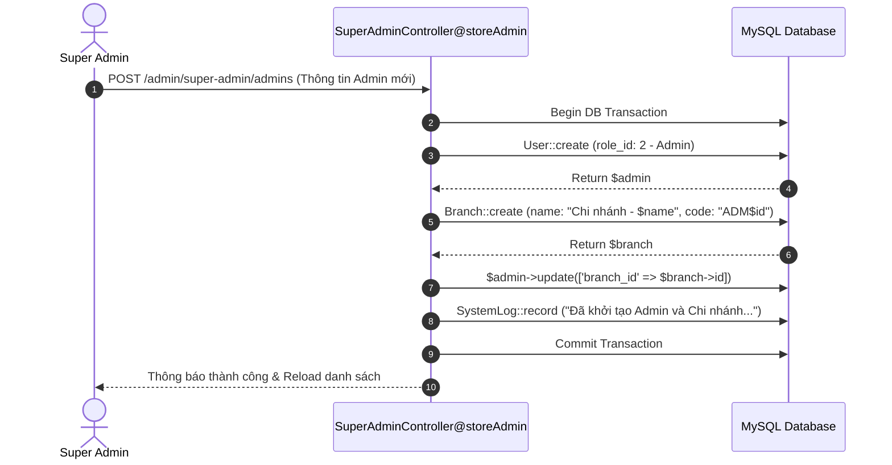

# 📖 TÀI LIỆU CHI TIẾT NGHIỆP VỤ: LUỒNG QUẢN TRỊ HỆ THỐNG (SUPER ADMIN FLOW)

> **Dự án:** CHILL DRINK  
> **Phiên bản tài liệu:** 2.6 (Đã đối chiếu & xử lý toàn bộ các issue trong SYSTEM_ISSUES.md)  
> **Tài liệu tham chiếu:** [PROJECT_DOCUMENTATION.md](file:///c:/xampp/htdocs/php01/du%20an%201%200000/DU_AN_1/DATN/docs/PROJECT_DOCUMENTATION.md)  
> **Người thực hiện:** Senior System Analyst & Laravel Architect  
> **Ngày cập nhật:** 31/07/2026  
> **Trạng thái:** ✅ Đã đối chiếu & xử lý toàn bộ các issue trong SYSTEM_ISSUES.md; 122/122 test pass (509 assertions).  

---

## ⚠️ PHẠM VI TÀI LIỆU — ĐỌC TRƯỚC KHI CODE/REVIEW

Tài liệu này mô tả **các luồng nghiệp vụ chính của Quản trị viên Tối cao / Quản trị Hệ thống (Super Admin)** — người giữ quyền hạn tối cao trong toàn bộ hệ thống Chill Drink (`role_id = 3` hoặc email `superadmin@chilldrink.com`).

Tài liệu bao gồm:
- Quản lý toàn bộ danh sách Admin chi nhánh & Xếp hạng doanh thu theo period (`all`, `week`, `month`, `year`).
- Khởi tạo Admin chi nhánh mới & Tự động tạo Chi nhánh đi kèm trong cùng DB Transaction.
- Gán lại Chi nhánh (`updateBranch`) & Đổi vai trò tài khoản (`updateRole`).
- Quản lý Mạng lưới Chi nhánh & Giải mã Tọa độ GPS Bản đồ (`BranchController`, `ResolveMapLinkController`).
- Giám sát Nhật ký Hệ thống (System Logs) & Sức khỏe Máy chủ (System Health & Security Stats).
- Giám sát Kênh Chat CSKH & Đóng giả CSKH (SuperAdmin Impersonation Takeover & Audit Logs).

---

## 📋 MỤC LỤC

1. [Tóm Tắt Các Tính Năng Đã Cài Đặt](#1-tóm-tắt-các-tính-năng-đã-cài-đặt)
2. [Định Nghĩa Quy Tắc Cốt Lõi & Phân Quyền](#2-định-nghĩa-quy-tắc-cốt-lõi--phân-quyền)
3. [Chi Tiết Các Sub-Flow Nghiệp Vụ](#3-chi-tiết-các-sub-flow-nghiệp-vụ)
   - [3.1. Quản Lý Admin Chi Nhánh & Xếp Hạng Doanh Thu](#31-quản-lý-admin-chi-nhánh--xếp-hạng-doanh-thu)
   - [3.2. Khởi Tạo Admin Mới & Tự Động Gán Chi Nhánh](#32-khởi-tạo-admin-mới--tự-động-gán-chi-nhánh)
   - [3.3. Điều Chỉnh Chi Nhánh & Vai Trò Tài Khoản](#33-điều-chỉnh-chi-nhánh--vai-trò-tài-khoản)
   - [3.4. Quản Lý Mạng Lưới Chi Nhánh & Tọa Độ GPS Map Resolver](#34-quản-lý-mạng-lưới-chi-nhánh--tọa-độ-gps-map-resolver)
   - [3.5. Giám Sát System Logs & Sức Khỏe Kỹ Thuật Máy Chủ](#35-giám-sát-system-logs--sức-khỏe-kỹ-thuật-máy-chủ)
   - [3.6. Giám Sát Chat CSKH & SuperAdmin Impersonation Takeover](#36-giám-sát-chat-cskh--superadmin-impersonation-takeover)
4. [Biểu Đồ Luồng Nghiệp Vụ (Mermaid Diagrams)](#4-biểu-đồ-luồng-nghiệp-vụ-mermaid-diagrams)
5. [Bảng Kê Chi Tiết Endpoints API & Routes](#5-bảng-kê-chi-tiết-endpoints-api--routes)
6. [Bảng Kê File Mã Nguồn Liên Quan](#6-bảng-kê-file-mã-nguồn-liên-quan)

---

## 1. TÓM TẮT CÁC TÍNH NĂNG ĐÃ CÀI ĐẶT

| # | Chủ đề / Tính năng | Mô tả chi tiết triển khai | Trạng thái |
|---|---|---|---|
| 1 | SuperAdmin Dashboard & Ranking | Xem toàn bộ chỉ số tổng quan hệ thống (tổng user, tổng đơn, tổng doanh thu, biểu đồ doanh thu). Xếp hạng Admin theo doanh thu (`all`, `week`, `month`, `year`). | ✅ Đã xong |
| 2 | Khởi tạo Admin & Tự động tạo Chi nhánh | Khi tạo Admin mới (`storeAdmin`), hệ thống chạy `DB::transaction()` tự động tạo 1 Chi nhánh tên `"Chi nhánh - [Tên Admin]"` và gán `branch_id` cho Admin đó. | ✅ Đã xong |
| 3 | Điều chỉnh Chi nhánh & Vai trò | Gán lại chi nhánh quản lý (`updateBranch`) hoặc phân lại vai trò tài khoản (`updateRole`). Bảo vệ không cho tự đổi vai trò của bản thân hoặc hạ cấp SuperAdmin cuối cùng. | ✅ Đã xong |
| 4 | Quản lý Mạng lưới Chi nhánh & GPS Map | CRUD Chi nhánh cửa hàng. Tích hợp API `ResolveMapLinkController` tự động giải mã link Google Maps thành tọa độ GPS Latitude/Longitude chuẩn. Không xóa cứng chi nhánh đã có đơn hàng. | ✅ Đã xong |
| 5 | Giám sát System Logs & System Health | Xem nhật ký hoạt động hệ thống trong `system_logs` (`SystemLog::record`). Kiểm tra sức khỏe hệ thống (`systemHealth`) và số liệu bảo mật (`securityStats`). | ✅ Đã xong |
| 6 | Impersonation Takeover Chat CSKH | Giám sát kênh chat CSKH realtime (`canMonitorChat`). Quyền đóng giả CSKH gửi tin nhắn (`canImpersonateInChat`), lưu `chat_takeover_sessions` và `chat_audit_logs`. | ✅ Đã xong |

---

## 2. ĐỊNH NGHĨA QUY TẮC CỐT Lõi & PHÂN QUYỀN

| Quy tắc | Chi tiết nghiệp vụ |
|---|---|
| **Quyền hạn Tối cao** | SuperAdmin (`role_id = 3` hoặc email `superadmin@chilldrink.com`) được bảo vệ bởi [SuperAdminMiddleware.php](file:///c:/xampp/htdocs/php01/du%20an%201%200000/DU_AN_1/DATN/chill-drink/app/Http/Middleware/SuperAdminMiddleware.php), có quyền truy cập tất cả các chi nhánh và toàn bộ tính năng quản trị. |
| **Giao dịch Đảm bảo khi Tạo Admin (Atomic Transaction)** | Thao tác tạo Admin mới bắt buộc đi kèm với việc tạo Chi nhánh tương ứng trong 1 `DB::transaction()`. Nếu tạo Chi nhánh thất bại ➔ Rollback toàn bộ dữ liệu User để tránh mồ côi. |
| **Bảo vệ Tài khoản SuperAdmin Tối thiểu** | Không bao giờ cho phép hạ cấp vai trò hoặc xóa/khóa tài khoản SuperAdmin cuối cùng còn hoạt động trong DB. |
| **Bảo toàn Dữ liệu Lịch sử Chi nhánh** | Chi nhánh cửa hàng không cho phép xóa vật lý (Hard Delete) để đảm bảo toàn vẹn dữ liệu đơn hàng và doanh thu quá khứ. Chỉ hỗ trợ chuyển `status` sang ngưng hoạt động. |
| **Kiểm toán Impersonation Minh bạch** | Mọi hành động đóng giả CSKH của SuperAdmin phải được ghi nhận vết kiểm toán trong `chat_audit_logs` để phân định trách nhiệm rõ ràng với tin nhắn do CSKH thật gửi. |

---

## 3. CHI TIẾT CÁC SUB-FLOW NGHIỆP VỤ

### 3.1. Quản Lý Admin Chi Nhánh & Xếp Hạng Doanh Thu
- **Mô tả**: Xem danh sách toàn bộ các quản trị viên, tìm kiếm theo tên/email, lọc theo trạng thái (`active`, `locked`), vai trò (`super`, `admin`) và ngày tạo.
- **Quy tắc nghiệp vụ**:
  - Xếp hạng Admin theo doanh thu phát sinh (`ranking_period`: `all`, `week`, `month`, `year`).
  - Xem chi tiết lịch sử đăng nhập gần nhất (`last_login_at`, `last_login_ip`) qua `loginHistoryByAdmin()`.
- **Mã nguồn liên quan**:
  - Controller: [SuperAdminController.php](file:///c:/xampp/htdocs/php01/du%20an%201%200000/DU_AN_1/DATN/chill-drink/app/Http/Controllers/Admin/SuperAdminController.php)
  - View: [admin/super-admin.blade.php](file:///c:/xampp/htdocs/php01/du%20an%201%200000/DU_AN_1/DATN/chill-drink/resources/views/admin/super-admin.blade.php)

---

### 3.2. Khởi Tạo Admin Mới & Tự Động Gán Chi Nhánh
- **Mô tả**: Khi khởi tạo một Admin chi nhánh mới, hệ thống tự động tạo một chi nhánh đi kèm.
- **Quy tắc nghiệp vụ**:
  1. SuperAdmin nhập Họ tên, Email, Mật khẩu, Số điện thoại cho Admin mới.
  2. Thực hiện trong `DB::transaction()`:
     - Tạo user mới với `role_id = 2` (Admin).
     - Tự động tạo record [Branch.php](file:///c:/xampp/htdocs/php01/du%20an%201%200000/DU_AN_1/DATN/chill-drink/app/Models/Branch.php) với tên `'Chi nhánh - ' . $admin->name`, mã code `'ADM' . $admin->id`, `status = true`.
     - Cập nhật `branch_id` của Admin vừa tạo trỏ đến ID chi nhánh mới này.
  3. Ghi log kiểm toán vào [SystemLog.php](file:///c:/xampp/htdocs/php01/du%20an%201%200000/DU_AN_1/DATN/chill-drink/app/Models/SystemLog.php).
- **Mã nguồn liên quan**:
  - Controller: [SuperAdminController.php@storeAdmin](file:///c:/xampp/htdocs/php01/du%20an%201%200000/DU_AN_1/DATN/chill-drink/app/Http/Controllers/Admin/SuperAdminController.php)

---

### 3.3. Điều Chỉnh Chi Nhánh & Vai Trò Tài Khoản
- **Mô tả**: Thay đổi chi nhánh phụ trách (`updateBranch`) hoặc phân lại vai trò (`updateRole`).
- **Quy tắc nghiệp vụ**:
  - Không cho phép tự đổi vai trò của tài khoản SuperAdmin đang đăng nhập.
  - Không cho phép hạ cấp SuperAdmin cuối cùng thành Admin thường.
- **Mã nguồn liên quan**:
  - Controller: [SuperAdminController.php](file:///c:/xampp/htdocs/php01/du%20an%201%200000/DU_AN_1/DATN/chill-drink/app/Http/Controllers/Admin/SuperAdminController.php) (các phương thức `updateBranch`, `updateRole`)

---

### 3.4. Quản Lý Mạng Lưới Chi Nhánh & Tọa Độ GPS Map Resolver
- **Mô tả**: Thêm, sửa, xóa và bật/tắt trạng thái hoạt động các chi nhánh cửa hàng.
- **Quy tắc nghiệp vụ**:
  - Tự động lấy tọa độ địa lý GPS (Latitude, Longitude) bằng cách dán đường link Google Maps thông qua API [ResolveMapLinkController.php](file:///c:/xampp/htdocs/php01/du%20an%201%200000/DU_AN_1/DATN/chill-drink/app/Http/Controllers/Api/ResolveMapLinkController.php).
  - Không cho phép xóa vật lý (Hard Delete) chi nhánh đã phát sinh đơn hàng để bảo toàn lịch sử giao dịch; chỉ hỗ trợ bật/tắt `status`.
- **Mã nguồn liên quan**:
  - Controller: [BranchController.php](file:///c:/xampp/htdocs/php01/du%20an%201%200000/DU_AN_1/DATN/chill-drink/app/Http/Controllers/Admin/BranchController.php)
  - Model: [Branch.php](file:///c:/xampp/htdocs/php01/du%20an%201%200000/DU_AN_1/DATN/chill-drink/app/Models/Branch.php)

---

### 3.5. Giám Sát System Logs & Sức Khỏe Kỹ Thuật Máy Chủ
- **Mô tả**: Xem nhật ký hoạt động hệ thống lưu trong `system_logs` và kiểm tra dung lượng ổ đĩa / kết nối cơ sở dữ liệu.
- **Mã nguồn liên quan**:
  - Controller: [SuperAdminController.php](file:///c:/xampp/htdocs/php01/du%20an%201%200000/DU_AN_1/DATN/chill-drink/app/Http/Controllers/Admin/SuperAdminController.php) (các phương thức `systemHealth`, `securityStats`)
  - Model: [SystemLog.php](file:///c:/xampp/htdocs/php01/du%20an%201%200000/DU_AN_1/DATN/chill-drink/app/Models/SystemLog.php)

---

### 3.6. Giám Sát Chat CSKH & SuperAdmin Impersonation Takeover
- **Mô tả**: SuperAdmin có quyền giám sát các cuộc trò chuyện giữa CSKH và Khách hàng, đồng thời có thể "đóng giả" CSKH để nhắn tin phản hồi trực tiếp khi cần thiết.
- **Quy tắc nghiệp vụ**:
  - Kiểm tra quyền xem qua `canMonitorChat()`.
  - Quyền đóng giả qua `canImpersonateInChat()`: Tạo phiên làm việc trong `chat_takeover_sessions`.
  - Tin nhắn gửi đi dưới danh nghĩa CSKH sẽ ghi nhận `impersonated_by_id = $superAdmin->id` và `display_as_sender_id = $cskh->id`, đồng thời lưu nhật ký kiểm toán vào `chat_audit_logs`.
- **Mã nguồn liên quan**:
  - Models: [ChatTakeoverSession.php](file:///c:/xampp/htdocs/php01/du%20an%201%200000/DU_AN_1/DATN/chill-drink/app/Models/ChatTakeoverSession.php), [ChatAuditLog.php](file:///c:/xampp/htdocs/php01/du%20an%201%200000/DU_AN_1/DATN/chill-drink/app/Models/ChatAuditLog.php)

---

## 4. BIỂU ĐỒ LUỒNG NGHIỆP VỤ (MERMAID DIAGRAMS)

### 4.1 Sơ đồ Tạo Admin & Sinh Chi nhánh Tự động (Sequence Diagram)

---

## 5. BẢNG KÊ CHI TIẾT ENDPOINTS API & ROUTES

| HTTP Method | URI | Route Name | Controller @ Method | Mục Đích |
|---|---|---|---|---|
| `GET` | `/admin/super-admin` | `admin.super-admin` | `SuperAdminController@index` | Trang Super Admin |
| `POST` | `/admin/super-admin/admins` | `admin.super-admin.admins.store` | `SuperAdminController@storeAdmin` | Tạo Admin + Chi nhánh |
| `PATCH` | `/admin/super-admin/admins/{user}/branch` | `admin.super-admin.update-branch` | `SuperAdminController@updateBranch` | Gán lại chi nhánh |
| `PATCH` | `/admin/super-admin/admins/{user}/role` | `admin.super-admin.update-role` | `SuperAdminController@updateRole` | Phân lại vai trò |
| `GET` | `/admin/branches` | `admin.branches.index` | `BranchController@index` | Quản lý chi nhánh |
| `POST` | `/admin/branches` | `admin.branches.store` | `BranchController@store` | Tạo chi nhánh mới |
| `PUT` | `/admin/branches/{branch}` | `admin.branches.update` | `BranchController@update` | Sửa chi nhánh |
| `DELETE` | `/admin/branches/{branch}` | `admin.branches.destroy` | `BranchController@destroy` | Xóa/Khóa chi nhánh |
| `PATCH` | `/admin/branches/{branch}/status` | `admin.branches.toggle-status` | `BranchController@toggleStatus` | Bật/tắt hoạt động chi nhánh |

---

## 6. QUẢN LÝ STAFF SAU MERGE

- SuperAdmin can create Staff accounts, assign or change their branch, lock/unlock them and delete them.
- Routes are protected by `auth` and `superadmin`: `admin.super-admin.staff.store`, `admin.super-admin.staff.update-branch`, `admin.super-admin.staff.toggle-status` and `admin.super-admin.staff.destroy`.
- Admin branch assignment keeps the unique-branch rule for Admin/SuperAdmin accounts. Staff users are allowed to share a branch.
- Staff role creation is included in migration `2026_07_29_000001_add_staff_role_and_status_timestamps.php` and `RoleSeeder.php`.

## 7. BẢNG KÊ FILE MÃ NGUỒN LIÊN QUAN

- **Controllers**:
  - [SuperAdminController.php](file:///c:/xampp/htdocs/php01/du%20an%201%200000/DU_AN_1/DATN/chill-drink/app/Http/Controllers/Admin/SuperAdminController.php)
  - [BranchController.php](file:///c:/xampp/htdocs/php01/du%20an%201%200000/DU_AN_1/DATN/chill-drink/app/Http/Controllers/Admin/BranchController.php)
- **Middleware**:
  - [SuperAdminMiddleware.php](file:///c:/xampp/htdocs/php01/du%20an%201%200000/DU_AN_1/DATN/chill-drink/app/Http/Middleware/SuperAdminMiddleware.php)
- **Models**:
  - [Branch.php](file:///c:/xampp/htdocs/php01/du%20an%201%200000/DU_AN_1/DATN/chill-drink/app/Models/Branch.php)
  - [SystemLog.php](file:///c:/xampp/htdocs/php01/du%20an%201%200000/DU_AN_1/DATN/chill-drink/app/Models/SystemLog.php)
  - [ChatTakeoverSession.php](file:///c:/xampp/htdocs/php01/du%20an%201%200000/DU_AN_1/DATN/chill-drink/app/Models/ChatTakeoverSession.php)
  - [ChatAuditLog.php](file:///c:/xampp/htdocs/php01/du%20an%201%200000/DU_AN_1/DATN/chill-drink/app/Models/ChatAuditLog.php)

---
*Tài liệu phản ánh trạng thái code được đối chiếu ngày 31/07/2026; các chức năng chưa có route/controller được xem là chưa triển khai.*
