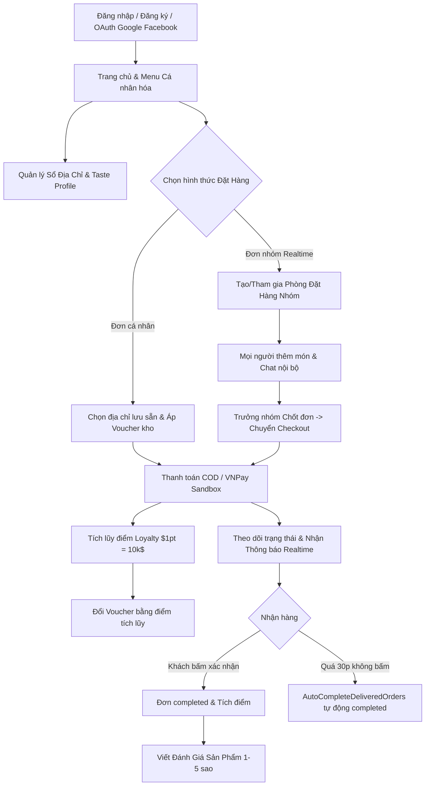
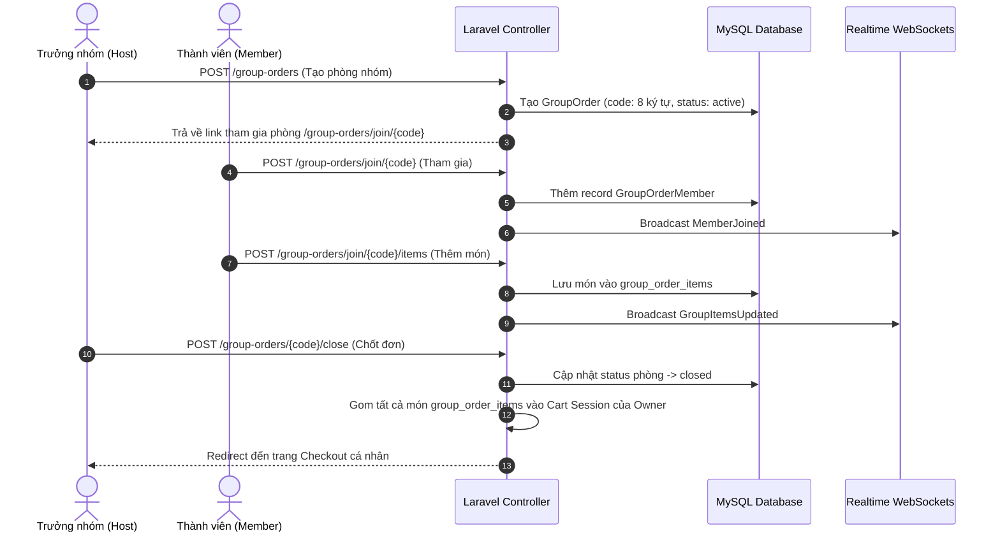

# 📖 TÀI LIỆU CHI TIẾT NGHIỆP VỤ: LUỒNG NGƯỜI DÙNG HỘI VIÊN (USER / MEMBER FLOW)

> **Dự án:** CHILL DRINK  
> **Phiên bản tài liệu:** 1.1 (Đã đối chiếu lại với code thực tế; các giới hạn được ghi rõ)  
> **Tài liệu tham chiếu:** [PROJECT_DOCUMENTATION.md](file:///c:/xampp/htdocs/php01/du%20an%201%200000/DU_AN_1/DATN/docs/PROJECT_DOCUMENTATION.md)  
> **Ngày cập nhật:** 31/07/2026  
> **Trạng thái:** ⚠️ Đã xác minh luồng chính; còn lỗi nghiệp vụ voucher, hủy đơn và quyền truy cập cần xử lý  

---

## ⚠️ PHẠM VI TÀI LIỆU

Tài liệu này mô tả **các luồng nghiệp vụ chính của Khách hàng thành viên (Registered Member User)** — người dùng đã đăng ký hoặc đăng nhập tài khoản trong hệ thống Chill Drink (`role_id = 1`).

Tài liệu bao gồm:
- Đăng ký, Đăng nhập, OAuth 2.0 (Google & Facebook), Khôi phục mật khẩu & Xác thực Email.
- Hồ sơ cá nhân & Sổ địa chỉ (Address Book) đồng bộ tự động.
- Đặt hàng cá nhân & Áp dụng Voucher giảm giá từ kho voucher.
- Lịch sử đơn hàng, Đặt lại đơn nhanh (Reorder), Hủy đơn (Pending) & Xác nhận nhận hàng (Delivered ➔ Completed).
- **Đặt hàng nhóm Realtime (Group Order)** với presence heartbeat, chat nội bộ và chốt đơn nhóm.
- Tích lũy điểm Loyalty, Đổi Voucher bằng điểm và lịch sử biến động điểm.
- Lưu sản phẩm yêu thích (Favorites) & Cấu hình vị giác mặc định (Taste Profile).
- Viết đánh giá sản phẩm sau khi mua hàng.
- Trung tâm Thông báo (Notifications Feed & Nhắc nhở đánh giá).
- Khung Chat hỗ trợ CSKH trực tuyến liên kết tài khoản.

---

## 📋 MỤC LỤC

1. [Tổng Quan Luồng Người Dùng Hội Viên](#1-tổng-quan-luồng-người-dùng-hội-viên)
2. [Chi Tiết Các Sub-Flow Nghiệp Vụ](#2-chi-tiết-các-sub-flow-nghiệp-vụ)
   - [2.1. Đăng Ký, Đăng Nhập & OAuth 2.0 (Google / Facebook)](#21-đăng-ký-đăng-nhập--oauth-20-google--facebook)
   - [2.2. Quản Lý Hồ Sơ & Sổ Địa Chỉ (Address Book)](#22-quản-lý-hồ-sơ--sổ-địa-chỉ-address-book)
   - [2.3. Đặt Hàng Cá Nhân & Áp Dụng Voucher (Member Checkout)](#23-đặt-hàng-cá-nhân--áp-dụng-voucher-member-checkout)
   - [2.4. Lịch Sử Đơn Hàng & Đặt Lại Đơn Nhanh (Reorder)](#24-lịch-sử-đơn-hàng--đặt-lại-đơn-nhanh-reorder)
   - [2.5. Hủy Đơn Hàng & Xác Nhận Đã Nhận Hàng (Auto-Complete 30p)](#25-hủy-đơn-hàng--xác-nhận-đã-nhận-hàng-auto-complete-30p)
   - [2.6. Đặt Hàng Nhóm Realtime (Group Order Flow)](#26-đặt-hàng-nhóm-realtime-group-order-flow)
   - [2.7. Tích Điểm Loyalty & Đổi Voucher Bằng Điểm](#27-tích-điểm-loyalty--đổi-voucher-bằng-điểm)
   - [2.8. Sản Phẩm Yêu Thích (Favorites) & Vị Giác (Taste Profile)](#28-sản-phẩm-yêu-thích-favorites--vị-giác-taste-profile)
   - [2.9. Đánh Giá Sản Phẩm (Product Reviews)](#29-đánh-giá-sản-phẩm-product-reviews)
   - [2.10. Trung Tâm Thông Báo (Notifications Feed & Reminders)](#210-trung-tâm-thông-báo-notifications-feed--reminders)
   - [2.11. Chat Hỗ Trợ CSKH Trực Tuyến Thành Viên](#211-chat-hỗ-trợ-cskh-trực-tuyến-thành-viên)
3. [Biểu Đồ Luồng Nghiệp Vụ (Mermaid Diagrams)](#3-biểu-đồ-luồng-nghiệp-vụ-mermaid-diagrams)
4. [Bảng Kê Chi Tiết Endpoints API & Routes](#4-bảng-kê-chi-tiết-endpoints-api--routes)
5. [Bảng Kê File Mã Nguồn Liên Quan](#5-bảng-kê-file-mã-nguồn-liên-quan)

---

## 1. TỔNG QUAN LUỒNG NGƯỜI DÙNG HỘI VIÊN

Người dùng hội viên tận hưởng đầy đủ các tính năng nâng cao của hệ thống Chill Drink nhằm gia tăng trải nghiệm cá nhân hóa.

---

## 2. CHI TIẾT CÁC SUB-FLOW NGHIỆP VỤ

### 2.1. Đăng Ký, Đăng Nhập & OAuth 2.0 (Google / Facebook)
- **Mô tả**: Đăng ký tài khoản mới, đăng nhập email/mật khẩu, đăng nhập nhanh qua Google hoặc Facebook, xác thực email và khôi phục mật khẩu.
- **Quy tắc nghiệp vụ**:
  - **Đăng ký**: Validate tên, email unique trong bảng `users`, mật khẩu $\ge 8$ ký tự.
  - **Đăng nhập**: Sử dụng Laravel RateLimiter chống tấn công Brute-Force (tối đa 5 lần thử/phút).
  - **Socialite OAuth**:
    - [GoogleController.php](file:///c:/xampp/htdocs/php01/du%20an%201%200000/DU_AN_1/DATN/chill-drink/app/Http/Controllers/Auth/GoogleController.php) & [FacebookController.php](file:///c:/xampp/htdocs/php01/du%20an%201%200000/DU_AN_1/DATN/chill-drink/app/Http/Controllers/Auth/FacebookController.php).
    - Nếu email từ Google/Facebook đã tồn tại trong DB ➔ tự động cập nhật `google_id` / `facebook_id` và đăng nhập.
  - **Khôi phục mật khẩu**: Sử dụng [PasswordResetLinkController.php](file:///c:/xampp/htdocs/php01/du%20an%201%200000/DU_AN_1/DATN/chill-drink/app/Http/Controllers/Auth/PasswordResetLinkController.php) gửi mail khôi phục qua PHPMailer SMTP.
- **Mã nguồn liên quan**:
  - Controllers: [RegisteredUserController.php](file:///c:/xampp/htdocs/php01/du%20an%201%200000/DU_AN_1/DATN/chill-drink/app/Http/Controllers/Auth/RegisteredUserController.php), [AuthenticatedSessionController.php](file:///c:/xampp/htdocs/php01/du%20an%201%200000/DU_AN_1/DATN/chill-drink/app/Http/Controllers/Auth/AuthenticatedSessionController.php), [GoogleController.php](file:///c:/xampp/htdocs/php01/du%20an%201%200000/DU_AN_1/DATN/chill-drink/app/Http/Controllers/Auth/GoogleController.php), [FacebookController.php](file:///c:/xampp/htdocs/php01/du%20an%201%200000/DU_AN_1/DATN/chill-drink/app/Http/Controllers/Auth/FacebookController.php)

---

### 2.2. Quản Lý Hồ Sơ & Sổ Địa Chỉ (Address Book)
- **Mô tả**: Thay đổi thông tin cá nhân, avatar và quản lý danh sách địa chỉ giao hàng.
- **Quy tắc nghiệp vụ**:
  - Người dùng có thể lưu nhiều địa chỉ trong bảng `addresses` (Nhà riêng, Văn phòng...).
  - Trong sổ địa chỉ, tối đa chỉ có 1 địa chỉ được đánh dấu `is_default = true`.
  - **Đồng bộ tự động**: Khi tạo/sửa địa chỉ có `is_default = true`, hàm `syncDefaultToUser()` trong [AddressController.php](file:///c:/xampp/htdocs/php01/du%20an%201%200000/DU_AN_1/DATN/chill-drink/app/Http/Controllers/Client/AddressController.php) sẽ tự động cập nhật lại các trường `name`, `phone`, `address`, `area` chính của bảng `users`.
  - Avatar: Hỗ trợ upload ảnh đại diện mới hoặc chọn preset avatar có sẵn.
- **Mã nguồn liên quan**:
  - Controller: [ProfileController.php](file:///c:/xampp/htdocs/php01/du%20an%201%200000/DU_AN_1/DATN/chill-drink/app/Http/Controllers/ProfileController.php), [AddressController.php](file:///c:/xampp/htdocs/php01/du%20an%201%200000/DU_AN_1/DATN/chill-drink/app/Http/Controllers/Client/AddressController.php)
  - Model: [Address.php](file:///c:/xampp/htdocs/php01/du%20an%201%200000/DU_AN_1/DATN/chill-drink/app/Models/Address.php)

---

### 2.3. Đặt Hàng Cá Nhân & Áp Dụng Voucher (Member Checkout)
- **Mô tả**: Thanh toán giỏ hàng cá nhân với địa chỉ lưu sẵn và mã giảm giá tích lũy.
- **Quy tắc nghiệp vụ**:
  - Người dùng có thể tạo/sửa địa chỉ mới trực tiếp tại màn hình Checkout (`storeAddress`, `updateAddress`, `updatePrimaryAddress`).
  - Áp dụng Voucher: Kiểm tra điều kiện voucher (`UserVoucher` chưa dùng `used_at = null`, giá trị đơn tối thiểu `min_order_amount`, ngày hết hạn).
  - Phí giao hàng tính theo tọa độ GPS hoặc khoảng cách từ sổ địa chỉ đến chi nhánh gần nhất qua [ShippingFee.php](file:///c:/xampp/htdocs/php01/du%20an%201%200000/DU_AN_1/DATN/chill-drink/app/Support/ShippingFee.php).
- **Mã nguồn liên quan**:
  - Controller: [CheckoutController.php](file:///c:/xampp/htdocs/php01/du%20an%201%200000/DU_AN_1/DATN/chill-drink/app/Http/Controllers/Client/CheckoutController.php)
  - Models: [Voucher.php](file:///c:/xampp/htdocs/php01/du%20an%201%200000/DU_AN_1/DATN/chill-drink/app/Models/Voucher.php), [UserVoucher.php](file:///c:/xampp/htdocs/php01/du%20an%201%200000/DU_AN_1/DATN/chill-drink/app/Models/UserVoucher.php)

---

### 2.4. Lịch Sử Đơn Hàng & Đặt Lại Đơn Nhanh (Reorder)
- **Mô tả**: Xem danh sách 15 đơn hàng gần nhất và thực hiện đặt lại đơn hàng cũ nhanh chóng.
- **Quy tắc nghiệp vụ**:
  - Trang lịch sử đơn hiển thị chi tiết sản phẩm, tổng tiền, trạng thái đơn kèm màu sắc badge và các món đã review.
  - **Đặt lại đơn (Reorder)**:
    - Đặt lại toàn bộ đơn (`reorderOrder`): Tự động nạp lại tất cả các món trong đơn cũ vào giỏ hàng hiện tại với giá sản phẩm theo thời giá hiện hành.
    - Đặt lại 1 món (`reorderItem`): Nạp lại đúng 1 món cụ thể kèm Size và Topping cũ.
- **Mã nguồn liên quan**:
  - Controller: [ProfileController.php@orders](file:///c:/xampp/htdocs/php01/du%20an%201%200000/DU_AN_1/DATN/chill-drink/app/Http/Controllers/ProfileController.php), [QuickOrderController.php](file:///c:/xampp/htdocs/php01/du%20an%201%200000/DU_AN_1/DATN/chill-drink/app/Http/Controllers/Client/QuickOrderController.php)

---

### 2.5. Hủy Đơn Hàng & Xác Nhận Đã Nhận Hàng (Auto-Complete 30p)
- **Mô tả**: Người dùng có quyền chủ động hủy đơn khi đang chờ hoặc xác nhận hoàn tất khi đã nhận hàng.
- **Quy tắc nghiệp vụ**:
  1. **Hủy đơn (`cancelOrder`)**: Chỉ cho phép khi đơn hàng ở trạng thái `pending`. Khách phải nhập lý do hủy (`cancellation_reason`, max 500 ký tự). Đơn chuyển sang `cancelled`, phát thông báo realtime cho Admin.
  2. **Xác nhận đã nhận hàng (`confirmReceived`)**: Chỉ cho phép khi đơn hàng ở trạng thái `delivered`. Đơn chuyển sang `completed`. Nếu là đơn COD ➔ tự động cập nhật `payment_status = 'paid'`. Gọi `order->awardLoyaltyPoints()` để cộng điểm tích lũy cho khách.
  3. **Tự động hoàn thành (Auto-Complete)**: Artisan Command [AutoCompleteDeliveredOrders.php](file:///c:/xampp/htdocs/php01/du%20an%201%200000/DU_AN_1/DATN/chill-drink/app/Console/Commands/AutoCompleteDeliveredOrders.php) chạy mỗi phút. Đơn hàng ở trạng thái `delivered` quá 30 phút mà khách chưa bấm xác nhận ➔ Tự động chuyển `completed`, đánh dấu COD paid và cộng điểm Loyalty.
- **Mã nguồn liên quan**:
  - Controller: [ProfileController.php](file:///c:/xampp/htdocs/php01/du%20an%201%200000/DU_AN_1/DATN/chill-drink/app/Http/Controllers/ProfileController.php)
  - Command: [AutoCompleteDeliveredOrders.php](file:///c:/xampp/htdocs/php01/du%20an%201%200000/DU_AN_1/DATN/chill-drink/app/Console/Commands/AutoCompleteDeliveredOrders.php)

---

### 2.6. Đặt Hàng Nhóm Realtime (Group Order Flow)
- **Mô tả**: Tính năng cho phép nhóm bạn bè cùng chọn món chung vào 1 phòng đặt hàng thời gian thực.
- **Quy tắc nghiệp vụ**:
  - **Tạo phòng**: Chủ nhóm tạo phòng ➔ sinh mã code 8 ký tự duy nhất (VD: `GRO12345`). Tối đa 20 thành viên (`MAX_MEMBERS = 20`), thời gian chờ 30 phút (`ORDER_WINDOW_MINUTES = 30`).
  - **Presence Heartbeat**: Khách gửi heartbeat mỗi 45s để cập nhật `owner_last_seen_at`.
  - **Thêm/Sửa món**: Thành viên chọn món kèm Size/Topping ➔ lưu vào `group_order_items`. Hệ thống tự cập nhật tổng tiền phòng nhóm.
  - **Chat nội bộ nhóm**: Thành viên gửi tin nhắn trao đổi (`sendMessage`), đánh dấu đã đọc (`readMessages`).
  - **Chốt đơn (`close`)**: Chỉ trưởng nhóm mới có quyền chốt đơn. Khi chốt đơn: Trạng thái phòng chuyển sang `closed`, toàn bộ các món trong `group_order_items` được gom tự động vào giỏ hàng của trưởng nhóm để tiến hành Checkout.
  - **Hủy & Khôi phục**: Trưởng nhóm có thể hủy phòng (`cancel`) hoặc tiếp tục mở lại (`resume`).
- **Mã nguồn liên quan**:
  - Controller Client: [GroupOrderController.php (Client)](file:///c:/xampp/htdocs/php01/du%20an%201%200000/DU_AN_1/DATN/chill-drink/app/Http/Controllers/Client/GroupOrderController.php)
  - Assets JS: [group-orders.js](file:///c:/xampp/htdocs/php01/du%20an%201%200000/DU_AN_1/DATN/chill-drink/resources/js/group-orders.js)
  - Models: [GroupOrder.php](file:///c:/xampp/htdocs/php01/du%20an%201%200000/DU_AN_1/DATN/chill-drink/app/Models/GroupOrder.php), [GroupOrderItem.php](file:///c:/xampp/htdocs/php01/du%20an%201%200000/DU_AN_1/DATN/chill-drink/app/Models/GroupOrderItem.php), [GroupOrderMember.php](file:///c:/xampp/htdocs/php01/du%20an%201%200000/DU_AN_1/DATN/chill-drink/app/Models/GroupOrderMember.php), [GroupOrderMessage.php](file:///c:/xampp/htdocs/php01/du%20an%201%200000/DU_AN_1/DATN/chill-drink/app/Models/GroupOrderMessage.php)

---

### 2.7. Tích Điểm Loyalty & Đổi Voucher Bằng Điểm
- **Mô tả**: Tích lũy điểm thưởng từ đơn hàng và sử dụng điểm để đổi các mã giảm giá đặc quyền.
- **Quy tắc nghiệp vụ**:
  - **Tích điểm**: Mỗi $10.000\text{đ}$ chi tiêu thành công (đơn `completed`) ➔ Tích $1\text{ điểm}$ Loyalty (`awardLoyaltyPoints()`). Ghi lịch sử vào `point_transactions` (type: `earn`).
  - **Đổi Voucher (`redeemVoucher`)**:
    - Hiển thị danh sách voucher có thể đổi (`is_redeemable = 1`, `status = 1`, `point_cost > 0`).
    - Kiểm tra điểm người dùng (`total_points >= point_cost`).
    - Không cho đổi trùng nếu người dùng đang sở hữu voucher đó chưa sử dụng.
    - Thực hiện trừ điểm qua `deductPoints()` trong DB Transaction, ghi log `point_transactions` (type: `spend`), và cấp `UserVoucher` mới.
- **Mã nguồn liên quan**:
  - Controller: [LoyaltyPointController.php](file:///c:/xampp/htdocs/php01/du%20an%201%200000/DU_AN_1/DATN/chill-drink/app/Http/Controllers/Client/LoyaltyPointController.php)
  - Models: [LoyaltyPoint.php](file:///c:/xampp/htdocs/php01/du%20an%201%200000/DU_AN_1/DATN/chill-drink/app/Models/LoyaltyPoint.php), [PointTransaction.php](file:///c:/xampp/htdocs/php01/du%20an%201%200000/DU_AN_1/DATN/chill-drink/app/Models/PointTransaction.php), [UserVoucher.php](file:///c:/xampp/htdocs/php01/du%20an%201%200000/DU_AN_1/DATN/chill-drink/app/Models/UserVoucher.php)

---

### 2.8. Sản Phẩm Yêu Thích (Favorites) & Vị Giác (Taste Profile)
- **Mô tả**: Lưu sản phẩm yêu thích (bấm biểu tượng trái tim) và thiết lập khẩu vị cá nhân cho từng loại sản phẩm.
- **Quy tắc nghiệp vụ**:
  - **Favorites**: Toggle lưu/xóa sản phẩm yêu thích trong bảng `favorites`.
  - **Taste Profile**: Lưu mức đường (0%, 30%, 50%, 100%), mức đá (0%, 50%, 100%), size mặc định và topping ưa thích cho từng sản phẩm trong bảng `taste_profiles`. Khi chọn món đó trong tương lai ➔ tự động điền cấu hình khẩu vị đã lưu.
- **Mã nguồn liên quan**:
  - Controller: [QuickOrderController.php](file:///c:/xampp/htdocs/php01/du%20an%201%200000/DU_AN_1/DATN/chill-drink/app/Http/Controllers/Client/QuickOrderController.php)
  - Models: [Favorite.php](file:///c:/xampp/htdocs/php01/du%20an%201%200000/DU_AN_1/DATN/chill-drink/app/Models/Favorite.php), [TasteProfile.php](file:///c:/xampp/htdocs/php01/du%20an%201%200000/DU_AN_1/DATN/chill-drink/app/Models/TasteProfile.php)

---

### 2.9. Đánh Giá Sản Phẩm (Product Reviews)
- **Mô tả**: Viết nhận xét và chấm điểm sao cho sản phẩm đã mua.
- **Quy tắc nghiệp vụ**:
  - **Điều kiện đánh giá**: Khách hàng chỉ được đánh giá các sản phẩm nằm trong đơn hàng đã `completed`.
  - Đảm bảo mỗi sản phẩm trong 1 đơn hàng chỉ được đánh giá 1 lần (`nextEligibleCompletedOrderId`).
  - Đánh giá mới tạo có `status = false` (chờ Admin kiểm duyệt trước khi hiển thị công khai).
- **Mã nguồn liên quan**:
  - Controller: [ProductReviewController.php](file:///c:/xampp/htdocs/php01/du%20an%201%200000/DU_AN_1/DATN/chill-drink/app/Http/Controllers/Client/ProductReviewController.php)
  - Model: [Review.php](file:///c:/xampp/htdocs/php01/du%20an%201%200000/DU_AN_1/DATN/chill-drink/app/Models/Review.php)

---

### 2.10. Trung Tâm Thông Báo (Notifications Feed & Reminders)
- **Mô tả**: Quản lý thông báo đơn hàng và nhắc nhở viết đánh giá.
- **Quy tắc nghiệp vụ**:
  - **Feed API**: Endpoint `GET /notifications/feed` trả về 10 thông báo gần nhất kèm số thông báo chưa đọc (`unread_count`).
  - **Đánh dấu đã đọc**: Endpoint `POST /notifications/mark-all-read`.
  - **Nhắc nhở đánh giá (Review Reminders)**: Artisan Command [GenerateReviewReminders.php](file:///c:/xampp/htdocs/php01/du%20an%201%200000/DU_AN_1/DATN/chill-drink/app/Console/Commands/GenerateReviewReminders.php) quét các đơn `completed` có sản phẩm chưa review để tạo thông báo `ReviewAvailableNotification`.
- **Mã nguồn liên quan**:
  - Controller: [ProfileController.php](file:///c:/xampp/htdocs/php01/du%20an%201%200000/DU_AN_1/DATN/chill-drink/app/Http/Controllers/ProfileController.php)
  - Notifications: [OrderStatusUpdatedNotification.php](file:///c:/xampp/htdocs/php01/du%20an%201%200000/DU_AN_1/DATN/chill-drink/app/Notifications/OrderStatusUpdatedNotification.php), [ReviewAvailableNotification.php](file:///c:/xampp/htdocs/php01/du%20an%201%200000/DU_AN_1/DATN/chill-drink/app/Notifications/ReviewAvailableNotification.php)
  - Command: [GenerateReviewReminders.php](file:///c:/xampp/htdocs/php01/du%20an%201%200000/DU_AN_1/DATN/chill-drink/app/Console/Commands/GenerateReviewReminders.php)

---

### 2.11. Chat Hỗ Trợ CSKH Trực Tuyến Thành Viên
- **Mô tả**: Tự động kết nối hội thoại với nhân viên CSKH khi đăng nhập.
- **Quy tắc nghiệp vụ**:
  - Thành viên đã đăng nhập không cần nhập tên/email ➔ Hệ thống tự động lấy `user_id` tạo hoặc mở lại `Conversation`.
  - Tin nhắn gửi đi phát sự kiện WebSockets [MessageSent.php](file:///c:/xampp/htdocs/php01/du%20an%201%200000/DU_AN_1/DATN/chill-drink/app/Events/MessageSent.php) hiển thị tức thì trên màn hình CSKH.
- **Mã nguồn liên quan**:
  - Controller: [ChatController.php](file:///c:/xampp/htdocs/php01/du%20an%201%200000/DU_AN_1/DATN/chill-drink/app/Http/Controllers/Client/ChatController.php)
  - Event: [MessageSent.php](file:///c:/xampp/htdocs/php01/du%20an%201%200000/DU_AN_1/DATN/chill-drink/app/Events/MessageSent.php)

---

## 3. BIỂU ĐỒ LUỒNG NGHIỆP VỤ (MERMAID DIAGRAMS)

### 3.1 Sơ đồ Đặt hàng nhóm Realtime (Group Order Sequence Diagram)

---

## 4. BẢNG KÊ CHI TIẾT ENDPOINTS API & ROUTES

| HTTP Method | URI | Route Name | Controller @ Method | Mục Đích |
|---|---|---|---|---|
| `GET` | `/checkout` | `checkout.index` | `CheckoutController@index` | Trang Checkout Member |
| `POST` | `/checkout/process` | `checkout.process` | `CheckoutController@process` | Xử lý đặt hàng Member |
| `POST` | `/checkout/addresses` | `checkout.addresses.store` | `CheckoutController@storeAddress` | Tạo địa chỉ mới tại checkout |
| `PUT` | `/checkout/addresses/{address}` | `checkout.addresses.update` | `CheckoutController@updateAddress` | Sửa địa chỉ tại checkout |
| `PATCH` | `/checkout/address/primary` | `checkout.addresses.primary.update` | `CheckoutController@updatePrimaryAddress` | Chọn địa chỉ chính |
| `GET` | `/orders` | `orders.index` | `ProfileController@orders` | Lịch sử mua hàng |
| `POST` | `/orders/{order}/cancel` | `orders.cancel` | `ProfileController@cancelOrder` | Hủy đơn hàng (pending) |
| `POST` | `/orders/{order}/confirm-received` | `orders.confirm-received` | `ProfileController@confirmReceived` | Xác nhận đã nhận hàng |
| `POST` | `/orders/{order}/reorder` | `orders.reorder` | `QuickOrderController@reorderOrder` | Reorder toàn bộ đơn cũ |
| `POST` | `/orders/{order}/items/{item}/reorder` | `orders.items.reorder` | `QuickOrderController@reorderItem` | Reorder 1 món cụ thể |
| `GET` | `/group-orders` | `group-orders.index` | `GroupOrderController@index` | Danh sách phòng nhóm |
| `GET` | `/group-orders/create` | `group-orders.create` | `GroupOrderController@create` | Form tạo phòng nhóm |
| `POST` | `/group-orders` | `group-orders.store` | `GroupOrderController@store` | Lưu phòng nhóm mới |
| `GET` | `/group-orders/join/{code}` | `group-orders.show` | `GroupOrderController@show` | Chi tiết phòng nhóm |
| `POST` | `/group-orders/join/{code}` | `group-orders.join` | `GroupOrderController@join` | Tham gia phòng nhóm |
| `POST` | `/group-orders/join/{code}/items` | `group-orders.items.store` | `GroupOrderController@addItem` | Thêm món vào nhóm |
| `PATCH` | `/group-orders/join/{code}/items/{item}/increment` | `group-orders.items.increment` | `GroupOrderController@incrementItem` | Tăng số lượng món nhóm |
| `DELETE` | `/group-orders/join/{code}/items/{item}` | `group-orders.items.destroy` | `GroupOrderController@removeItem` | Xóa món khỏi nhóm |
| `POST` | `/group-orders/{code}/close` | `group-orders.close` | `GroupOrderController@close` | Chốt đơn phòng nhóm |
| `POST` | `/group-orders/{code}/cancel` | `group-orders.cancel` | `GroupOrderController@cancel` | Hủy phòng nhóm |
| `POST` | `/group-orders/{code}/resume` | `group-orders.resume` | `GroupOrderController@resume` | Mở lại phòng nhóm |
| `POST` | `/group-orders/join/{code}/presence` | `group-orders.presence` | `GroupOrderController@presence` | Heartbeat sự hiện diện |
| `POST` | `/group-orders/join/{code}/leave` | `group-orders.leave` | `GroupOrderController@leave` | Rời phòng nhóm |
| `GET` | `/group-orders/join/{code}/messages` | `group-orders.messages` | `GroupOrderController@messages` | Lấy tin nhắn nhóm |
| `POST` | `/group-orders/join/{code}/messages` | `group-orders.messages.send` | `GroupOrderController@sendMessage` | Gửi tin nhắn nhóm |
| `POST` | `/group-orders/join/{code}/messages/read` | `group-orders.messages.read` | `GroupOrderController@readMessages` | Đánh dấu tin nhắn nhóm đã đọc |
| `GET` | `/loyalty-points` | `loyalty.index` | `LoyaltyPointController@index` | Trang tích điểm Loyalty |
| `POST` | `/loyalty-points/redeem/{voucher}` | `loyalty.redeem-voucher` | `LoyaltyPointController@redeemVoucher` | Đổi voucher bằng điểm |
| `GET` | `/favorites` | `favorites.index` | `QuickOrderController@favorites` | Danh sách món yêu thích |
| `POST` | `/favorites/{product}` | `favorites.toggle` | `QuickOrderController@toggleFavorite` | Toggle món yêu thích |
| `POST` | `/products/{product}/taste-profile` | `taste-profiles.store` | `QuickOrderController@saveTaste` | Lưu khẩu vị vị giác |
| `POST` | `/products/{product}/reviews` | `products.reviews.store` | `ProductReviewController@store` | Gửi đánh giá 1-5 sao |
| `GET` | `/notifications/feed` | `notifications.feed` | `ProfileController@notificationsFeed` | API thông báo feed |
| `POST` | `/notifications/mark-all-read` | `notifications.mark-all-read` | `ProfileController@markAllNotificationsRead` | Đánh dấu tất cả thông báo đã đọc |

---

## 5. BẢNG KÊ FILE MÃ NGUỒN LIÊN QUAN

- **Controllers**:
  - [ProfileController.php](file:///c:/xampp/htdocs/php01/du%20an%201%200000/DU_AN_1/DATN/chill-drink/app/Http/Controllers/ProfileController.php)
  - [AddressController.php](file:///c:/xampp/htdocs/php01/du%20an%201%200000/DU_AN_1/DATN/chill-drink/app/Http/Controllers/Client/AddressController.php)
  - [CheckoutController.php](file:///c:/xampp/htdocs/php01/du%20an%201%200000/DU_AN_1/DATN/chill-drink/app/Http/Controllers/Client/CheckoutController.php)
  - [QuickOrderController.php](file:///c:/xampp/htdocs/php01/du%20an%201%200000/DU_AN_1/DATN/chill-drink/app/Http/Controllers/Client/QuickOrderController.php)
  - [GroupOrderController.php](file:///c:/xampp/htdocs/php01/du%20an%201%200000/DU_AN_1/DATN/chill-drink/app/Http/Controllers/Client/GroupOrderController.php)
  - [LoyaltyPointController.php](file:///c:/xampp/htdocs/php01/du%20an%201%200000/DU_AN_1/DATN/chill-drink/app/Http/Controllers/Client/LoyaltyPointController.php)
  - [ProductReviewController.php](file:///c:/xampp/htdocs/php01/du%20an%201%200000/DU_AN_1/DATN/chill-drink/app/Http/Controllers/Client/ProductReviewController.php)
  - [ChatController.php](file:///c:/xampp/htdocs/php01/du%20an%201%200000/DU_AN_1/DATN/chill-drink/app/Http/Controllers/Client/ChatController.php)
- **Models**:
  - [User.php](file:///c:/xampp/htdocs/php01/du%20an%201%200000/DU_AN_1/DATN/chill-drink/app/Models/User.php)
  - [Address.php](file:///c:/xampp/htdocs/php01/du%20an%201%200000/DU_AN_1/DATN/chill-drink/app/Models/Address.php)
  - [LoyaltyPoint.php](file:///c:/xampp/htdocs/php01/du%20an%201%200000/DU_AN_1/DATN/chill-drink/app/Models/LoyaltyPoint.php)
  - [PointTransaction.php](file:///c:/xampp/htdocs/php01/du%20an%201%200000/DU_AN_1/DATN/chill-drink/app/Models/PointTransaction.php)
  - [GroupOrder.php](file:///c:/xampp/htdocs/php01/du%20an%201%200000/DU_AN_1/DATN/chill-drink/app/Models/GroupOrder.php)
  - [Favorite.php](file:///c:/xampp/htdocs/php01/du%20an%201%200000/DU_AN_1/DATN/chill-drink/app/Models/Favorite.php)
  - [TasteProfile.php](file:///c:/xampp/htdocs/php01/du%20an%201%200000/DU_AN_1/DATN/chill-drink/app/Models/TasteProfile.php)
  - [Review.php](file:///c:/xampp/htdocs/php01/du%20an%201%200000/DU_AN_1/DATN/chill-drink/app/Models/Review.php)
- **Commands & Notifications**:
  - [AutoCompleteDeliveredOrders.php](file:///c:/xampp/htdocs/php01/du%20an%201%200000/DU_AN_1/DATN/chill-drink/app/Console/Commands/AutoCompleteDeliveredOrders.php)
  - [GenerateReviewReminders.php](file:///c:/xampp/htdocs/php01/du%20an%201%200000/DU_AN_1/DATN/chill-drink/app/Console/Commands/GenerateReviewReminders.php)
  - [OrderStatusUpdatedNotification.php](file:///c:/xampp/htdocs/php01/du%20an%201%200000/DU_AN_1/DATN/chill-drink/app/Notifications/OrderStatusUpdatedNotification.php)
  - [ReviewAvailableNotification.php](file:///c:/xampp/htdocs/php01/du%20an%201%200000/DU_AN_1/DATN/chill-drink/app/Notifications/ReviewAvailableNotification.php)

---
*Tài liệu phản ánh luồng người dùng được đối chiếu ngày 31/07/2026; xem `SYSTEM_ISSUES.md` để biết các lỗi còn tồn tại.*
